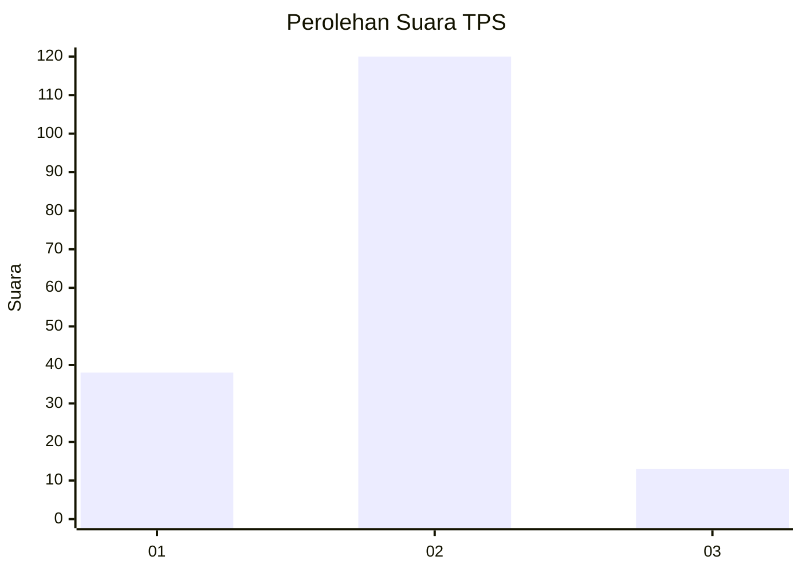
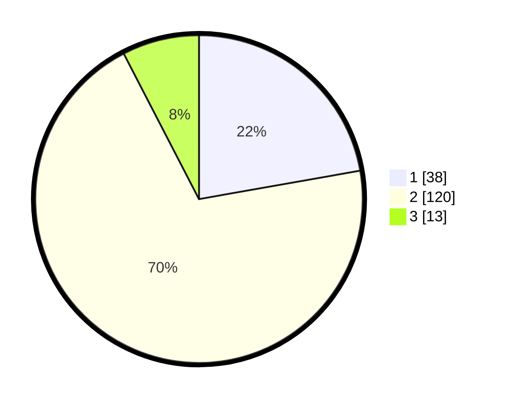

# Hasil

## Grafik

## Tabel

| No. | Nama Paslon    | Suara | Suara (raw) | Persentase |
|:--- |:-------------- | -----:| -----------:| ----------:|
| 1   | ANIES MUHAIMIN | 38    | [38][p-1]   | 22,22      |
| 2   | PRABOWO GIBRAN | 120   | [120][p-2]  | 70,18      |
| 3   | GANJAR MAHFUD  | 13    | [13][p-3]   | 7,60       |

[p-1]: https://github.com/gigit-pemilu/pemilu-2024/blob/main/pilpres/hitung-suara/sub/35-jawa-timur/sub/09-jember/sub/06-tanggul/sub/2005-manggisan/sub/006-tps/sub/paslon-1.txt
[p-2]: https://github.com/gigit-pemilu/pemilu-2024/blob/main/pilpres/hitung-suara/sub/35-jawa-timur/sub/09-jember/sub/06-tanggul/sub/2005-manggisan/sub/006-tps/sub/paslon-2.txt
[p-3]: https://github.com/gigit-pemilu/pemilu-2024/blob/main/pilpres/hitung-suara/sub/35-jawa-timur/sub/09-jember/sub/06-tanggul/sub/2005-manggisan/sub/006-tps/sub/paslon-3.txt

## Foto C Plano

https://sirekap-obj-formc.kpu.go.id/dd08/pemilu/ppwp/35/09/06/20/05/3509062005006-20240214-235115--c2d50074-bf71-45cb-a582-31ebfe403e67.jpg

https://sirekap-obj-formc.kpu.go.id/dd08/pemilu/ppwp/35/09/06/20/05/3509062005006-20240214-211449--28f1421f-e979-497e-8bdb-8431c6134435.jpg

https://sirekap-obj-formc.kpu.go.id/dd08/pemilu/ppwp/35/09/06/20/05/3509062005006-20240214-235310--cfaf4ace-8786-49b4-9c0a-7e2c38b17e2e.jpg

## Metadata

| Key        | Value               |
| ---------- | ------------------- |
| Time Stamp | 2024-02-25 12:00:00 |

