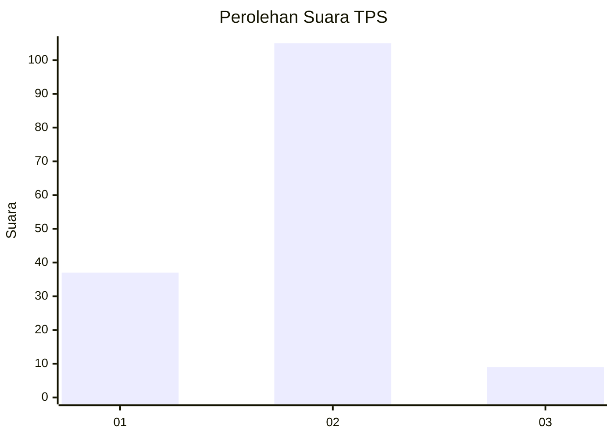

# Hasil

## Grafik

## Tabel

| No. | Nama Paslon    | Suara | Suara (raw) | Persentase |
|:--- |:-------------- | -----:| -----------:| ----------:|
| 1   | ANIES MUHAIMIN | 37    | [37][p-1]   | 24,50      |
| 2   | PRABOWO GIBRAN | 105   | [105][p-2]  | 69,54      |
| 3   | GANJAR MAHFUD  | 9     | [9][p-3]    | 5,96       |

[p-1]: https://github.com/gigit-pemilu/pemilu-2024-35-jawa-timur/blob/main/pilpres/hitung-suara/sub/35-jawa-timur/sub/09-jember/sub/06-tanggul/sub/2005-manggisan/sub/014-tps/sub/paslon-1.txt
[p-2]: https://github.com/gigit-pemilu/pemilu-2024-35-jawa-timur/blob/main/pilpres/hitung-suara/sub/35-jawa-timur/sub/09-jember/sub/06-tanggul/sub/2005-manggisan/sub/014-tps/sub/paslon-2.txt
[p-3]: https://github.com/gigit-pemilu/pemilu-2024-35-jawa-timur/blob/main/pilpres/hitung-suara/sub/35-jawa-timur/sub/09-jember/sub/06-tanggul/sub/2005-manggisan/sub/014-tps/sub/paslon-3.txt

## Foto C Plano

https://sirekap-obj-formc.kpu.go.id/5a51/pemilu/ppwp/35/09/06/20/05/3509062005014-20240215-015504--e830ce62-1a21-49f1-a124-f1e17c8a8a15.jpg

https://sirekap-obj-formc.kpu.go.id/5a51/pemilu/ppwp/35/09/06/20/05/3509062005014-20240215-014946--f38d9295-db25-4858-804f-6790b79f1b1a.jpg

https://sirekap-obj-formc.kpu.go.id/5a51/pemilu/ppwp/35/09/06/20/05/3509062005014-20240215-015837--178c4343-9157-4434-87e9-f4322eaf5f07.jpg

## Metadata

| Key        | Value               |
| ---------- | ------------------- |
| Time Stamp | 2024-02-15 15:00:29 |

