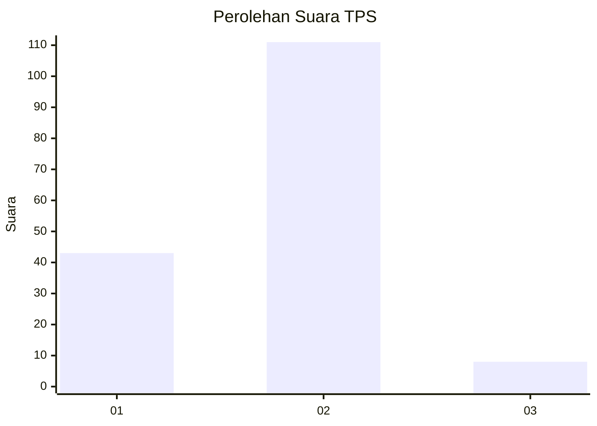
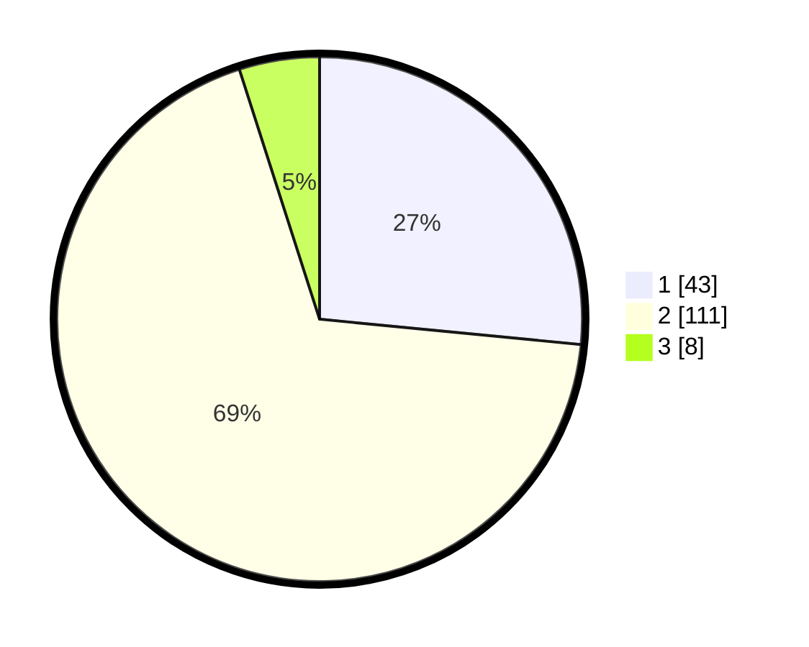

# Hasil

## Grafik

## Tabel

| No. | Nama Paslon    | Suara | Suara (raw) | Persentase |
|:--- |:-------------- | -----:| -----------:| ----------:|
| 1   | ANIES MUHAIMIN | 43    | [43][p-1]   | 26,54      |
| 2   | PRABOWO GIBRAN | 111   | [111][p-2]  | 68,52      |
| 3   | GANJAR MAHFUD  | 8     | [8][p-3]    | 4,94       |

[p-1]: https://github.com/gigit-pemilu/pemilu-2024/blob/main/pilpres/hitung-suara/sub/35-jawa-timur/sub/09-jember/sub/06-tanggul/sub/2005-manggisan/sub/018-tps/sub/paslon-1.txt
[p-2]: https://github.com/gigit-pemilu/pemilu-2024/blob/main/pilpres/hitung-suara/sub/35-jawa-timur/sub/09-jember/sub/06-tanggul/sub/2005-manggisan/sub/018-tps/sub/paslon-2.txt
[p-3]: https://github.com/gigit-pemilu/pemilu-2024/blob/main/pilpres/hitung-suara/sub/35-jawa-timur/sub/09-jember/sub/06-tanggul/sub/2005-manggisan/sub/018-tps/sub/paslon-3.txt

## Foto C Plano

https://sirekap-obj-formc.kpu.go.id/4726/pemilu/ppwp/35/09/06/20/05/3509062005018-20240214-205647--4c9a73cc-8836-49cb-83dd-230a58924421.jpg

https://sirekap-obj-formc.kpu.go.id/4726/pemilu/ppwp/35/09/06/20/05/3509062005018-20240214-205903--d3364e3a-718d-4219-b71d-0cf5db08624c.jpg

https://sirekap-obj-formc.kpu.go.id/4726/pemilu/ppwp/35/09/06/20/05/3509062005018-20240214-210041--25d3584f-0bb0-42d7-8542-98119e9a5f30.jpg

## Metadata

| Key        | Value               |
| ---------- | ------------------- |
| Time Stamp | 2024-02-15 15:00:29 |

