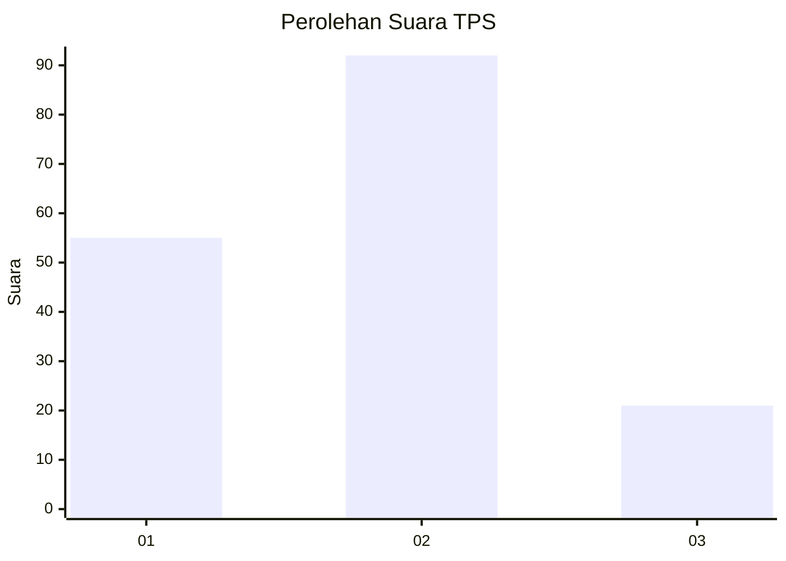
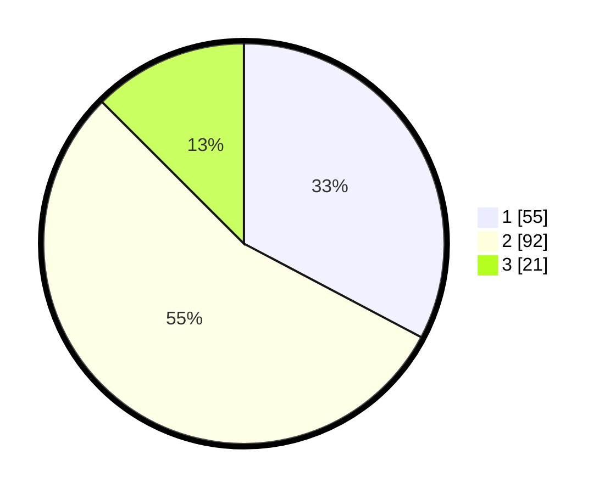

# Hasil

## Grafik

## Tabel

| No. | Nama Paslon    | Suara | Suara (raw) | Persentase |
|:--- |:-------------- | -----:| -----------:| ----------:|
| 1   | ANIES MUHAIMIN | 55    | [55][p-1]   | 32,74      |
| 2   | PRABOWO GIBRAN | 92    | [92][p-2]   | 54,76      |
| 3   | GANJAR MAHFUD  | 21    | [21][p-3]   | 12,50      |

[p-1]: https://github.com/gigit-pemilu/pemilu-2024/blob/main/pilpres/hitung-suara/sub/35-jawa-timur/sub/09-jember/sub/06-tanggul/sub/2005-manggisan/sub/026-tps/sub/paslon-1.txt
[p-2]: https://github.com/gigit-pemilu/pemilu-2024/blob/main/pilpres/hitung-suara/sub/35-jawa-timur/sub/09-jember/sub/06-tanggul/sub/2005-manggisan/sub/026-tps/sub/paslon-2.txt
[p-3]: https://github.com/gigit-pemilu/pemilu-2024/blob/main/pilpres/hitung-suara/sub/35-jawa-timur/sub/09-jember/sub/06-tanggul/sub/2005-manggisan/sub/026-tps/sub/paslon-3.txt

## Foto C Plano

https://sirekap-obj-formc.kpu.go.id/694e/pemilu/ppwp/35/09/06/20/05/3509062005026-20240215-003550--f29c2a91-1922-413a-96b5-c0a32c8dae51.jpg

https://sirekap-obj-formc.kpu.go.id/694e/pemilu/ppwp/35/09/06/20/05/3509062005026-20240215-003922--d9194ef5-5569-4cac-884c-8aba9c04d846.jpg

https://sirekap-obj-formc.kpu.go.id/694e/pemilu/ppwp/35/09/06/20/05/3509062005026-20240215-005046--8615d669-dd1e-4297-9137-8d07b8a3c32b.jpg

## Metadata

| Key        | Value               |
| ---------- | ------------------- |
| Time Stamp | 2024-02-25 15:00:00 |

