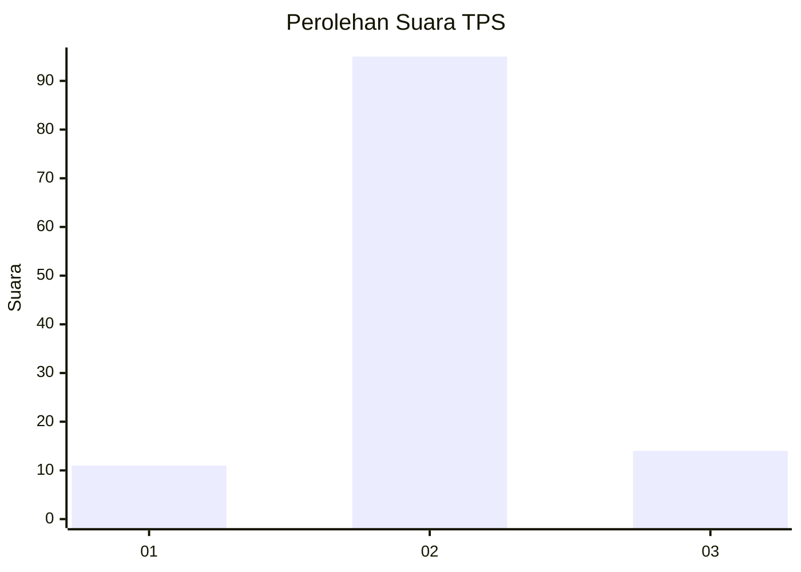
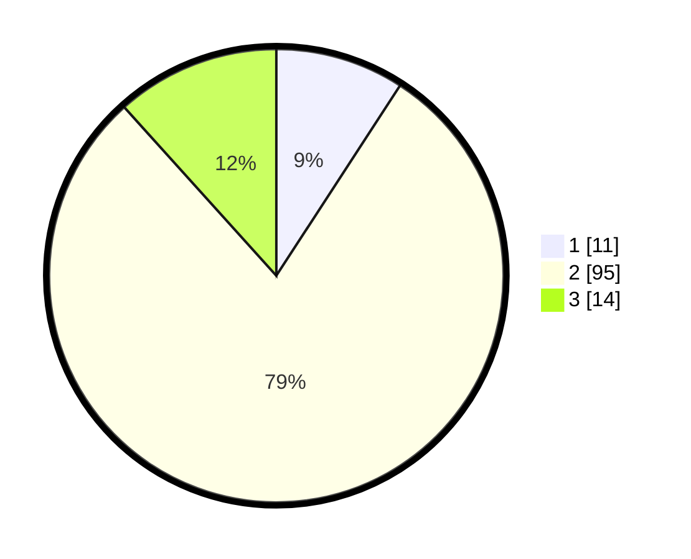

# Hasil

## Grafik

## Tabel

| No. | Nama Paslon    | Suara | Suara (raw) | Persentase |
|:--- |:-------------- | -----:| -----------:| ----------:|
| 1   | ANIES MUHAIMIN | 11    | [11][p-1]   | 9,17       |
| 2   | PRABOWO GIBRAN | 95    | [95][p-2]   | 79,17      |
| 3   | GANJAR MAHFUD  | 14    | [14][p-3]   | 11,67      |

[p-1]: https://github.com/gigit-pemilu/pemilu-2024-35-jawa-timur/blob/main/pilpres/hitung-suara/sub/35-jawa-timur/sub/09-jember/sub/06-tanggul/sub/2005-manggisan/sub/035-tps/sub/paslon-1.txt
[p-2]: https://github.com/gigit-pemilu/pemilu-2024-35-jawa-timur/blob/main/pilpres/hitung-suara/sub/35-jawa-timur/sub/09-jember/sub/06-tanggul/sub/2005-manggisan/sub/035-tps/sub/paslon-2.txt
[p-3]: https://github.com/gigit-pemilu/pemilu-2024-35-jawa-timur/blob/main/pilpres/hitung-suara/sub/35-jawa-timur/sub/09-jember/sub/06-tanggul/sub/2005-manggisan/sub/035-tps/sub/paslon-3.txt

## Foto C Plano

https://sirekap-obj-formc.kpu.go.id/3efa/pemilu/ppwp/35/09/06/20/05/3509062005035-20240215-100419--df347947-ab3e-4efa-8344-327c0beffb4a.jpg

https://sirekap-obj-formc.kpu.go.id/3efa/pemilu/ppwp/35/09/06/20/05/3509062005035-20240214-192300--d198f0aa-1276-4840-884b-cc4c7dc0412f.jpg

https://sirekap-obj-formc.kpu.go.id/3efa/pemilu/ppwp/35/09/06/20/05/3509062005035-20240214-192313--d3168495-abcd-437c-abef-7e63c8571aa4.jpg

## Metadata

| Key        | Value               |
| ---------- | ------------------- |
| Time Stamp | 2024-02-16 16:25:10 |

