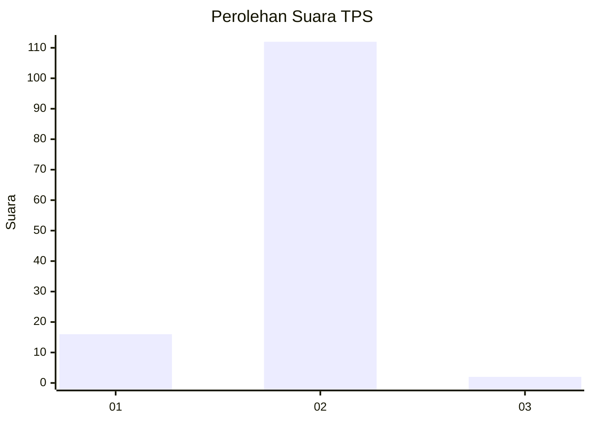
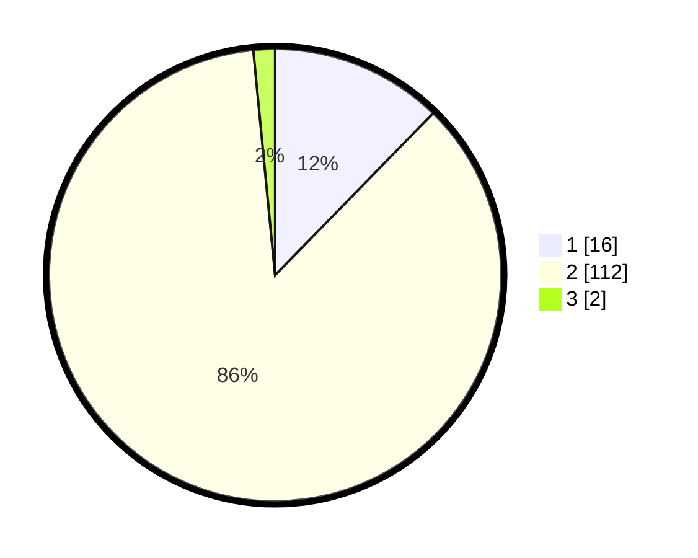

# Hasil

## Grafik

## Tabel

| No. | Nama Paslon    | Suara | Suara (raw) | Persentase |
|:--- |:-------------- | -----:| -----------:| ----------:|
| 1   | ANIES MUHAIMIN | 16    | [16][p-1]   | 12,31      |
| 2   | PRABOWO GIBRAN | 112   | [112][p-2]  | 86,15      |
| 3   | GANJAR MAHFUD  | 2     | [2][p-3]    | 1,54       |

[p-1]: https://github.com/gigit-pemilu/pemilu-2024-35-jawa-timur/blob/main/pilpres/hitung-suara/sub/35-jawa-timur/sub/09-jember/sub/06-tanggul/sub/2005-manggisan/sub/036-tps/sub/paslon-1.txt
[p-2]: https://github.com/gigit-pemilu/pemilu-2024-35-jawa-timur/blob/main/pilpres/hitung-suara/sub/35-jawa-timur/sub/09-jember/sub/06-tanggul/sub/2005-manggisan/sub/036-tps/sub/paslon-2.txt
[p-3]: https://github.com/gigit-pemilu/pemilu-2024-35-jawa-timur/blob/main/pilpres/hitung-suara/sub/35-jawa-timur/sub/09-jember/sub/06-tanggul/sub/2005-manggisan/sub/036-tps/sub/paslon-3.txt

## Foto C Plano

https://sirekap-obj-formc.kpu.go.id/e37e/pemilu/ppwp/35/09/06/20/05/3509062005036-20240215-053821--2ac022b2-e742-4d85-800b-9a105b0106d9.jpg

https://sirekap-obj-formc.kpu.go.id/e37e/pemilu/ppwp/35/09/06/20/05/3509062005036-20240215-053834--00759017-a341-442b-8b6e-57fa0d6cfd44.jpg

https://sirekap-obj-formc.kpu.go.id/e37e/pemilu/ppwp/35/09/06/20/05/3509062005036-20240215-053838--c66c48b0-b094-4c82-a098-4db03bf522dc.jpg

## Metadata

| Key        | Value               |
| ---------- | ------------------- |
| Time Stamp | 2024-02-15 15:30:25 |

