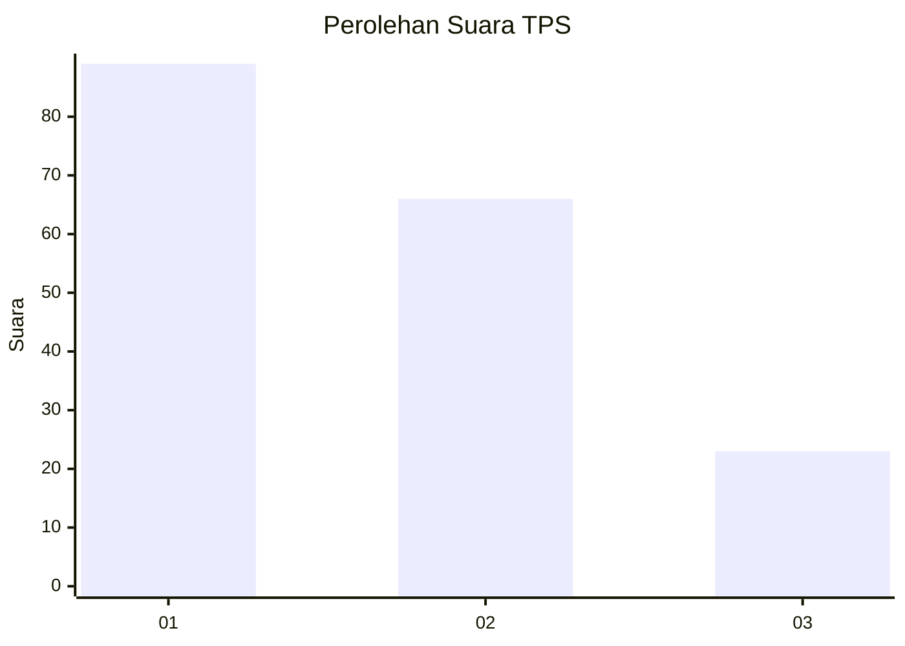
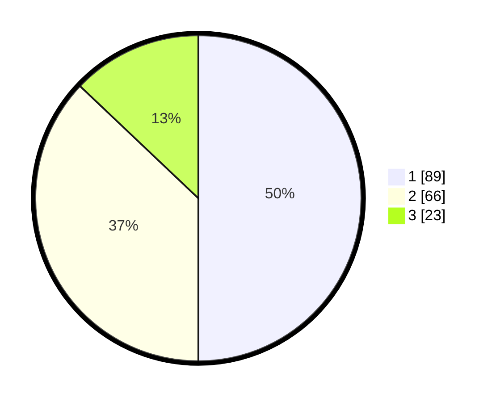

# Hasil

## Grafik

## Tabel

| No. | Nama Paslon    | Suara | Suara (raw) | Persentase |
|:--- |:-------------- | -----:| -----------:| ----------:|
| 1   | ANIES MUHAIMIN | 89    | [89][p-1]   | 50,00      |
| 2   | PRABOWO GIBRAN | 66    | [66][p-2]   | 37,08      |
| 3   | GANJAR MAHFUD  | 23    | [23][p-3]   | 12,92      |

[p-1]: https://github.com/gigit-pemilu/pemilu-2024-35-jawa-timur/blob/main/pilpres/hitung-suara/sub/35-jawa-timur/sub/09-jember/sub/06-tanggul/sub/2006-selodakon/sub/013-tps/sub/paslon-1.txt
[p-2]: https://github.com/gigit-pemilu/pemilu-2024-35-jawa-timur/blob/main/pilpres/hitung-suara/sub/35-jawa-timur/sub/09-jember/sub/06-tanggul/sub/2006-selodakon/sub/013-tps/sub/paslon-2.txt
[p-3]: https://github.com/gigit-pemilu/pemilu-2024-35-jawa-timur/blob/main/pilpres/hitung-suara/sub/35-jawa-timur/sub/09-jember/sub/06-tanggul/sub/2006-selodakon/sub/013-tps/sub/paslon-3.txt

## Foto C Plano

https://sirekap-obj-formc.kpu.go.id/04fb/pemilu/ppwp/35/09/06/20/06/3509062006013-20240220-162000--f53ed22b-2e75-4137-b70d-b8feaf6b114c.jpg

https://sirekap-obj-formc.kpu.go.id/04fb/pemilu/ppwp/35/09/06/20/06/3509062006013-20240214-200710--6e3bdc7e-5dc4-43dd-9dc1-9aa901d15492.jpg

https://sirekap-obj-formc.kpu.go.id/04fb/pemilu/ppwp/35/09/06/20/06/3509062006013-20240214-200827--201bf7cd-f9da-436f-94d7-4280c40db6cb.jpg

## Metadata

| Key        | Value               |
| ---------- | ------------------- |
| Time Stamp | 2024-02-20 17:00:00 |

