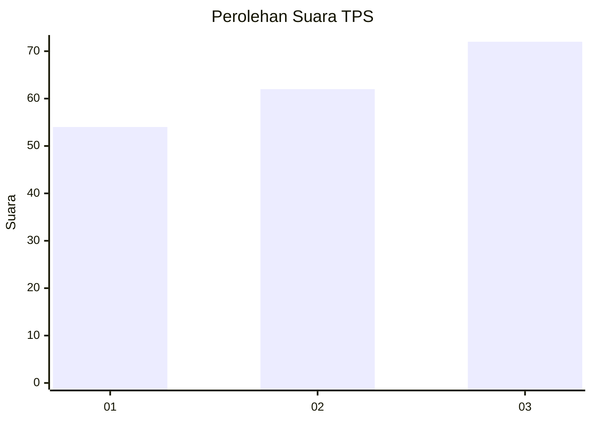
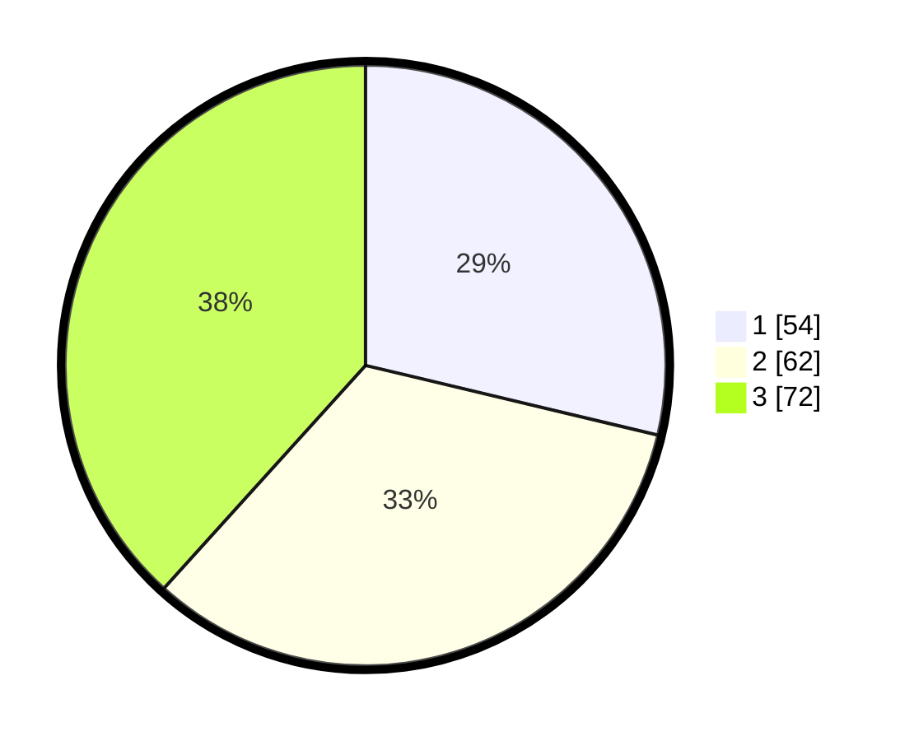

# Hasil

## Grafik

## Tabel

| No. | Nama Paslon    | Suara | Suara (raw) | Persentase |
|:--- |:-------------- | -----:| -----------:| ----------:|
| 1   | ANIES MUHAIMIN | 54    | [54][p-1]   | 28,72      |
| 2   | PRABOWO GIBRAN | 62    | [62][p-2]   | 32,98      |
| 3   | GANJAR MAHFUD  | 72    | [72][p-3]   | 38,30      |

[p-1]: https://github.com/gigit-pemilu/pemilu-2024-35-jawa-timur/blob/main/pilpres/hitung-suara/sub/35-jawa-timur/sub/09-jember/sub/06-tanggul/sub/2006-selodakon/sub/020-tps/sub/paslon-1.txt
[p-2]: https://github.com/gigit-pemilu/pemilu-2024-35-jawa-timur/blob/main/pilpres/hitung-suara/sub/35-jawa-timur/sub/09-jember/sub/06-tanggul/sub/2006-selodakon/sub/020-tps/sub/paslon-2.txt
[p-3]: https://github.com/gigit-pemilu/pemilu-2024-35-jawa-timur/blob/main/pilpres/hitung-suara/sub/35-jawa-timur/sub/09-jember/sub/06-tanggul/sub/2006-selodakon/sub/020-tps/sub/paslon-3.txt

## Foto C Plano

https://sirekap-obj-formc.kpu.go.id/035a/pemilu/ppwp/35/09/06/20/06/3509062006020-20240214-213100--c6f8c918-5707-4edb-b325-30a362f4bf73.jpg

https://sirekap-obj-formc.kpu.go.id/035a/pemilu/ppwp/35/09/06/20/06/3509062006020-20240214-213155--f732c93a-00b0-41a8-972e-62191fcb4ca8.jpg

https://sirekap-obj-formc.kpu.go.id/035a/pemilu/ppwp/35/09/06/20/06/3509062006020-20240214-213412--5db4c6a6-d405-475c-8529-87f59b268966.jpg

## Metadata

| Key        | Value               |
| ---------- | ------------------- |
| Time Stamp | 2024-02-15 15:00:29 |

