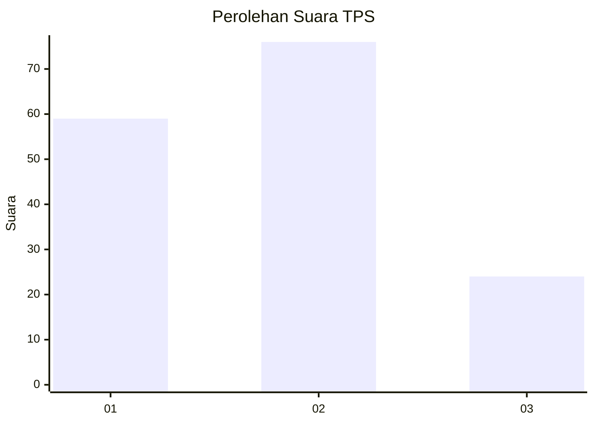
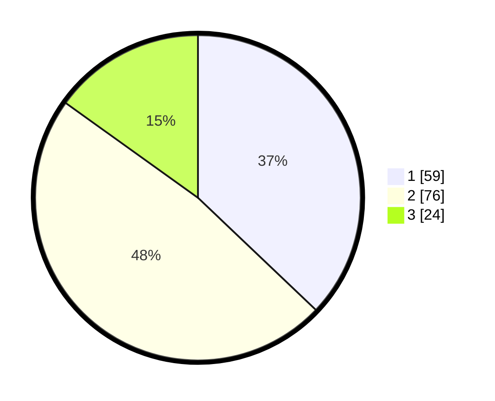

# Hasil

## Grafik

## Tabel

| No. | Nama Paslon    | Suara | Suara (raw) | Persentase |
|:--- |:-------------- | -----:| -----------:| ----------:|
| 1   | ANIES MUHAIMIN | 59    | [59][p-1]   | 37,11      |
| 2   | PRABOWO GIBRAN | 76    | [76][p-2]   | 47,80      |
| 3   | GANJAR MAHFUD  | 24    | [24][p-3]   | 15,09      |

[p-1]: https://github.com/gigit-pemilu/pemilu-2024/blob/main/pilpres/hitung-suara/sub/35-jawa-timur/sub/09-jember/sub/06-tanggul/sub/2007-kramat-sukoharjo/sub/003-tps/sub/paslon-1.txt
[p-2]: https://github.com/gigit-pemilu/pemilu-2024/blob/main/pilpres/hitung-suara/sub/35-jawa-timur/sub/09-jember/sub/06-tanggul/sub/2007-kramat-sukoharjo/sub/003-tps/sub/paslon-2.txt
[p-3]: https://github.com/gigit-pemilu/pemilu-2024/blob/main/pilpres/hitung-suara/sub/35-jawa-timur/sub/09-jember/sub/06-tanggul/sub/2007-kramat-sukoharjo/sub/003-tps/sub/paslon-3.txt

## Foto C Plano

https://sirekap-obj-formc.kpu.go.id/1fb1/pemilu/ppwp/35/09/06/20/07/3509062007003-20240215-011027--8228f0cb-b3e1-4ade-b887-05e66657d29d.jpg

https://sirekap-obj-formc.kpu.go.id/1fb1/pemilu/ppwp/35/09/06/20/07/3509062007003-20240215-011111--62520db7-53ae-403a-9a6f-ae8064fba6fe.jpg

https://sirekap-obj-formc.kpu.go.id/1fb1/pemilu/ppwp/35/09/06/20/07/3509062007003-20240215-011129--44b64117-c443-4c42-a5ba-08587a085804.jpg

## Metadata

| Key        | Value               |
| ---------- | ------------------- |
| Time Stamp | 2024-02-15 12:00:28 |

