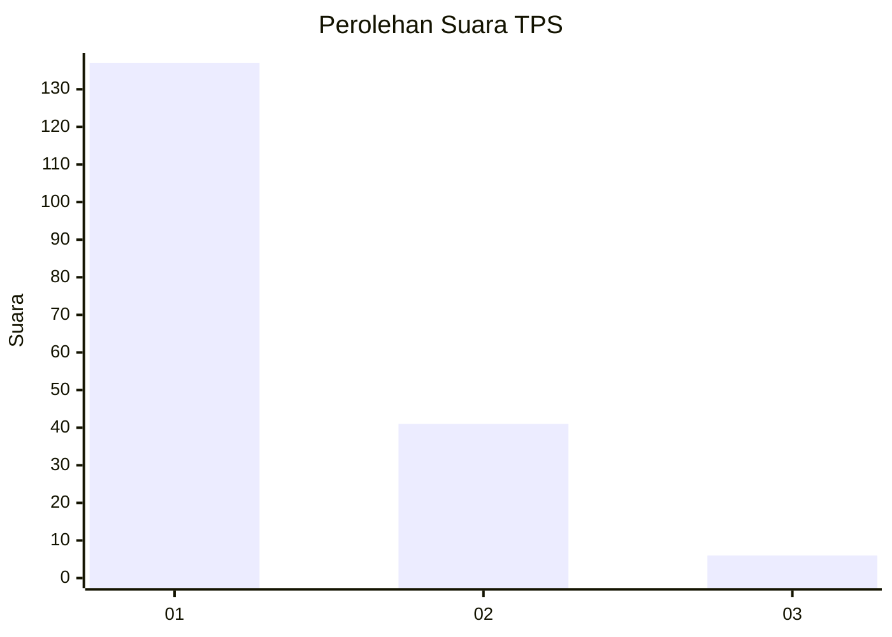
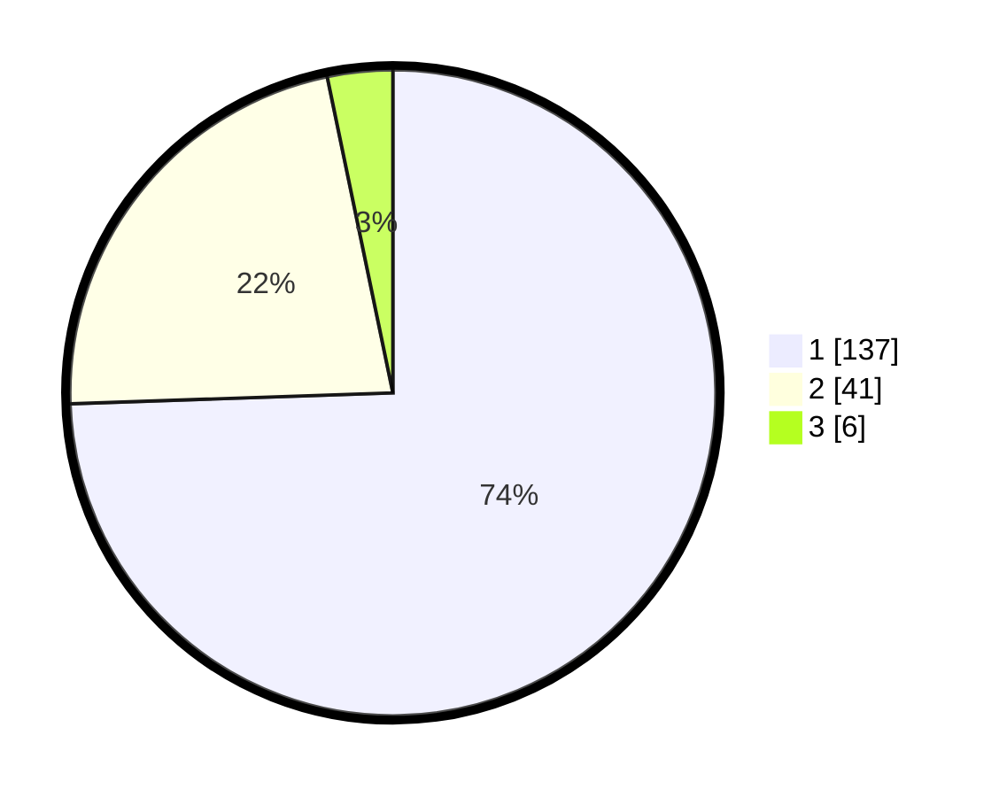

# Hasil

## Grafik

## Tabel

| No. | Nama Paslon    | Suara | Suara (raw) | Persentase |
|:--- |:-------------- | -----:| -----------:| ----------:|
| 1   | ANIES MUHAIMIN | 137   | [137][p-1]  | 74,46      |
| 2   | PRABOWO GIBRAN | 41    | [41][p-2]   | 22,28      |
| 3   | GANJAR MAHFUD  | 6     | [6][p-3]    | 3,26       |

[p-1]: https://github.com/gigit-pemilu/pemilu-2024-35-jawa-timur/blob/main/pilpres/hitung-suara/sub/35-jawa-timur/sub/09-jember/sub/06-tanggul/sub/2007-kramat-sukoharjo/sub/011-tps/sub/paslon-1.txt
[p-2]: https://github.com/gigit-pemilu/pemilu-2024-35-jawa-timur/blob/main/pilpres/hitung-suara/sub/35-jawa-timur/sub/09-jember/sub/06-tanggul/sub/2007-kramat-sukoharjo/sub/011-tps/sub/paslon-2.txt
[p-3]: https://github.com/gigit-pemilu/pemilu-2024-35-jawa-timur/blob/main/pilpres/hitung-suara/sub/35-jawa-timur/sub/09-jember/sub/06-tanggul/sub/2007-kramat-sukoharjo/sub/011-tps/sub/paslon-3.txt

## Foto C Plano

https://sirekap-obj-formc.kpu.go.id/2d0c/pemilu/ppwp/35/09/06/20/07/3509062007011-20240215-024326--8336db1a-ea3e-4921-b167-4a366e595d9e.jpg

https://sirekap-obj-formc.kpu.go.id/2d0c/pemilu/ppwp/35/09/06/20/07/3509062007011-20240216-063003--a414e389-b378-4d22-b3f5-87188aa5d400.jpg

https://sirekap-obj-formc.kpu.go.id/2d0c/pemilu/ppwp/35/09/06/20/07/3509062007011-20240216-063002--40af278c-325d-4f43-ab18-3e3e659d1f87.jpg

## Metadata

| Key        | Value               |
| ---------- | ------------------- |
| Time Stamp | 2024-02-21 22:00:00 |

