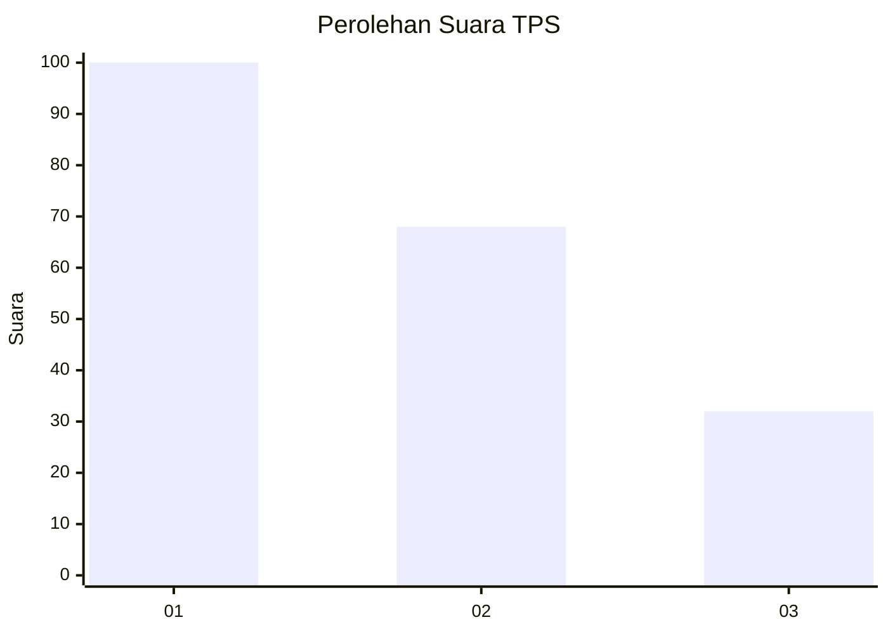
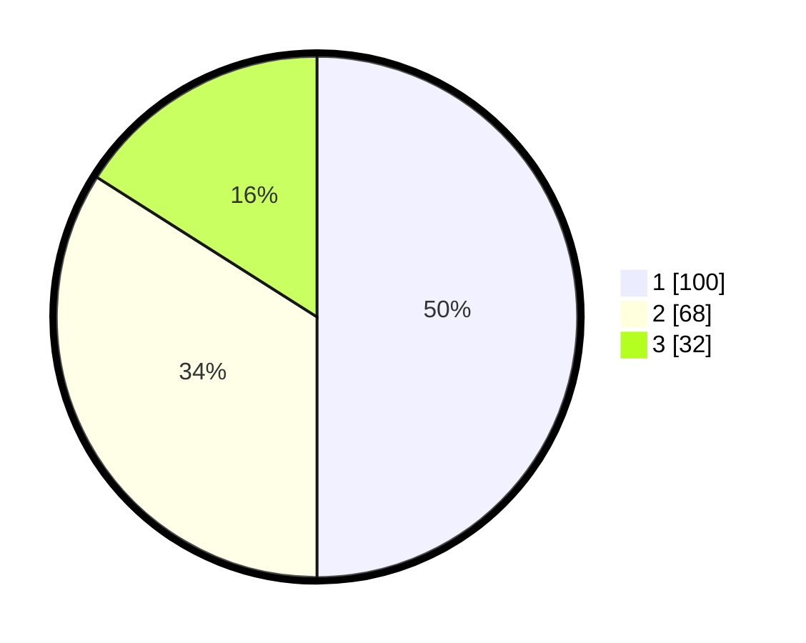

# Hasil

## Grafik

## Tabel

| No. | Nama Paslon    | Suara | Suara (raw) | Persentase |
|:--- |:-------------- | -----:| -----------:| ----------:|
| 1   | ANIES MUHAIMIN | 100   | [100][p-1]  | 50,00      |
| 2   | PRABOWO GIBRAN | 68    | [68][p-2]   | 34,00      |
| 3   | GANJAR MAHFUD  | 32    | [32][p-3]   | 16,00      |

[p-1]: https://github.com/gigit-pemilu/pemilu-2024/blob/main/pilpres/hitung-suara/sub/35-jawa-timur/sub/09-jember/sub/06-tanggul/sub/2007-kramat-sukoharjo/sub/014-tps/sub/paslon-1.txt
[p-2]: https://github.com/gigit-pemilu/pemilu-2024/blob/main/pilpres/hitung-suara/sub/35-jawa-timur/sub/09-jember/sub/06-tanggul/sub/2007-kramat-sukoharjo/sub/014-tps/sub/paslon-2.txt
[p-3]: https://github.com/gigit-pemilu/pemilu-2024/blob/main/pilpres/hitung-suara/sub/35-jawa-timur/sub/09-jember/sub/06-tanggul/sub/2007-kramat-sukoharjo/sub/014-tps/sub/paslon-3.txt

## Foto C Plano

https://sirekap-obj-formc.kpu.go.id/254a/pemilu/ppwp/35/09/06/20/07/3509062007014-20240215-015105--11f35ac8-8145-4d3d-a701-6ffd3e153dfb.jpg

https://sirekap-obj-formc.kpu.go.id/254a/pemilu/ppwp/35/09/06/20/07/3509062007014-20240215-021612--c35381f3-c61d-4699-8712-53a962854bf2.jpg

https://sirekap-obj-formc.kpu.go.id/254a/pemilu/ppwp/35/09/06/20/07/3509062007014-20240215-021908--64eb58a8-b1d8-413f-ab8a-67c726ffb0f4.jpg

## Metadata

| Key        | Value               |
| ---------- | ------------------- |
| Time Stamp | 2024-02-15 16:00:26 |

