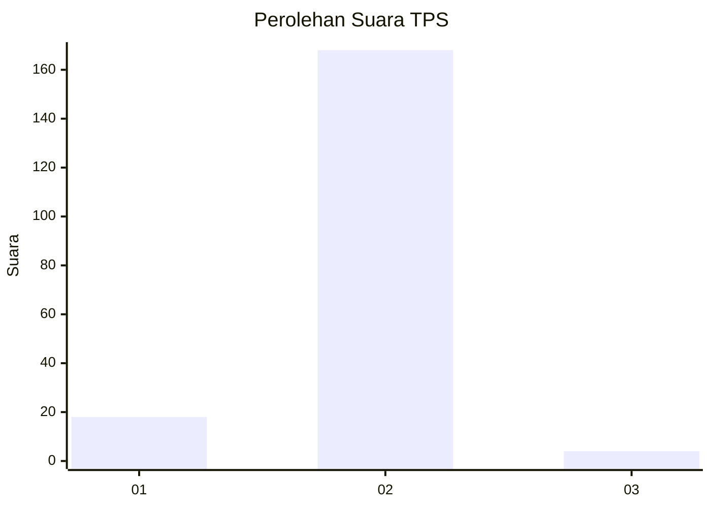
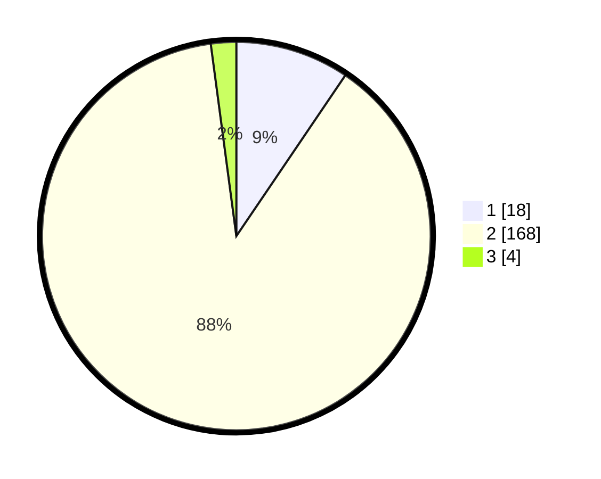

# Hasil

## Grafik

## Tabel

| No. | Nama Paslon    | Suara | Suara (raw) | Persentase |
|:--- |:-------------- | -----:| -----------:| ----------:|
| 1   | ANIES MUHAIMIN | 18    | [18][p-1]   | 9,47       |
| 2   | PRABOWO GIBRAN | 168   | [168][p-2]  | 88,42      |
| 3   | GANJAR MAHFUD  | 4     | [4][p-3]    | 2,11       |

[p-1]: https://github.com/gigit-pemilu/pemilu-2024-35-jawa-timur/blob/main/pilpres/hitung-suara/sub/35-jawa-timur/sub/09-jember/sub/06-tanggul/sub/2008-klatakan/sub/007-tps/sub/paslon-1.txt
[p-2]: https://github.com/gigit-pemilu/pemilu-2024-35-jawa-timur/blob/main/pilpres/hitung-suara/sub/35-jawa-timur/sub/09-jember/sub/06-tanggul/sub/2008-klatakan/sub/007-tps/sub/paslon-2.txt
[p-3]: https://github.com/gigit-pemilu/pemilu-2024-35-jawa-timur/blob/main/pilpres/hitung-suara/sub/35-jawa-timur/sub/09-jember/sub/06-tanggul/sub/2008-klatakan/sub/007-tps/sub/paslon-3.txt

## Foto C Plano

https://sirekap-obj-formc.kpu.go.id/c118/pemilu/ppwp/35/09/06/20/08/3509062008007-20240214-214510--182e45c0-5f12-4c8a-a120-23ef2811ce09.jpg

https://sirekap-obj-formc.kpu.go.id/c118/pemilu/ppwp/35/09/06/20/08/3509062008007-20240214-215323--2a472017-14c7-4a1e-8401-9cde8be0d782.jpg

https://sirekap-obj-formc.kpu.go.id/c118/pemilu/ppwp/35/09/06/20/08/3509062008007-20240214-215618--e8973369-1472-44ae-a7b2-723e308edac4.jpg

## Metadata

| Key        | Value               |
| ---------- | ------------------- |
| Time Stamp | 2024-02-15 16:00:26 |

