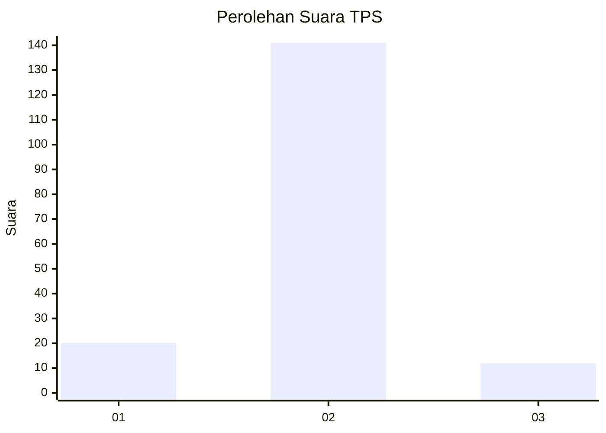
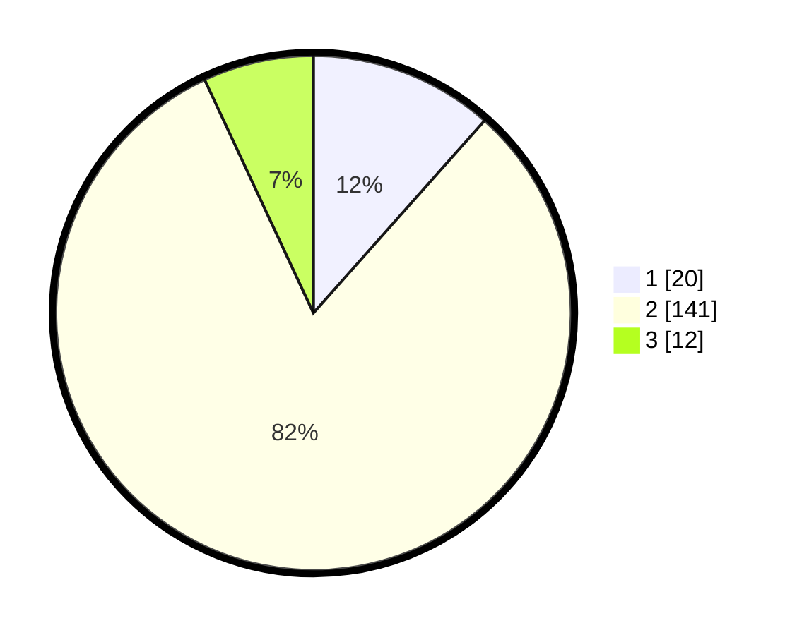

# Hasil

## Grafik

## Tabel

| No. | Nama Paslon    | Suara | Suara (raw) | Persentase |
|:--- |:-------------- | -----:| -----------:| ----------:|
| 1   | ANIES MUHAIMIN | 20    | [20][p-1]   | 11,56      |
| 2   | PRABOWO GIBRAN | 141   | [141][p-2]  | 81,50      |
| 3   | GANJAR MAHFUD  | 12    | [12][p-3]   | 6,94       |

[p-1]: https://github.com/gigit-pemilu/pemilu-2024-35-jawa-timur/blob/main/pilpres/hitung-suara/sub/35-jawa-timur/sub/09-jember/sub/06-tanggul/sub/2008-klatakan/sub/017-tps/sub/paslon-1.txt
[p-2]: https://github.com/gigit-pemilu/pemilu-2024-35-jawa-timur/blob/main/pilpres/hitung-suara/sub/35-jawa-timur/sub/09-jember/sub/06-tanggul/sub/2008-klatakan/sub/017-tps/sub/paslon-2.txt
[p-3]: https://github.com/gigit-pemilu/pemilu-2024-35-jawa-timur/blob/main/pilpres/hitung-suara/sub/35-jawa-timur/sub/09-jember/sub/06-tanggul/sub/2008-klatakan/sub/017-tps/sub/paslon-3.txt

## Foto C Plano

https://sirekap-obj-formc.kpu.go.id/d67a/pemilu/ppwp/35/09/06/20/08/3509062008017-20240214-230114--ace1a52a-cbcc-4646-a493-c74b7806d9f4.jpg

https://sirekap-obj-formc.kpu.go.id/d67a/pemilu/ppwp/35/09/06/20/08/3509062008017-20240214-230201--8d8d9041-8c10-4a1e-93e2-493645e0a476.jpg

https://sirekap-obj-formc.kpu.go.id/d67a/pemilu/ppwp/35/09/06/20/08/3509062008017-20240214-230211--f825f4c0-0554-4c53-9a75-615bb7e30961.jpg

## Metadata

| Key        | Value               |
| ---------- | ------------------- |
| Time Stamp | 2024-02-15 16:00:26 |

