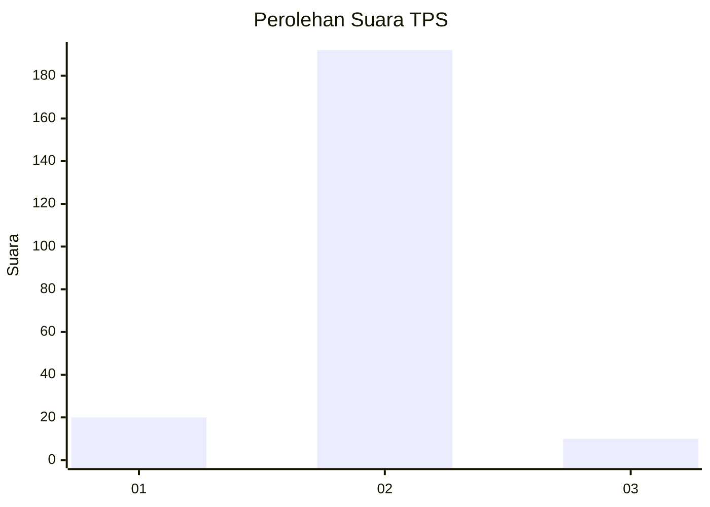
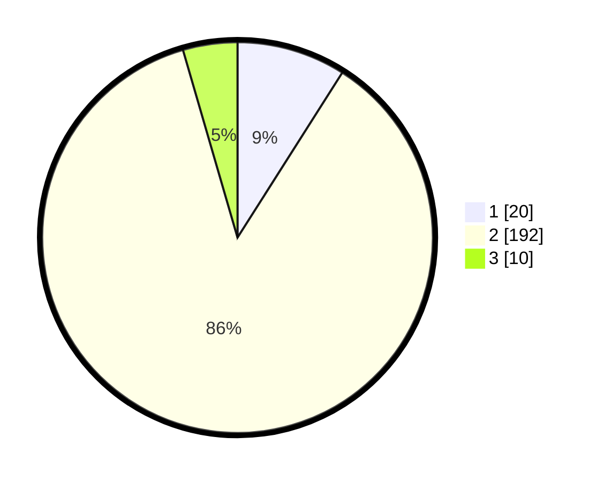

# Hasil

## Grafik

## Tabel

| No. | Nama Paslon    | Suara | Suara (raw) | Persentase |
|:--- |:-------------- | -----:| -----------:| ----------:|
| 1   | ANIES MUHAIMIN | 20    | [20][p-1]   | 9,01       |
| 2   | PRABOWO GIBRAN | 192   | [192][p-2]  | 86,49      |
| 3   | GANJAR MAHFUD  | 10    | [10][p-3]   | 4,50       |

[p-1]: https://github.com/gigit-pemilu/pemilu-2024/blob/main/pilpres/hitung-suara/sub/35-jawa-timur/sub/09-jember/sub/06-tanggul/sub/2008-klatakan/sub/022-tps/sub/paslon-1.txt
[p-2]: https://github.com/gigit-pemilu/pemilu-2024/blob/main/pilpres/hitung-suara/sub/35-jawa-timur/sub/09-jember/sub/06-tanggul/sub/2008-klatakan/sub/022-tps/sub/paslon-2.txt
[p-3]: https://github.com/gigit-pemilu/pemilu-2024/blob/main/pilpres/hitung-suara/sub/35-jawa-timur/sub/09-jember/sub/06-tanggul/sub/2008-klatakan/sub/022-tps/sub/paslon-3.txt

## Foto C Plano

https://sirekap-obj-formc.kpu.go.id/313c/pemilu/ppwp/35/09/06/20/08/3509062008022-20240214-213710--0f0888f6-eb06-4f7d-bf82-7321569b6994.jpg

https://sirekap-obj-formc.kpu.go.id/313c/pemilu/ppwp/35/09/06/20/08/3509062008022-20240214-214054--48918767-c79f-4420-bafc-b31f9bd90d9d.jpg

https://sirekap-obj-formc.kpu.go.id/313c/pemilu/ppwp/35/09/06/20/08/3509062008022-20240214-225632--ea06ecfd-d3b1-4e6a-bb36-e7310c175598.jpg

## Metadata

| Key        | Value               |
| ---------- | ------------------- |
| Time Stamp | 2024-02-25 12:00:00 |

