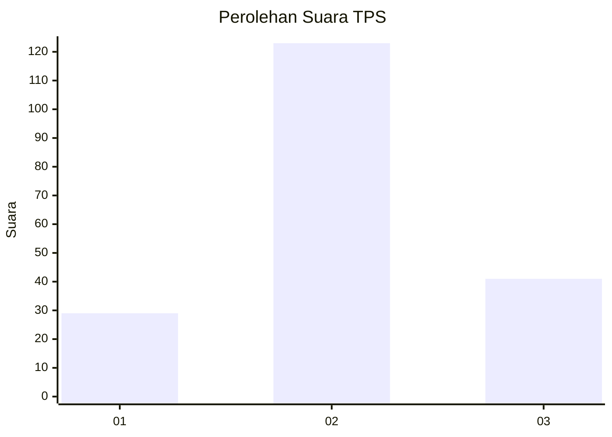
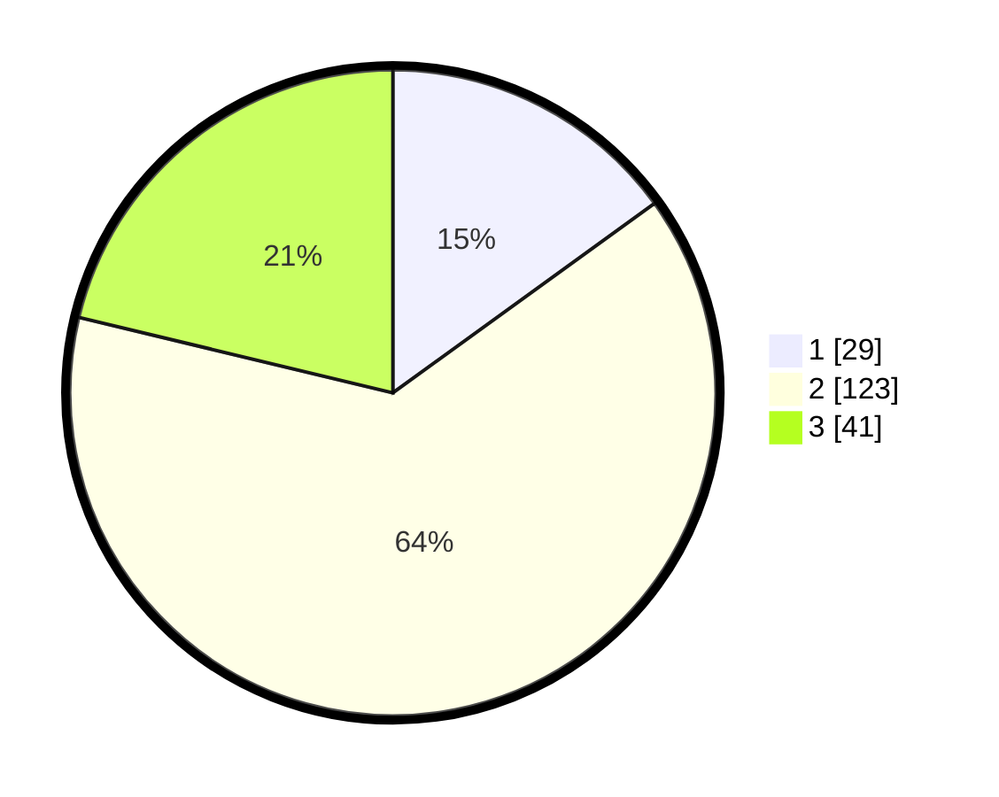

# Hasil

## Grafik

## Tabel

| No. | Nama Paslon    | Suara | Suara (raw) | Persentase |
|:--- |:-------------- | -----:| -----------:| ----------:|
| 1   | ANIES MUHAIMIN | 29    | [29][p-1]   | 15,03      |
| 2   | PRABOWO GIBRAN | 123   | [123][p-2]  | 63,73      |
| 3   | GANJAR MAHFUD  | 41    | [41][p-3]   | 21,24      |

[p-1]: https://github.com/gigit-pemilu/pemilu-2024/blob/main/pilpres/hitung-suara/sub/35-jawa-timur/sub/09-jember/sub/07-semboro/sub/2001-pondokjoyo/sub/006-tps/sub/paslon-1.txt
[p-2]: https://github.com/gigit-pemilu/pemilu-2024/blob/main/pilpres/hitung-suara/sub/35-jawa-timur/sub/09-jember/sub/07-semboro/sub/2001-pondokjoyo/sub/006-tps/sub/paslon-2.txt
[p-3]: https://github.com/gigit-pemilu/pemilu-2024/blob/main/pilpres/hitung-suara/sub/35-jawa-timur/sub/09-jember/sub/07-semboro/sub/2001-pondokjoyo/sub/006-tps/sub/paslon-3.txt

## Foto C Plano

https://sirekap-obj-formc.kpu.go.id/dd19/pemilu/ppwp/35/09/07/20/01/3509072001006-20240214-215229--dddd07d1-3dd3-4609-83d1-f8b3f4d6640a.jpg

https://sirekap-obj-formc.kpu.go.id/dd19/pemilu/ppwp/35/09/07/20/01/3509072001006-20240214-215701--4e2fe5d0-15d9-4560-b742-e9ad99db1385.jpg

https://sirekap-obj-formc.kpu.go.id/dd19/pemilu/ppwp/35/09/07/20/01/3509072001006-20240214-215858--66e6d203-e440-4fe1-b6d6-4676ea78b0e4.jpg

## Metadata

| Key        | Value               |
| ---------- | ------------------- |
| Time Stamp | 2024-02-15 19:00:26 |

