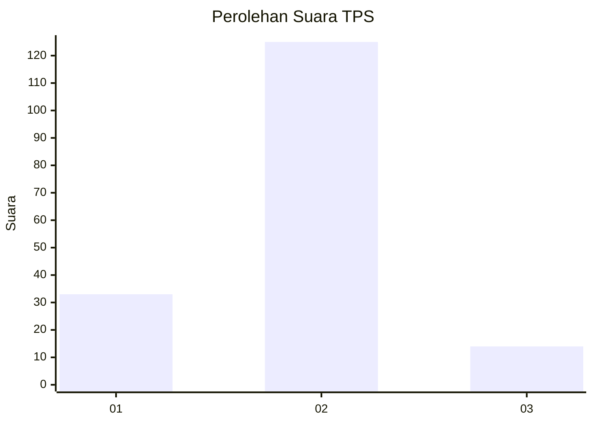
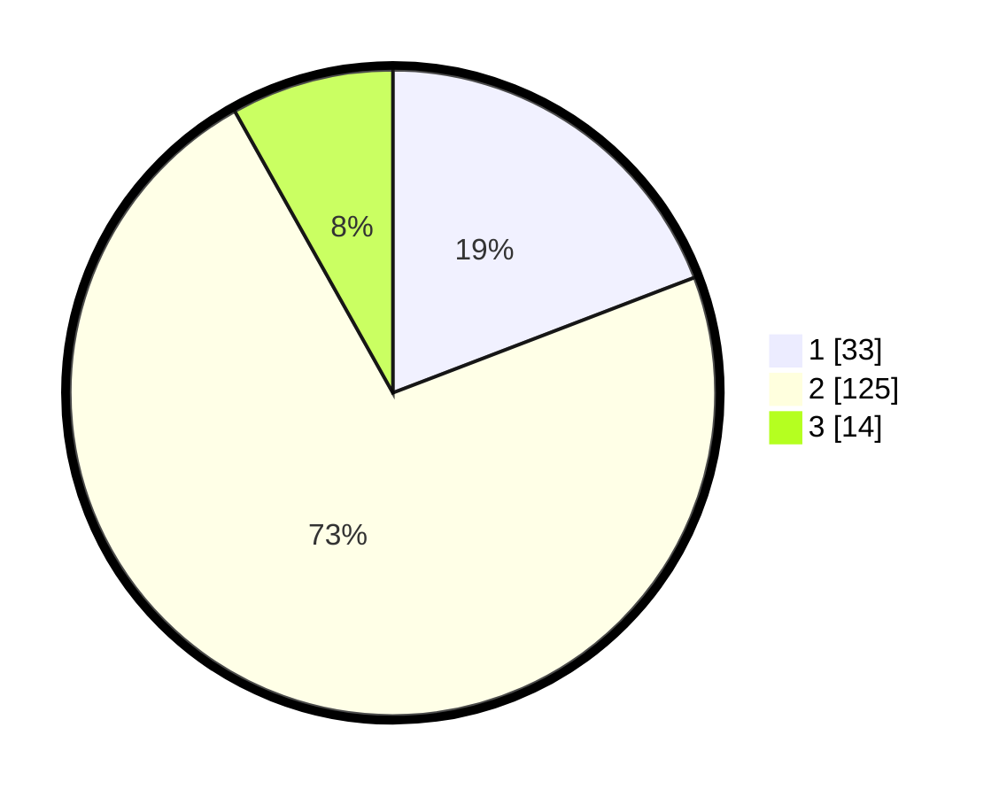

# Hasil

## Grafik

## Tabel

| No. | Nama Paslon    | Suara | Suara (raw) | Persentase |
|:--- |:-------------- | -----:| -----------:| ----------:|
| 1   | ANIES MUHAIMIN | 33    | [33][p-1]   | 19,19      |
| 2   | PRABOWO GIBRAN | 125   | [125][p-2]  | 72,67      |
| 3   | GANJAR MAHFUD  | 14    | [14][p-3]   | 8,14       |

[p-1]: https://github.com/gigit-pemilu/pemilu-2024/blob/main/pilpres/hitung-suara/sub/35-jawa-timur/sub/09-jember/sub/07-semboro/sub/2002-pondokdalem/sub/008-tps/sub/paslon-1.txt
[p-2]: https://github.com/gigit-pemilu/pemilu-2024/blob/main/pilpres/hitung-suara/sub/35-jawa-timur/sub/09-jember/sub/07-semboro/sub/2002-pondokdalem/sub/008-tps/sub/paslon-2.txt
[p-3]: https://github.com/gigit-pemilu/pemilu-2024/blob/main/pilpres/hitung-suara/sub/35-jawa-timur/sub/09-jember/sub/07-semboro/sub/2002-pondokdalem/sub/008-tps/sub/paslon-3.txt

## Foto C Plano

https://sirekap-obj-formc.kpu.go.id/ec88/pemilu/ppwp/35/09/07/20/02/3509072002008-20240214-204604--a51459fb-8cad-47ec-8504-0d849d1dc76c.jpg

https://sirekap-obj-formc.kpu.go.id/ec88/pemilu/ppwp/35/09/07/20/02/3509072002008-20240214-204916--ca4ff1d7-1779-4deb-b17d-f7ff107b1f54.jpg

https://sirekap-obj-formc.kpu.go.id/ec88/pemilu/ppwp/35/09/07/20/02/3509072002008-20240214-220351--63715a81-3109-47b7-b109-d8b31b883967.jpg

## Metadata

| Key        | Value               |
| ---------- | ------------------- |
| Time Stamp | 2024-02-24 22:31:28 |

