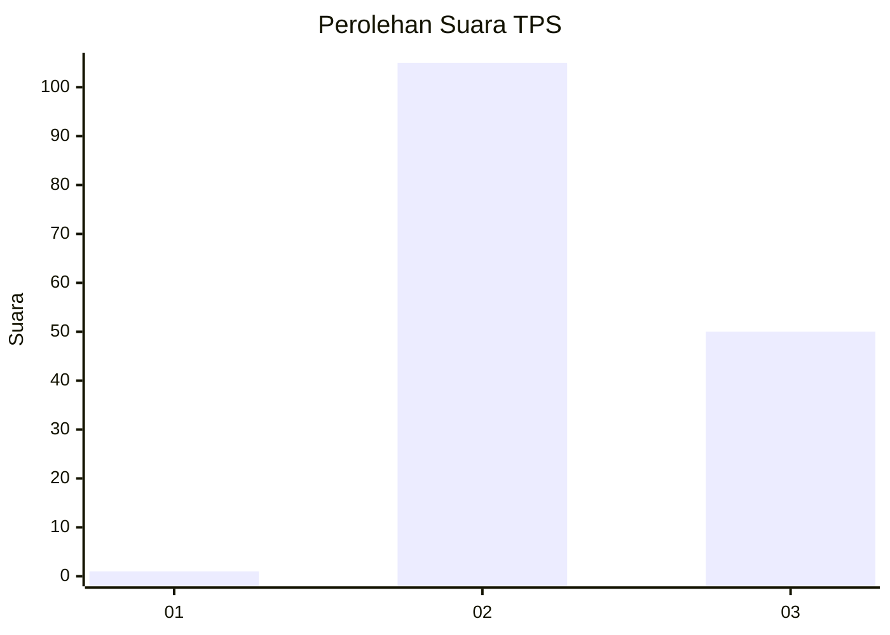
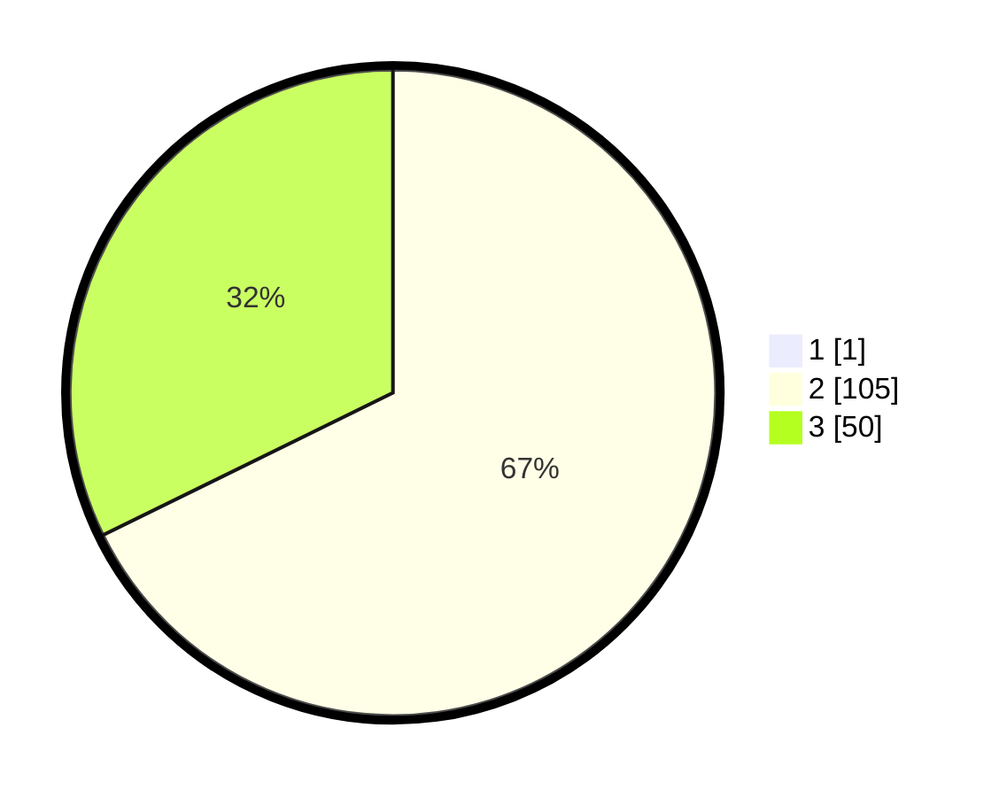

# Hasil

## Grafik

## Tabel

| No. | Nama Paslon    | Suara | Suara (raw) | Persentase |
|:--- |:-------------- | -----:| -----------:| ----------:|
| 1   | ANIES MUHAIMIN | 1     | [1][p-1]    | 0,64       |
| 2   | PRABOWO GIBRAN | 105   | [105][p-2]  | 67,31      |
| 3   | GANJAR MAHFUD  | 50    | [50][p-3]   | 32,05      |

[p-1]: https://github.com/gigit-pemilu/pemilu-2024-35-jawa-timur/blob/main/pilpres/hitung-suara/sub/35-jawa-timur/sub/09-jember/sub/07-semboro/sub/2003-rejoagung/sub/002-tps/sub/paslon-1.txt
[p-2]: https://github.com/gigit-pemilu/pemilu-2024-35-jawa-timur/blob/main/pilpres/hitung-suara/sub/35-jawa-timur/sub/09-jember/sub/07-semboro/sub/2003-rejoagung/sub/002-tps/sub/paslon-2.txt
[p-3]: https://github.com/gigit-pemilu/pemilu-2024-35-jawa-timur/blob/main/pilpres/hitung-suara/sub/35-jawa-timur/sub/09-jember/sub/07-semboro/sub/2003-rejoagung/sub/002-tps/sub/paslon-3.txt

## Foto C Plano

https://sirekap-obj-formc.kpu.go.id/b327/pemilu/ppwp/35/09/07/20/03/3509072003002-20240214-221743--e3127069-0849-4f2f-8bdd-f979210fee98.jpg

https://sirekap-obj-formc.kpu.go.id/b327/pemilu/ppwp/35/09/07/20/03/3509072003002-20240214-221932--ec3fc776-bf9a-4093-9eb6-8da1dc972edf.jpg

https://sirekap-obj-formc.kpu.go.id/b327/pemilu/ppwp/35/09/07/20/03/3509072003002-20240214-222011--37b2f7a7-5f26-4161-aa9e-08d93618b547.jpg

## Metadata

| Key        | Value               |
| ---------- | ------------------- |
| Time Stamp | 2024-02-15 18:30:25 |

