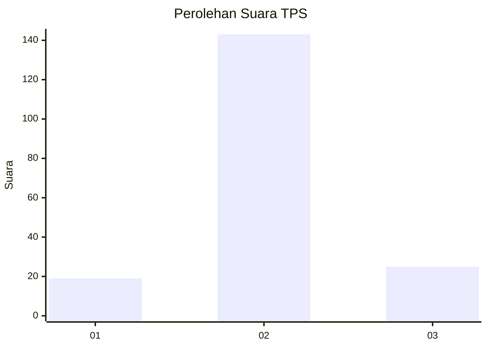
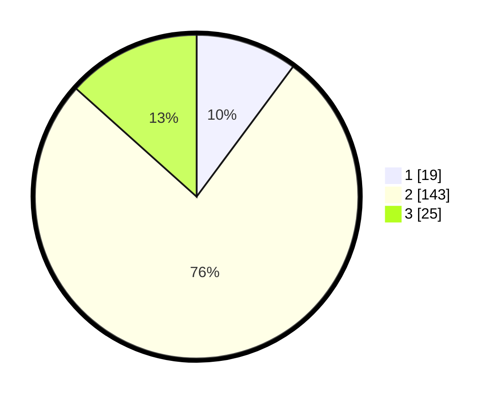

# Hasil

## Grafik

## Tabel

| No. | Nama Paslon    | Suara | Suara (raw) | Persentase |
|:--- |:-------------- | -----:| -----------:| ----------:|
| 1   | ANIES MUHAIMIN | 19    | [19][p-1]   | 10,16      |
| 2   | PRABOWO GIBRAN | 143   | [143][p-2]  | 76,47      |
| 3   | GANJAR MAHFUD  | 25    | [25][p-3]   | 13,37      |

[p-1]: https://github.com/gigit-pemilu/pemilu-2024/blob/main/pilpres/hitung-suara/sub/35-jawa-timur/sub/09-jember/sub/07-semboro/sub/2004-semboro/sub/007-tps/sub/paslon-1.txt
[p-2]: https://github.com/gigit-pemilu/pemilu-2024/blob/main/pilpres/hitung-suara/sub/35-jawa-timur/sub/09-jember/sub/07-semboro/sub/2004-semboro/sub/007-tps/sub/paslon-2.txt
[p-3]: https://github.com/gigit-pemilu/pemilu-2024/blob/main/pilpres/hitung-suara/sub/35-jawa-timur/sub/09-jember/sub/07-semboro/sub/2004-semboro/sub/007-tps/sub/paslon-3.txt

## Foto C Plano

https://sirekap-obj-formc.kpu.go.id/b3df/pemilu/ppwp/35/09/07/20/04/3509072004007-20240215-072911--87d64198-ba25-4b66-9f75-5df2b41be43f.jpg

https://sirekap-obj-formc.kpu.go.id/b3df/pemilu/ppwp/35/09/07/20/04/3509072004007-20240215-110441--1ca72c8f-ff24-4f59-96dc-77908b492cdd.jpg

https://sirekap-obj-formc.kpu.go.id/b3df/pemilu/ppwp/35/09/07/20/04/3509072004007-20240215-072921--fa1b38d9-c038-4d2f-9267-eb561134c620.jpg

## Metadata

| Key        | Value               |
| ---------- | ------------------- |
| Time Stamp | 2024-02-24 22:31:28 |

