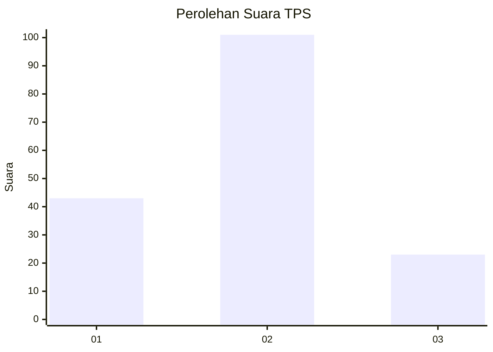
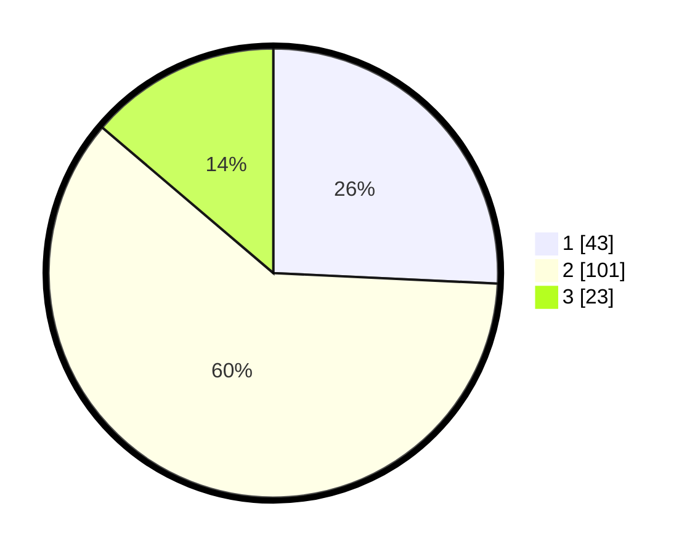

# Hasil

## Grafik

## Tabel

| No. | Nama Paslon    | Suara | Suara (raw) | Persentase |
|:--- |:-------------- | -----:| -----------:| ----------:|
| 1   | ANIES MUHAIMIN | 43    | [43][p-1]   | 25,75      |
| 2   | PRABOWO GIBRAN | 101   | [101][p-2]  | 60,48      |
| 3   | GANJAR MAHFUD  | 23    | [23][p-3]   | 13,77      |

[p-1]: https://github.com/gigit-pemilu/pemilu-2024/blob/main/pilpres/hitung-suara/sub/35-jawa-timur/sub/09-jember/sub/07-semboro/sub/2004-semboro/sub/017-tps/sub/paslon-1.txt
[p-2]: https://github.com/gigit-pemilu/pemilu-2024/blob/main/pilpres/hitung-suara/sub/35-jawa-timur/sub/09-jember/sub/07-semboro/sub/2004-semboro/sub/017-tps/sub/paslon-2.txt
[p-3]: https://github.com/gigit-pemilu/pemilu-2024/blob/main/pilpres/hitung-suara/sub/35-jawa-timur/sub/09-jember/sub/07-semboro/sub/2004-semboro/sub/017-tps/sub/paslon-3.txt

## Foto C Plano

https://sirekap-obj-formc.kpu.go.id/dd6d/pemilu/ppwp/35/09/07/20/04/3509072004017-20240219-192619--a1a3c822-9b61-414a-bac7-3f1cf6a65718.jpg

https://sirekap-obj-formc.kpu.go.id/dd6d/pemilu/ppwp/35/09/07/20/04/3509072004017-20240214-214230--66322085-30d4-4caa-9f17-34252ddb6506.jpg

https://sirekap-obj-formc.kpu.go.id/dd6d/pemilu/ppwp/35/09/07/20/04/3509072004017-20240214-214319--9dc144f8-09eb-4012-adfc-6a1d3877e0e5.jpg

## Metadata

| Key        | Value               |
| ---------- | ------------------- |
| Time Stamp | 2024-02-19 20:00:00 |

