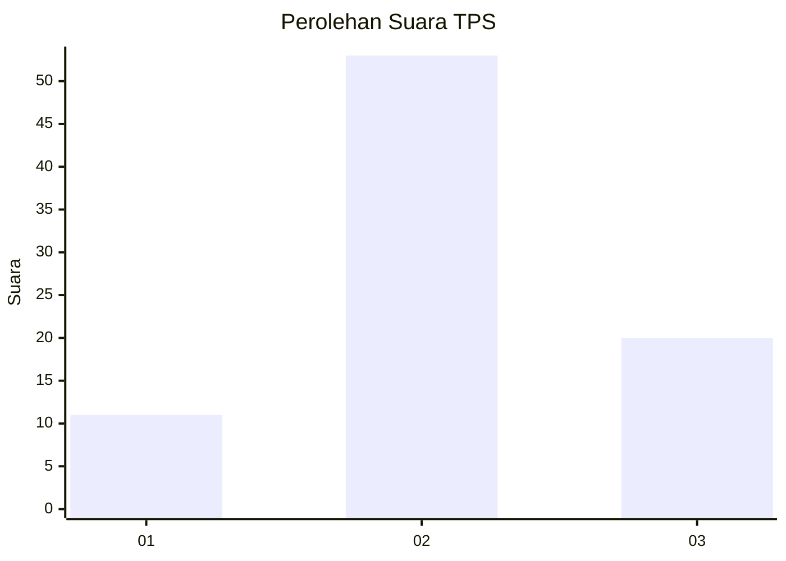
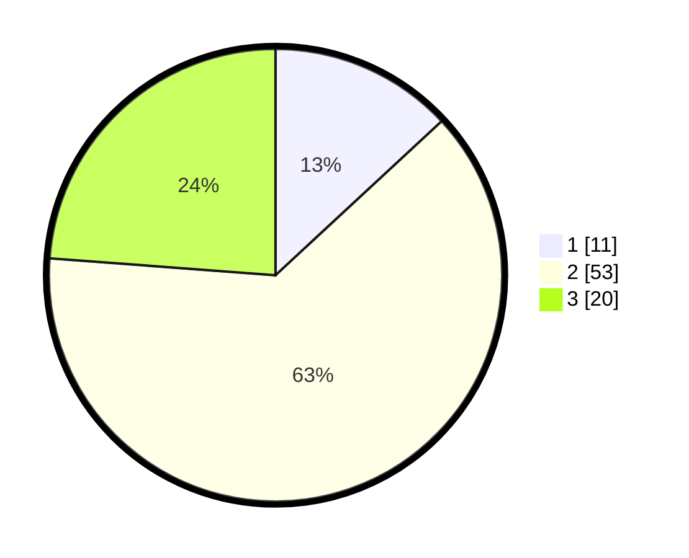

# Hasil

## Grafik

## Tabel

| No. | Nama Paslon    | Suara | Suara (raw) | Persentase |
|:--- |:-------------- | -----:| -----------:| ----------:|
| 1   | ANIES MUHAIMIN | 11    | [11][p-1]   | 13,10      |
| 2   | PRABOWO GIBRAN | 53    | [53][p-2]   | 63,10      |
| 3   | GANJAR MAHFUD  | 20    | [20][p-3]   | 23,81      |

[p-1]: https://github.com/gigit-pemilu/pemilu-2024-35-jawa-timur/blob/main/pilpres/hitung-suara/sub/35-jawa-timur/sub/09-jember/sub/07-semboro/sub/2004-semboro/sub/022-tps/sub/paslon-1.txt
[p-2]: https://github.com/gigit-pemilu/pemilu-2024-35-jawa-timur/blob/main/pilpres/hitung-suara/sub/35-jawa-timur/sub/09-jember/sub/07-semboro/sub/2004-semboro/sub/022-tps/sub/paslon-2.txt
[p-3]: https://github.com/gigit-pemilu/pemilu-2024-35-jawa-timur/blob/main/pilpres/hitung-suara/sub/35-jawa-timur/sub/09-jember/sub/07-semboro/sub/2004-semboro/sub/022-tps/sub/paslon-3.txt

## Foto C Plano

https://sirekap-obj-formc.kpu.go.id/903d/pemilu/ppwp/35/09/07/20/04/3509072004022-20240215-011451--d9065c8b-9619-4a83-9022-4b4ea3f9a91d.jpg

https://sirekap-obj-formc.kpu.go.id/903d/pemilu/ppwp/35/09/07/20/04/3509072004022-20240215-011512--a84344fd-18ed-4a1e-ad2d-2d6319815529.jpg

https://sirekap-obj-formc.kpu.go.id/903d/pemilu/ppwp/35/09/07/20/04/3509072004022-20240215-011532--ca74fbc8-d831-4acd-b528-ef7a3e8aef49.jpg

## Metadata

| Key        | Value               |
| ---------- | ------------------- |
| Time Stamp | 2024-02-25 14:00:00 |

