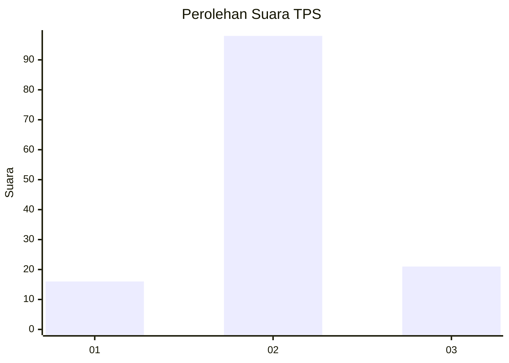
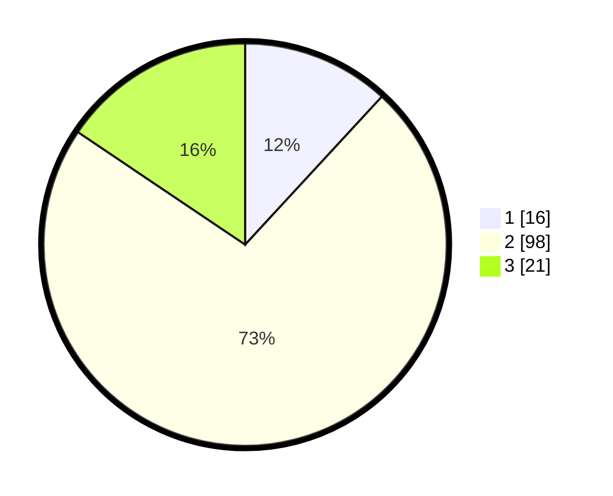

# Hasil

## Grafik

## Tabel

| No. | Nama Paslon    | Suara | Suara (raw) | Persentase |
|:--- |:-------------- | -----:| -----------:| ----------:|
| 1   | ANIES MUHAIMIN | 16    | [16][p-1]   | 11,85      |
| 2   | PRABOWO GIBRAN | 98    | [98][p-2]   | 72,59      |
| 3   | GANJAR MAHFUD  | 21    | [21][p-3]   | 15,56      |

[p-1]: https://github.com/gigit-pemilu/pemilu-2024-35-jawa-timur/blob/main/pilpres/hitung-suara/sub/35-jawa-timur/sub/09-jember/sub/07-semboro/sub/2004-semboro/sub/023-tps/sub/paslon-1.txt
[p-2]: https://github.com/gigit-pemilu/pemilu-2024-35-jawa-timur/blob/main/pilpres/hitung-suara/sub/35-jawa-timur/sub/09-jember/sub/07-semboro/sub/2004-semboro/sub/023-tps/sub/paslon-2.txt
[p-3]: https://github.com/gigit-pemilu/pemilu-2024-35-jawa-timur/blob/main/pilpres/hitung-suara/sub/35-jawa-timur/sub/09-jember/sub/07-semboro/sub/2004-semboro/sub/023-tps/sub/paslon-3.txt

## Foto C Plano

https://sirekap-obj-formc.kpu.go.id/c5eb/pemilu/ppwp/35/09/07/20/04/3509072004023-20240220-115103--6162aa74-31f7-4990-b9f6-58f06958311a.jpg

https://sirekap-obj-formc.kpu.go.id/c5eb/pemilu/ppwp/35/09/07/20/04/3509072004023-20240220-115202--a47370b3-c46c-4526-b082-16c913e82893.jpg

https://sirekap-obj-formc.kpu.go.id/c5eb/pemilu/ppwp/35/09/07/20/04/3509072004023-20240220-114409--a44357a6-a7af-4606-98b8-1d98e86e625e.jpg

## Metadata

| Key        | Value               |
| ---------- | ------------------- |
| Time Stamp | 2024-02-25 20:00:00 |

