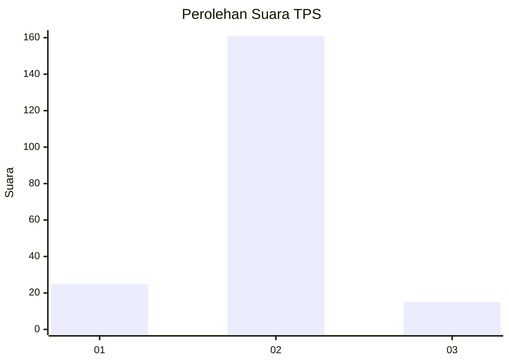
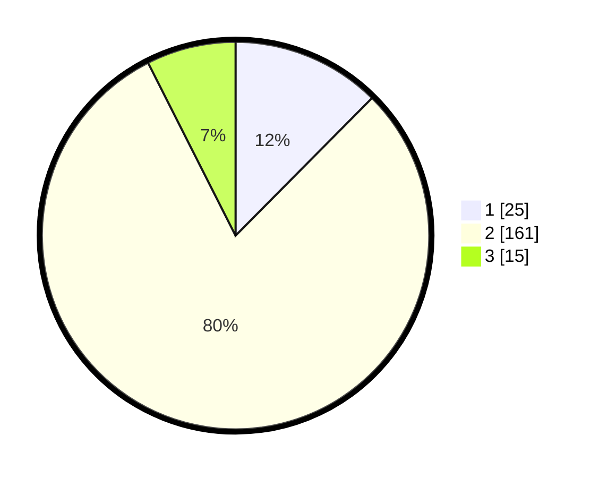

# Hasil

## Grafik

## Tabel

| No. | Nama Paslon    | Suara | Suara (raw) | Persentase |
|:--- |:-------------- | -----:| -----------:| ----------:|
| 1   | ANIES MUHAIMIN | 25    | [25][p-1]   | 12,44      |
| 2   | PRABOWO GIBRAN | 161   | [161][p-2]  | 80,10      |
| 3   | GANJAR MAHFUD  | 15    | [15][p-3]   | 7,46       |

[p-1]: https://github.com/gigit-pemilu/pemilu-2024-35-jawa-timur/blob/main/pilpres/hitung-suara/sub/35-jawa-timur/sub/09-jember/sub/07-semboro/sub/2004-semboro/sub/033-tps/sub/paslon-1.txt
[p-2]: https://github.com/gigit-pemilu/pemilu-2024-35-jawa-timur/blob/main/pilpres/hitung-suara/sub/35-jawa-timur/sub/09-jember/sub/07-semboro/sub/2004-semboro/sub/033-tps/sub/paslon-2.txt
[p-3]: https://github.com/gigit-pemilu/pemilu-2024-35-jawa-timur/blob/main/pilpres/hitung-suara/sub/35-jawa-timur/sub/09-jember/sub/07-semboro/sub/2004-semboro/sub/033-tps/sub/paslon-3.txt

## Foto C Plano

https://sirekap-obj-formc.kpu.go.id/f772/pemilu/ppwp/35/09/07/20/04/3509072004033-20240214-215530--1eb58298-401e-4ee8-a1cb-4fe7510e0b50.jpg

https://sirekap-obj-formc.kpu.go.id/f772/pemilu/ppwp/35/09/07/20/04/3509072004033-20240214-215559--8190ad08-7e45-4650-b211-1f5f650410e8.jpg

https://sirekap-obj-formc.kpu.go.id/f772/pemilu/ppwp/35/09/07/20/04/3509072004033-20240214-215900--a14ea49d-8b10-40cd-9631-9ca0779f3c48.jpg

## Metadata

| Key        | Value               |
| ---------- | ------------------- |
| Time Stamp | 2024-02-24 22:31:28 |

