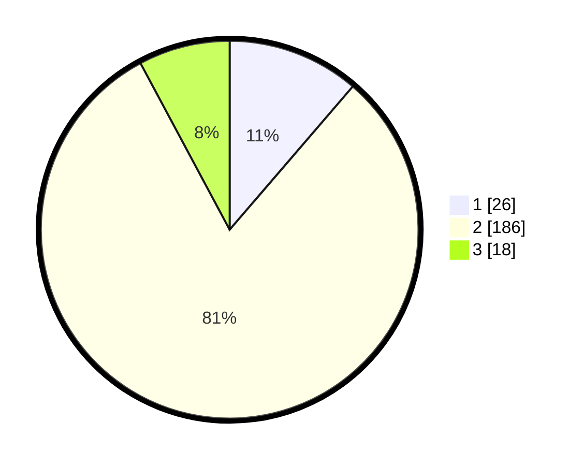

# Hasil

## Grafik

## Tabel

| No. | Nama Paslon    | Suara | Suara (raw) | Persentase |
|:--- |:-------------- | -----:| -----------:| ----------:|
| 1   | ANIES MUHAIMIN | 26    | [26][p-1]   | 11,30      |
| 2   | PRABOWO GIBRAN | 186   | [186][p-2]  | 80,87      |
| 3   | GANJAR MAHFUD  | 18    | [18][p-3]   | 7,83       |

[p-1]: https://github.com/gigit-pemilu/pemilu-2024/blob/main/pilpres/hitung-suara/sub/35-jawa-timur/sub/09-jember/sub/07-semboro/sub/2006-sidomulyo/sub/004-tps/sub/paslon-1.txt
[p-2]: https://github.com/gigit-pemilu/pemilu-2024/blob/main/pilpres/hitung-suara/sub/35-jawa-timur/sub/09-jember/sub/07-semboro/sub/2006-sidomulyo/sub/004-tps/sub/paslon-2.txt
[p-3]: https://github.com/gigit-pemilu/pemilu-2024/blob/main/pilpres/hitung-suara/sub/35-jawa-timur/sub/09-jember/sub/07-semboro/sub/2006-sidomulyo/sub/004-tps/sub/paslon-3.txt

## Foto C Plano

https://sirekap-obj-formc.kpu.go.id/ad6b/pemilu/ppwp/35/09/07/20/06/3509072006004-20240214-223045--7ddbabd8-4821-4d4f-881d-8664a9d5ddb8.jpg

https://sirekap-obj-formc.kpu.go.id/ad6b/pemilu/ppwp/35/09/07/20/06/3509072006004-20240214-223128--cd3543ed-b301-449e-ae23-52b18e88eb1b.jpg

https://sirekap-obj-formc.kpu.go.id/ad6b/pemilu/ppwp/35/09/07/20/06/3509072006004-20240214-223507--3059c538-e341-4f3c-af6d-fe71cc8a2873.jpg

## Metadata

| Key        | Value               |
| ---------- | ------------------- |
| Time Stamp | 2024-02-25 11:00:00 |

