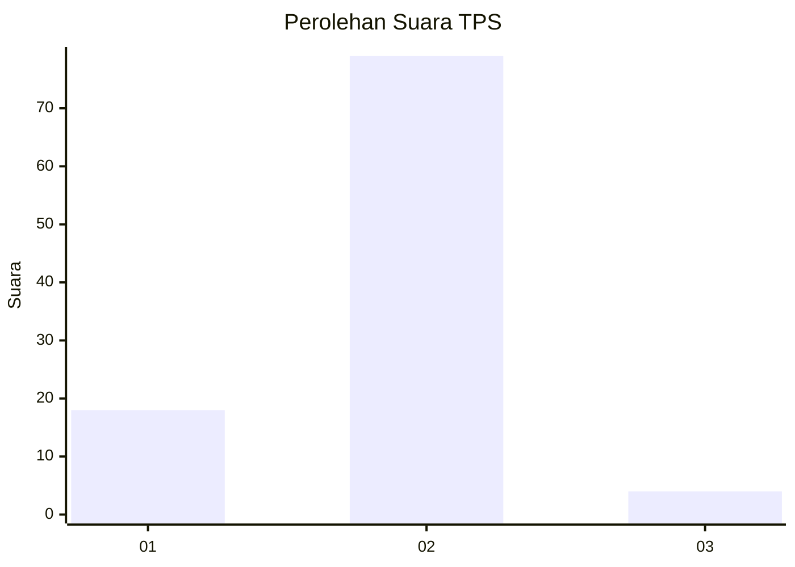
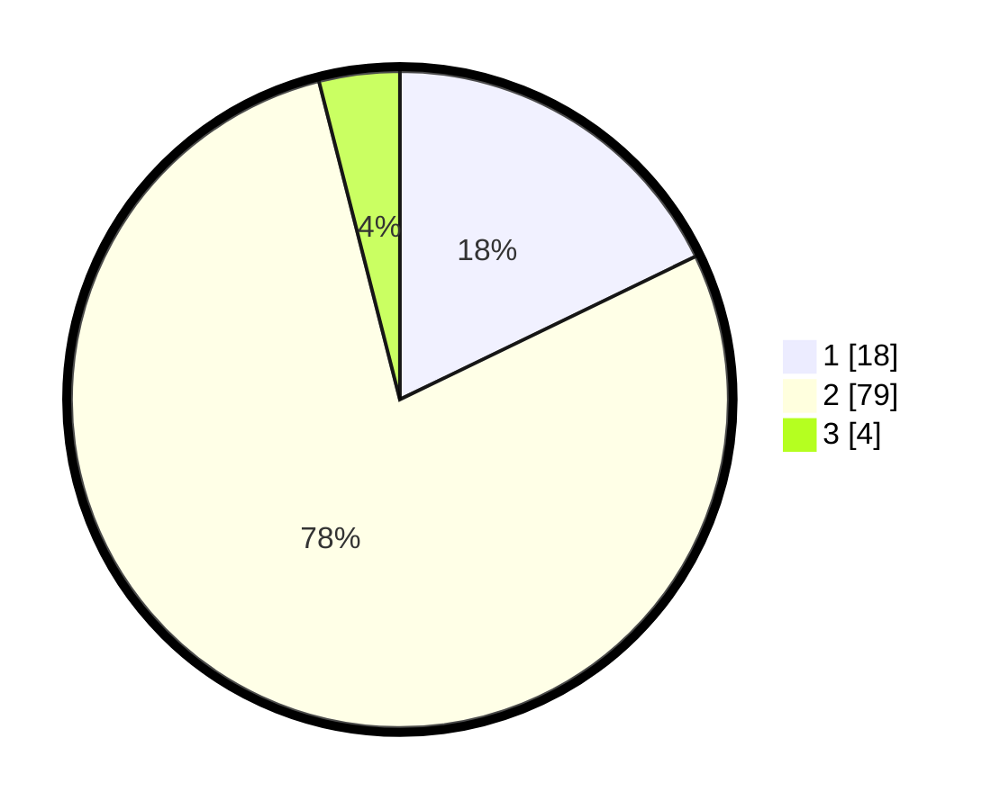

# Hasil

## Grafik

## Tabel

| No. | Nama Paslon    | Suara | Suara (raw) | Persentase |
|:--- |:-------------- | -----:| -----------:| ----------:|
| 1   | ANIES MUHAIMIN | 18    | [18][p-1]   | 17,82      |
| 2   | PRABOWO GIBRAN | 79    | [79][p-2]   | 78,22      |
| 3   | GANJAR MAHFUD  | 4     | [4][p-3]    | 3,96       |

[p-1]: https://github.com/gigit-pemilu/pemilu-2024-35-jawa-timur/blob/main/pilpres/hitung-suara/sub/35-jawa-timur/sub/09-jember/sub/07-semboro/sub/2006-sidomulyo/sub/006-tps/sub/paslon-1.txt
[p-2]: https://github.com/gigit-pemilu/pemilu-2024-35-jawa-timur/blob/main/pilpres/hitung-suara/sub/35-jawa-timur/sub/09-jember/sub/07-semboro/sub/2006-sidomulyo/sub/006-tps/sub/paslon-2.txt
[p-3]: https://github.com/gigit-pemilu/pemilu-2024-35-jawa-timur/blob/main/pilpres/hitung-suara/sub/35-jawa-timur/sub/09-jember/sub/07-semboro/sub/2006-sidomulyo/sub/006-tps/sub/paslon-3.txt

## Foto C Plano

https://sirekap-obj-formc.kpu.go.id/81dc/pemilu/ppwp/35/09/07/20/06/3509072006006-20240214-221442--6835bbe4-c83f-436e-8af8-b9ce64e59b69.jpg

https://sirekap-obj-formc.kpu.go.id/81dc/pemilu/ppwp/35/09/07/20/06/3509072006006-20240214-221456--4f0f1a27-e179-435b-b6eb-d9f88780b476.jpg

https://sirekap-obj-formc.kpu.go.id/81dc/pemilu/ppwp/35/09/07/20/06/3509072006006-20240214-221520--4de0b8a6-a4a9-4d1a-8609-84d5aa1c1447.jpg

## Metadata

| Key        | Value               |
| ---------- | ------------------- |
| Time Stamp | 2024-02-25 13:00:00 |

