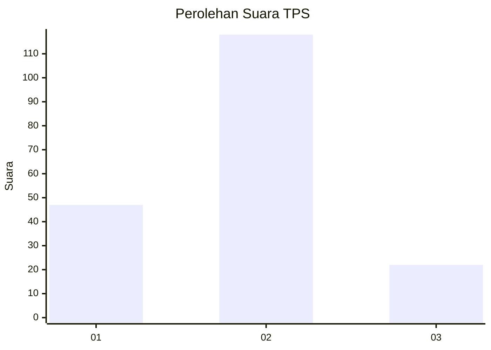
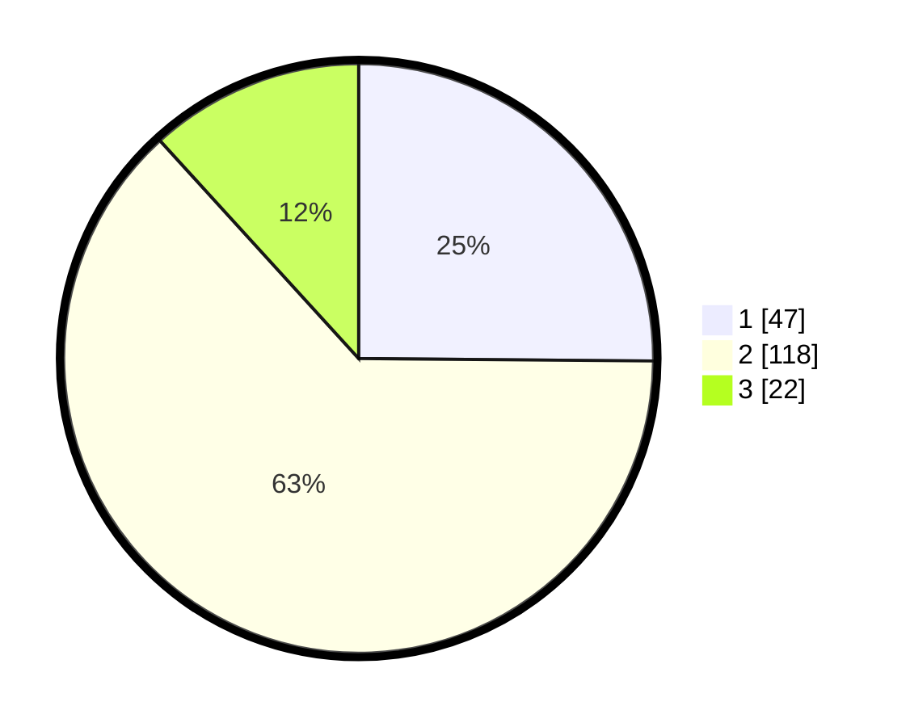

# Hasil

## Grafik

## Tabel

| No. | Nama Paslon    | Suara | Suara (raw) | Persentase |
|:--- |:-------------- | -----:| -----------:| ----------:|
| 1   | ANIES MUHAIMIN | 47    | [47][p-1]   | 25,13      |
| 2   | PRABOWO GIBRAN | 118   | [118][p-2]  | 63,10      |
| 3   | GANJAR MAHFUD  | 22    | [22][p-3]   | 11,76      |

[p-1]: https://github.com/gigit-pemilu/pemilu-2024/blob/main/pilpres/hitung-suara/sub/35-jawa-timur/sub/09-jember/sub/07-semboro/sub/2006-sidomulyo/sub/010-tps/sub/paslon-1.txt
[p-2]: https://github.com/gigit-pemilu/pemilu-2024/blob/main/pilpres/hitung-suara/sub/35-jawa-timur/sub/09-jember/sub/07-semboro/sub/2006-sidomulyo/sub/010-tps/sub/paslon-2.txt
[p-3]: https://github.com/gigit-pemilu/pemilu-2024/blob/main/pilpres/hitung-suara/sub/35-jawa-timur/sub/09-jember/sub/07-semboro/sub/2006-sidomulyo/sub/010-tps/sub/paslon-3.txt

## Foto C Plano

https://sirekap-obj-formc.kpu.go.id/fe5c/pemilu/ppwp/35/09/07/20/06/3509072006010-20240216-150042--dc0bfe04-dea7-4918-a7a9-66e685318606.jpg

https://sirekap-obj-formc.kpu.go.id/fe5c/pemilu/ppwp/35/09/07/20/06/3509072006010-20240216-150012--454b4c41-c175-40d8-b6fa-2e46b4fe88b9.jpg

https://sirekap-obj-formc.kpu.go.id/fe5c/pemilu/ppwp/35/09/07/20/06/3509072006010-20240216-150306--99866e01-c501-439f-a869-e6151b16c3e6.jpg

## Metadata

| Key        | Value               |
| ---------- | ------------------- |
| Time Stamp | 2024-02-25 16:00:00 |

