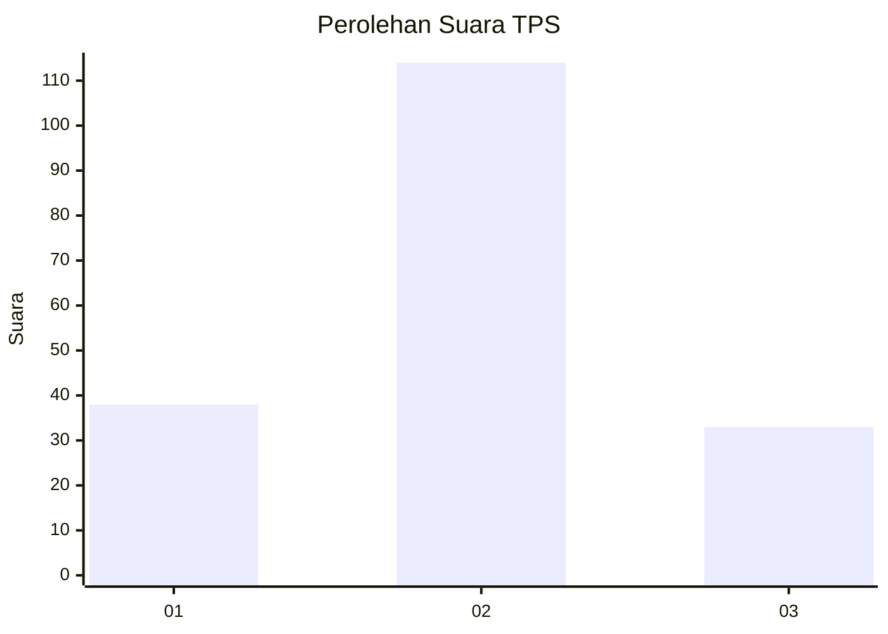

# Hasil

## Grafik

## Tabel

| No. | Nama Paslon    | Suara | Suara (raw) | Persentase |
|:--- |:-------------- | -----:| -----------:| ----------:|
| 1   | ANIES MUHAIMIN | 38    | [38][p-1]   | 20,54      |
| 2   | PRABOWO GIBRAN | 114   | [114][p-2]  | 61,62      |
| 3   | GANJAR MAHFUD  | 33    | [33][p-3]   | 17,84      |

[p-1]: https://github.com/gigit-pemilu/pemilu-2024-35-jawa-timur/blob/main/pilpres/hitung-suara/sub/35-jawa-timur/sub/09-jember/sub/07-semboro/sub/2006-sidomulyo/sub/012-tps/sub/paslon-1.txt
[p-2]: https://github.com/gigit-pemilu/pemilu-2024-35-jawa-timur/blob/main/pilpres/hitung-suara/sub/35-jawa-timur/sub/09-jember/sub/07-semboro/sub/2006-sidomulyo/sub/012-tps/sub/paslon-2.txt
[p-3]: https://github.com/gigit-pemilu/pemilu-2024-35-jawa-timur/blob/main/pilpres/hitung-suara/sub/35-jawa-timur/sub/09-jember/sub/07-semboro/sub/2006-sidomulyo/sub/012-tps/sub/paslon-3.txt

## Foto C Plano

https://sirekap-obj-formc.kpu.go.id/4872/pemilu/ppwp/35/09/07/20/06/3509072006012-20240214-222714--afdd7711-2876-4fda-9687-5bc6001d3cab.jpg

https://sirekap-obj-formc.kpu.go.id/4872/pemilu/ppwp/35/09/07/20/06/3509072006012-20240214-222956--0b27709d-aeeb-43e9-8fd7-000e7f4c3b69.jpg

https://sirekap-obj-formc.kpu.go.id/4872/pemilu/ppwp/35/09/07/20/06/3509072006012-20240214-223235--d9c796a7-15a2-444b-a4ae-ff814d113d3b.jpg

## Metadata

| Key        | Value               |
| ---------- | ------------------- |
| Time Stamp | 2024-02-25 14:00:00 |

