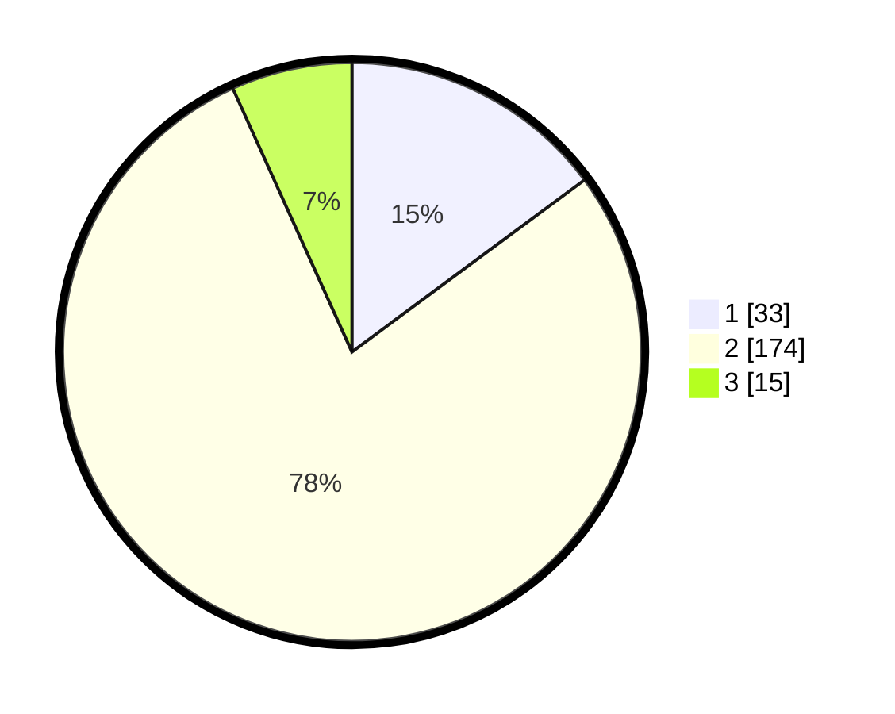

# Hasil

## Grafik

## Tabel

| No. | Nama Paslon    | Suara | Suara (raw) | Persentase |
|:--- |:-------------- | -----:| -----------:| ----------:|
| 1   | ANIES MUHAIMIN | 33    | [33][p-1]   | 14,86      |
| 2   | PRABOWO GIBRAN | 174   | [174][p-2]  | 78,38      |
| 3   | GANJAR MAHFUD  | 15    | [15][p-3]   | 6,76       |

[p-1]: https://github.com/gigit-pemilu/pemilu-2024-35-jawa-timur/blob/main/pilpres/hitung-suara/sub/35-jawa-timur/sub/09-jember/sub/07-semboro/sub/2006-sidomulyo/sub/016-tps/sub/paslon-1.txt
[p-2]: https://github.com/gigit-pemilu/pemilu-2024-35-jawa-timur/blob/main/pilpres/hitung-suara/sub/35-jawa-timur/sub/09-jember/sub/07-semboro/sub/2006-sidomulyo/sub/016-tps/sub/paslon-2.txt
[p-3]: https://github.com/gigit-pemilu/pemilu-2024-35-jawa-timur/blob/main/pilpres/hitung-suara/sub/35-jawa-timur/sub/09-jember/sub/07-semboro/sub/2006-sidomulyo/sub/016-tps/sub/paslon-3.txt

## Foto C Plano

https://sirekap-obj-formc.kpu.go.id/d56e/pemilu/ppwp/35/09/07/20/06/3509072006016-20240214-232050--41575b5b-4ada-4345-8177-6623b9bed6e1.jpg

https://sirekap-obj-formc.kpu.go.id/d56e/pemilu/ppwp/35/09/07/20/06/3509072006016-20240214-231940--e9fba1c3-8aba-442e-91d7-66adfa571976.jpg

https://sirekap-obj-formc.kpu.go.id/d56e/pemilu/ppwp/35/09/07/20/06/3509072006016-20240214-232035--fc73af43-963b-4771-a3fa-4b4093920256.jpg

## Metadata

| Key        | Value               |
| ---------- | ------------------- |
| Time Stamp | 2024-02-15 09:00:24 |

