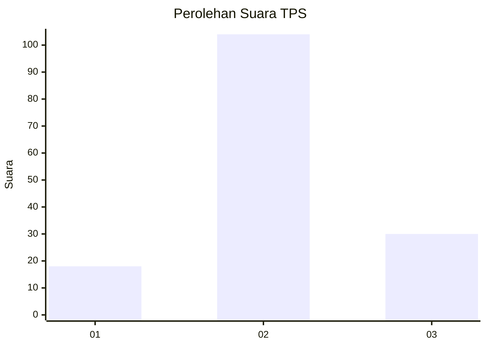
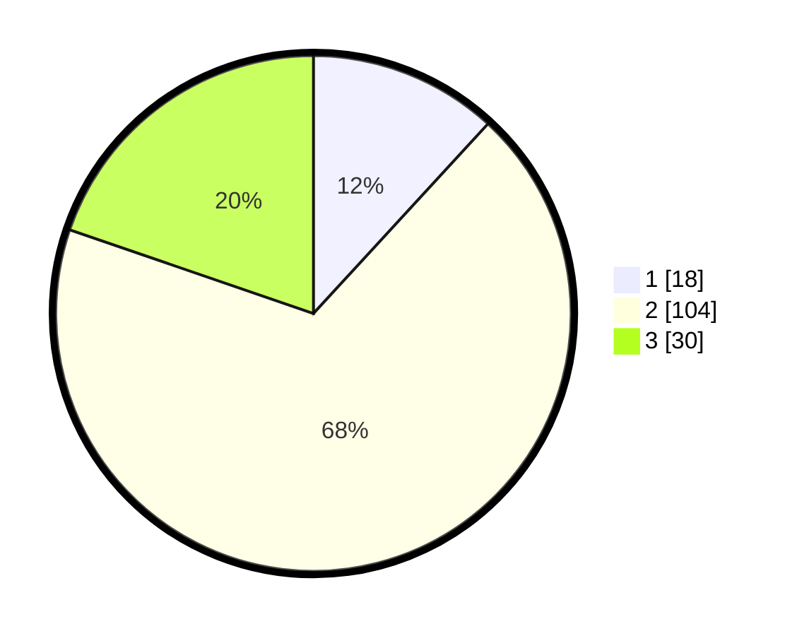

# Hasil

## Grafik

## Tabel

| No. | Nama Paslon    | Suara | Suara (raw) | Persentase |
|:--- |:-------------- | -----:| -----------:| ----------:|
| 1   | ANIES MUHAIMIN | 18    | [18][p-1]   | 11,84      |
| 2   | PRABOWO GIBRAN | 104   | [104][p-2]  | 68,42      |
| 3   | GANJAR MAHFUD  | 30    | [30][p-3]   | 19,74      |

[p-1]: https://github.com/gigit-pemilu/pemilu-2024-35-jawa-timur/blob/main/pilpres/hitung-suara/sub/35-jawa-timur/sub/09-jember/sub/07-semboro/sub/2006-sidomulyo/sub/023-tps/sub/paslon-1.txt
[p-2]: https://github.com/gigit-pemilu/pemilu-2024-35-jawa-timur/blob/main/pilpres/hitung-suara/sub/35-jawa-timur/sub/09-jember/sub/07-semboro/sub/2006-sidomulyo/sub/023-tps/sub/paslon-2.txt
[p-3]: https://github.com/gigit-pemilu/pemilu-2024-35-jawa-timur/blob/main/pilpres/hitung-suara/sub/35-jawa-timur/sub/09-jember/sub/07-semboro/sub/2006-sidomulyo/sub/023-tps/sub/paslon-3.txt

## Foto C Plano

https://sirekap-obj-formc.kpu.go.id/9380/pemilu/ppwp/35/09/07/20/06/3509072006023-20240214-220812--1c46b34b-5140-4ec7-8828-0b048a28c80c.jpg

https://sirekap-obj-formc.kpu.go.id/9380/pemilu/ppwp/35/09/07/20/06/3509072006023-20240214-220851--80a570a4-b3ed-414e-a2f5-5f00c3c4688a.jpg

https://sirekap-obj-formc.kpu.go.id/9380/pemilu/ppwp/35/09/07/20/06/3509072006023-20240214-220925--67f0b640-4969-4085-adb0-6effe528445c.jpg

## Metadata

| Key        | Value               |
| ---------- | ------------------- |
| Time Stamp | 2024-02-25 17:00:00 |

