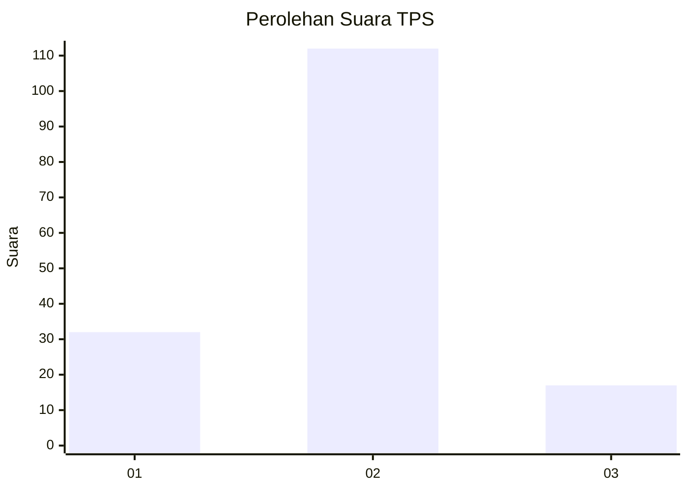
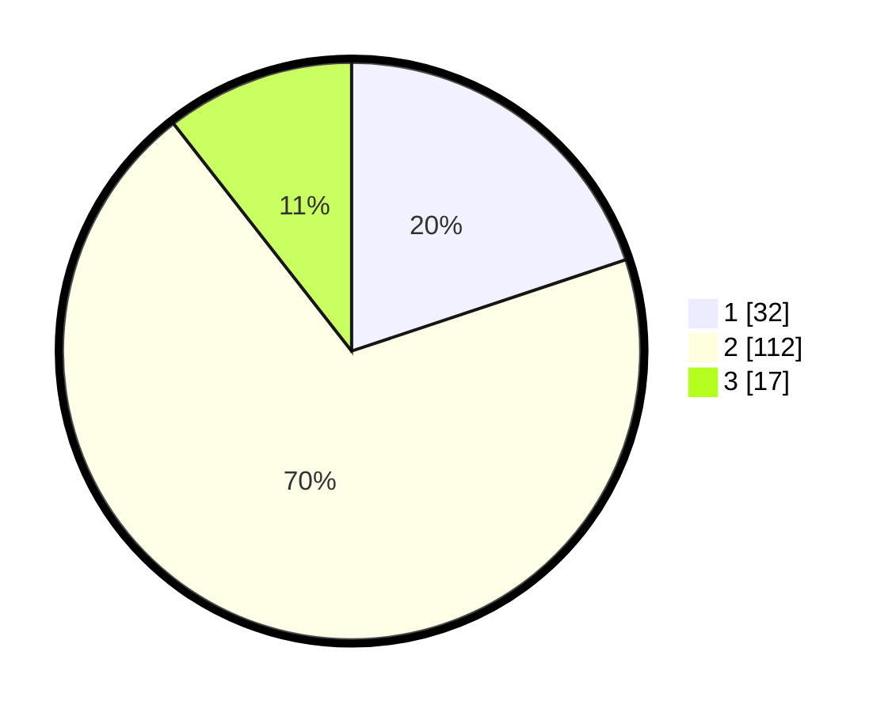

# Hasil

## Grafik

## Tabel

| No. | Nama Paslon    | Suara | Suara (raw) | Persentase |
|:--- |:-------------- | -----:| -----------:| ----------:|
| 1   | ANIES MUHAIMIN | 32    | [32][p-1]   | 19,88      |
| 2   | PRABOWO GIBRAN | 112   | [112][p-2]  | 69,57      |
| 3   | GANJAR MAHFUD  | 17    | [17][p-3]   | 10,56      |

[p-1]: https://github.com/gigit-pemilu/pemilu-2024-35-jawa-timur/blob/main/pilpres/hitung-suara/sub/35-jawa-timur/sub/09-jember/sub/08-puger/sub/2001-mlokorejo/sub/004-tps/sub/paslon-1.txt
[p-2]: https://github.com/gigit-pemilu/pemilu-2024-35-jawa-timur/blob/main/pilpres/hitung-suara/sub/35-jawa-timur/sub/09-jember/sub/08-puger/sub/2001-mlokorejo/sub/004-tps/sub/paslon-2.txt
[p-3]: https://github.com/gigit-pemilu/pemilu-2024-35-jawa-timur/blob/main/pilpres/hitung-suara/sub/35-jawa-timur/sub/09-jember/sub/08-puger/sub/2001-mlokorejo/sub/004-tps/sub/paslon-3.txt

## Foto C Plano

https://sirekap-obj-formc.kpu.go.id/7bac/pemilu/ppwp/35/09/08/20/01/3509082001004-20240214-235802--9e1c2479-d586-409e-82f7-89ce8fe5a56a.jpg

https://sirekap-obj-formc.kpu.go.id/7bac/pemilu/ppwp/35/09/08/20/01/3509082001004-20240214-235930--0a858859-88cc-46f2-af09-dd8678e8a597.jpg

https://sirekap-obj-formc.kpu.go.id/7bac/pemilu/ppwp/35/09/08/20/01/3509082001004-20240215-000020--29feca6f-e47e-4ab8-8ac4-3ca292bf9f0f.jpg

## Metadata

| Key        | Value               |
| ---------- | ------------------- |
| Time Stamp | 2024-02-16 12:51:22 |

