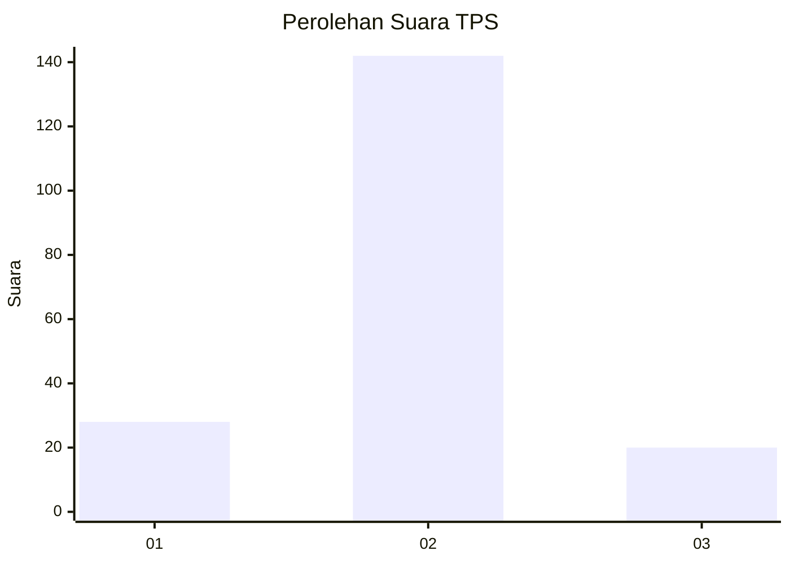
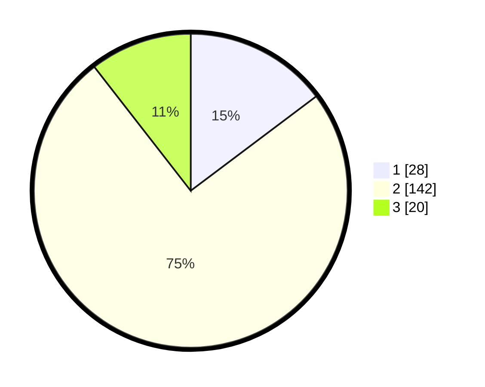

# Hasil

## Grafik

## Tabel

| No. | Nama Paslon    | Suara | Suara (raw) | Persentase |
|:--- |:-------------- | -----:| -----------:| ----------:|
| 1   | ANIES MUHAIMIN | 28    | [28][p-1]   | 14,74      |
| 2   | PRABOWO GIBRAN | 142   | [142][p-2]  | 74,74      |
| 3   | GANJAR MAHFUD  | 20    | [20][p-3]   | 10,53      |

[p-1]: https://github.com/gigit-pemilu/pemilu-2024/blob/main/pilpres/hitung-suara/sub/35-jawa-timur/sub/09-jember/sub/08-puger/sub/2001-mlokorejo/sub/007-tps/sub/paslon-1.txt
[p-2]: https://github.com/gigit-pemilu/pemilu-2024/blob/main/pilpres/hitung-suara/sub/35-jawa-timur/sub/09-jember/sub/08-puger/sub/2001-mlokorejo/sub/007-tps/sub/paslon-2.txt
[p-3]: https://github.com/gigit-pemilu/pemilu-2024/blob/main/pilpres/hitung-suara/sub/35-jawa-timur/sub/09-jember/sub/08-puger/sub/2001-mlokorejo/sub/007-tps/sub/paslon-3.txt

## Foto C Plano

https://sirekap-obj-formc.kpu.go.id/eaae/pemilu/ppwp/35/09/08/20/01/3509082001007-20240215-022842--fb02fb33-5d0e-425f-bb14-2c92dd378d92.jpg

https://sirekap-obj-formc.kpu.go.id/eaae/pemilu/ppwp/35/09/08/20/01/3509082001007-20240215-022904--18a09925-ea9e-4a1b-9a4d-dad0e7aa5489.jpg

https://sirekap-obj-formc.kpu.go.id/eaae/pemilu/ppwp/35/09/08/20/01/3509082001007-20240215-023042--f8b521a0-b448-42fc-90cf-f7987bdf0692.jpg

## Metadata

| Key        | Value               |
| ---------- | ------------------- |
| Time Stamp | 2024-02-16 12:51:22 |

