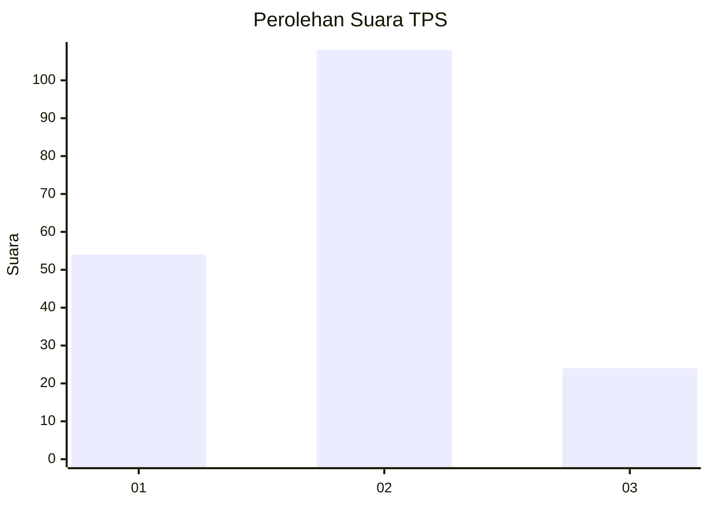
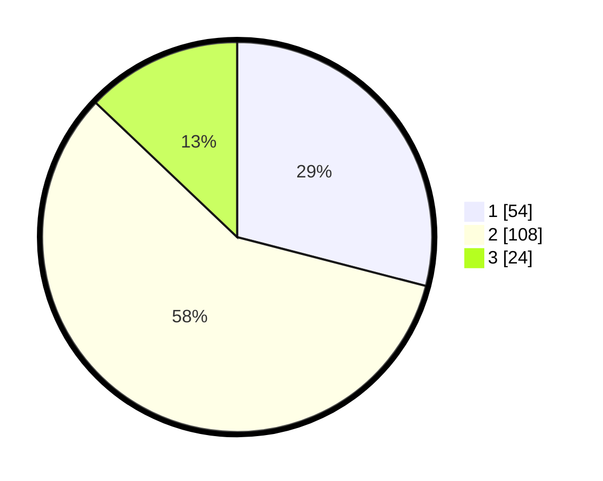

# Hasil

## Grafik

## Tabel

| No. | Nama Paslon    | Suara | Suara (raw) | Persentase |
|:--- |:-------------- | -----:| -----------:| ----------:|
| 1   | ANIES MUHAIMIN | 54    | [54][p-1]   | 29,03      |
| 2   | PRABOWO GIBRAN | 108   | [108][p-2]  | 58,06      |
| 3   | GANJAR MAHFUD  | 24    | [24][p-3]   | 12,90      |

[p-1]: https://github.com/gigit-pemilu/pemilu-2024-35-jawa-timur/blob/main/pilpres/hitung-suara/sub/35-jawa-timur/sub/09-jember/sub/08-puger/sub/2001-mlokorejo/sub/015-tps/sub/paslon-1.txt
[p-2]: https://github.com/gigit-pemilu/pemilu-2024-35-jawa-timur/blob/main/pilpres/hitung-suara/sub/35-jawa-timur/sub/09-jember/sub/08-puger/sub/2001-mlokorejo/sub/015-tps/sub/paslon-2.txt
[p-3]: https://github.com/gigit-pemilu/pemilu-2024-35-jawa-timur/blob/main/pilpres/hitung-suara/sub/35-jawa-timur/sub/09-jember/sub/08-puger/sub/2001-mlokorejo/sub/015-tps/sub/paslon-3.txt

## Foto C Plano

https://sirekap-obj-formc.kpu.go.id/a661/pemilu/ppwp/35/09/08/20/01/3509082001015-20240224-151358--7bc04803-dee1-4381-bffb-12c541c80e2c.jpg

https://sirekap-obj-formc.kpu.go.id/a661/pemilu/ppwp/35/09/08/20/01/3509082001015-20240224-151615--9432ceff-f3e1-4e0d-9c2d-32487292b209.jpg

https://sirekap-obj-formc.kpu.go.id/a661/pemilu/ppwp/35/09/08/20/01/3509082001015-20240217-205925--8b2b12bd-a1da-4af8-8e5b-2abbc6443d7f.jpg

## Metadata

| Key        | Value               |
| ---------- | ------------------- |
| Time Stamp | 2024-02-24 22:31:28 |

