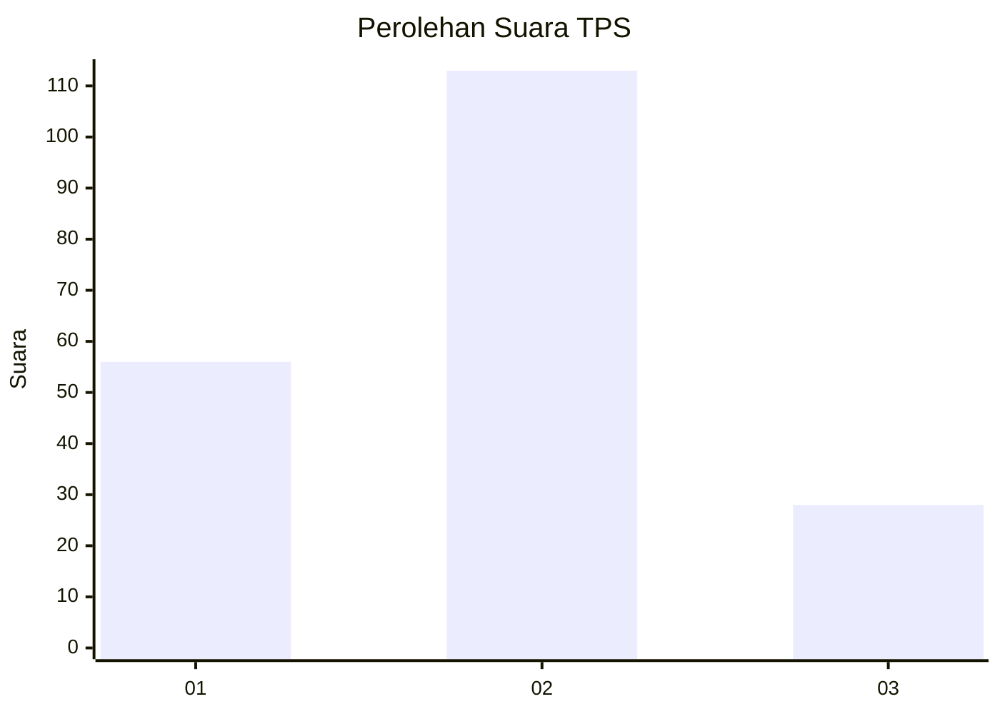
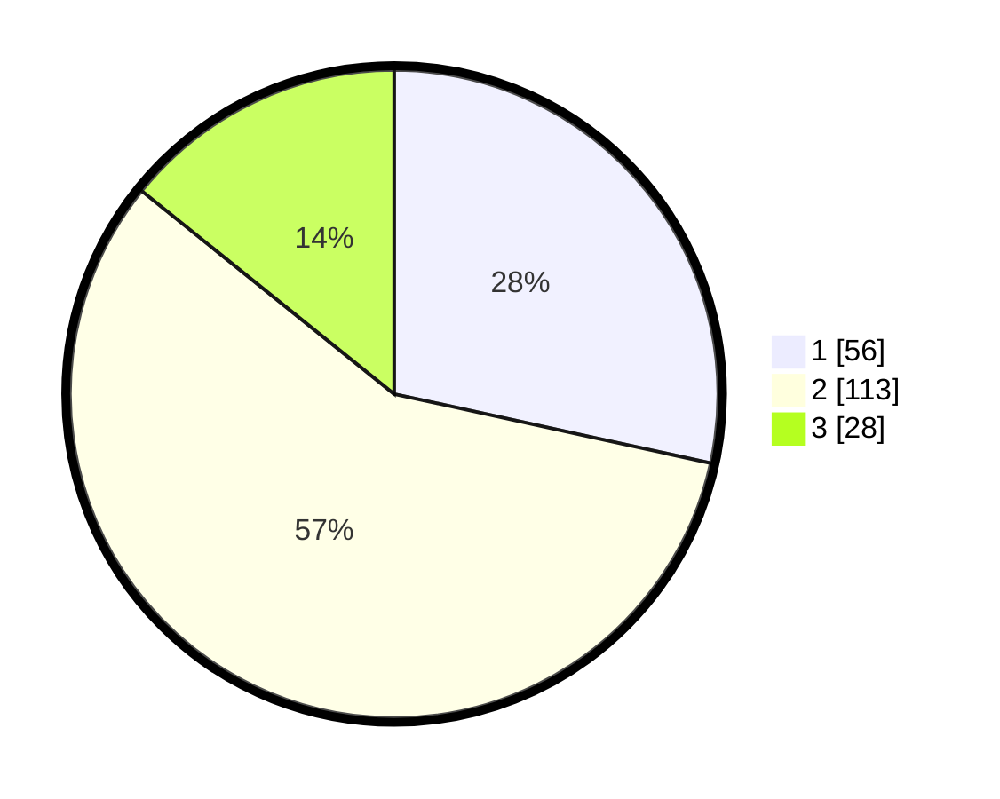

# Hasil

## Grafik

## Tabel

| No. | Nama Paslon    | Suara | Suara (raw) | Persentase |
|:--- |:-------------- | -----:| -----------:| ----------:|
| 1   | ANIES MUHAIMIN | 56    | [56][p-1]   | 28,43      |
| 2   | PRABOWO GIBRAN | 113   | [113][p-2]  | 57,36      |
| 3   | GANJAR MAHFUD  | 28    | [28][p-3]   | 14,21      |

[p-1]: https://github.com/gigit-pemilu/pemilu-2024/blob/main/pilpres/hitung-suara/sub/35-jawa-timur/sub/09-jember/sub/08-puger/sub/2001-mlokorejo/sub/016-tps/sub/paslon-1.txt
[p-2]: https://github.com/gigit-pemilu/pemilu-2024/blob/main/pilpres/hitung-suara/sub/35-jawa-timur/sub/09-jember/sub/08-puger/sub/2001-mlokorejo/sub/016-tps/sub/paslon-2.txt
[p-3]: https://github.com/gigit-pemilu/pemilu-2024/blob/main/pilpres/hitung-suara/sub/35-jawa-timur/sub/09-jember/sub/08-puger/sub/2001-mlokorejo/sub/016-tps/sub/paslon-3.txt

## Foto C Plano

https://sirekap-obj-formc.kpu.go.id/138c/pemilu/ppwp/35/09/08/20/01/3509082001016-20240214-194438--ec29d861-3b9b-4dd2-9884-9e40ba10b49c.jpg

https://sirekap-obj-formc.kpu.go.id/138c/pemilu/ppwp/35/09/08/20/01/3509082001016-20240215-012115--086d7742-34df-4069-93e8-c3dc10cac9c9.jpg

https://sirekap-obj-formc.kpu.go.id/138c/pemilu/ppwp/35/09/08/20/01/3509082001016-20240215-012247--c0ef2eaa-a32f-4ff6-8e6c-8d97165000ba.jpg

## Metadata

| Key        | Value               |
| ---------- | ------------------- |
| Time Stamp | 2024-02-24 22:31:28 |

