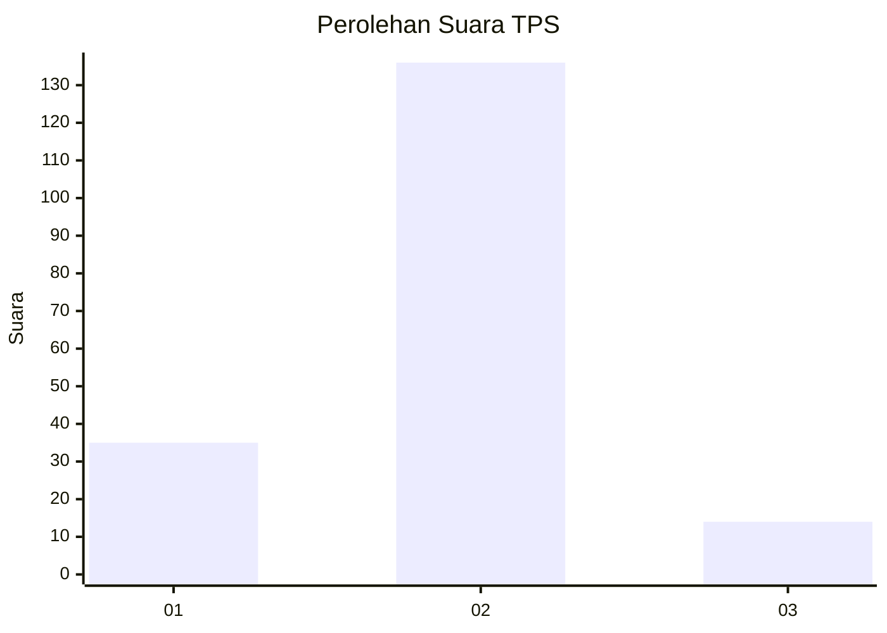
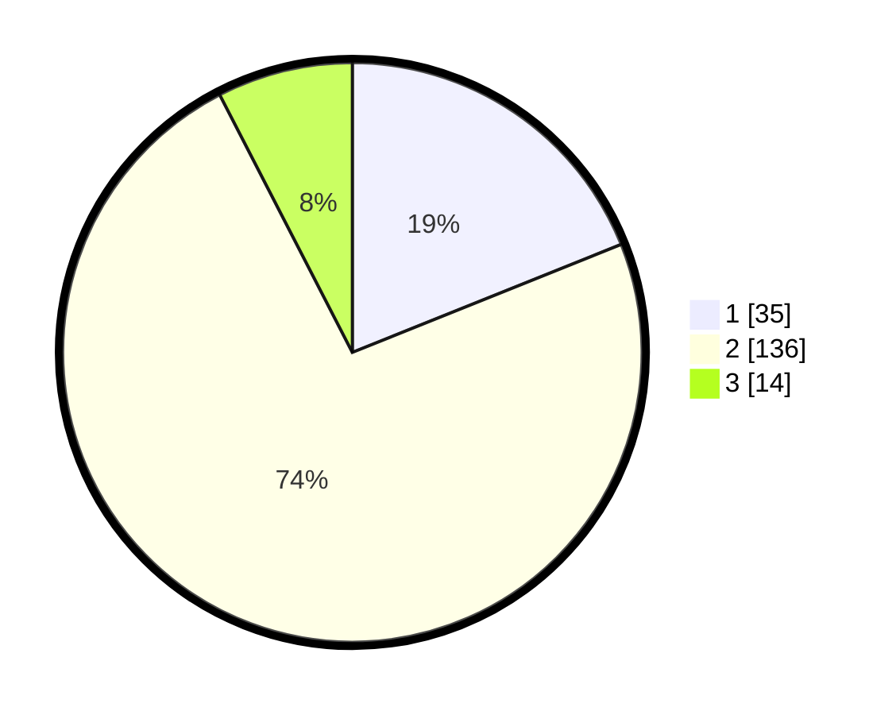

# Hasil

## Grafik

## Tabel

| No. | Nama Paslon    | Suara | Suara (raw) | Persentase |
|:--- |:-------------- | -----:| -----------:| ----------:|
| 1   | ANIES MUHAIMIN | 35    | [35][p-1]   | 18,92      |
| 2   | PRABOWO GIBRAN | 136   | [136][p-2]  | 73,51      |
| 3   | GANJAR MAHFUD  | 14    | [14][p-3]   | 7,57       |

[p-1]: https://github.com/gigit-pemilu/pemilu-2024/blob/main/pilpres/hitung-suara/sub/35-jawa-timur/sub/09-jember/sub/08-puger/sub/2001-mlokorejo/sub/020-tps/sub/paslon-1.txt
[p-2]: https://github.com/gigit-pemilu/pemilu-2024/blob/main/pilpres/hitung-suara/sub/35-jawa-timur/sub/09-jember/sub/08-puger/sub/2001-mlokorejo/sub/020-tps/sub/paslon-2.txt
[p-3]: https://github.com/gigit-pemilu/pemilu-2024/blob/main/pilpres/hitung-suara/sub/35-jawa-timur/sub/09-jember/sub/08-puger/sub/2001-mlokorejo/sub/020-tps/sub/paslon-3.txt

## Foto C Plano

https://sirekap-obj-formc.kpu.go.id/1f47/pemilu/ppwp/35/09/08/20/01/3509082001020-20240215-121258--3edea13b-9025-41e4-b04f-3e4e9bb52675.jpg

https://sirekap-obj-formc.kpu.go.id/1f47/pemilu/ppwp/35/09/08/20/01/3509082001020-20240215-121250--e9b436b2-282c-4fe8-acf4-fe893609dd91.jpg

https://sirekap-obj-formc.kpu.go.id/1f47/pemilu/ppwp/35/09/08/20/01/3509082001020-20240215-121304--45c09698-f13f-4d87-9423-8c06b9b578e1.jpg

## Metadata

| Key        | Value               |
| ---------- | ------------------- |
| Time Stamp | 2024-02-20 17:00:00 |

