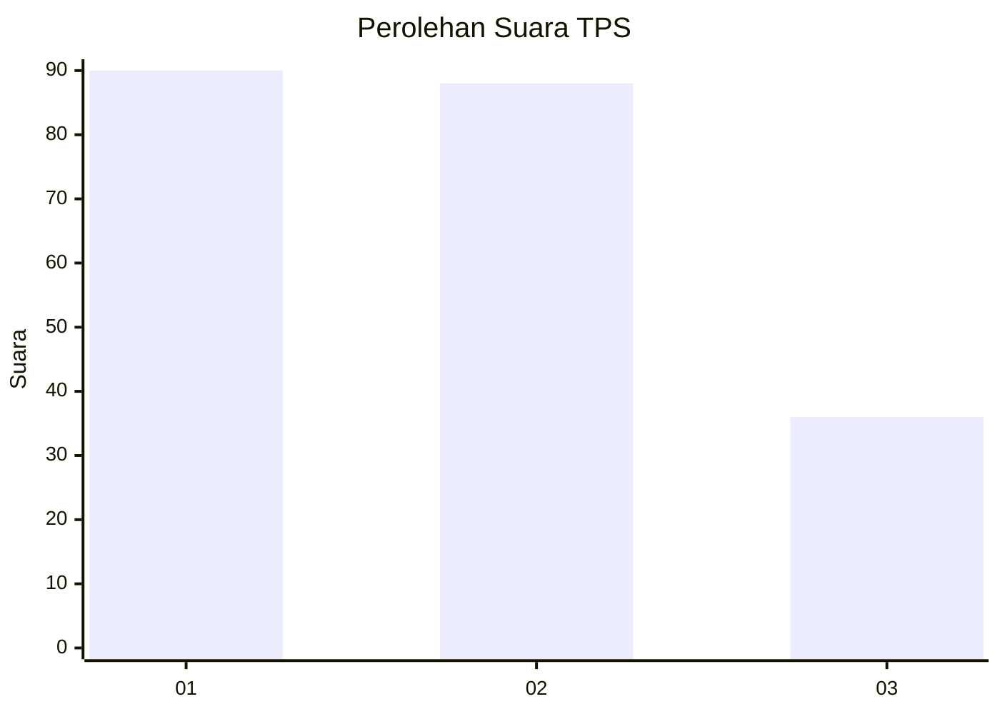
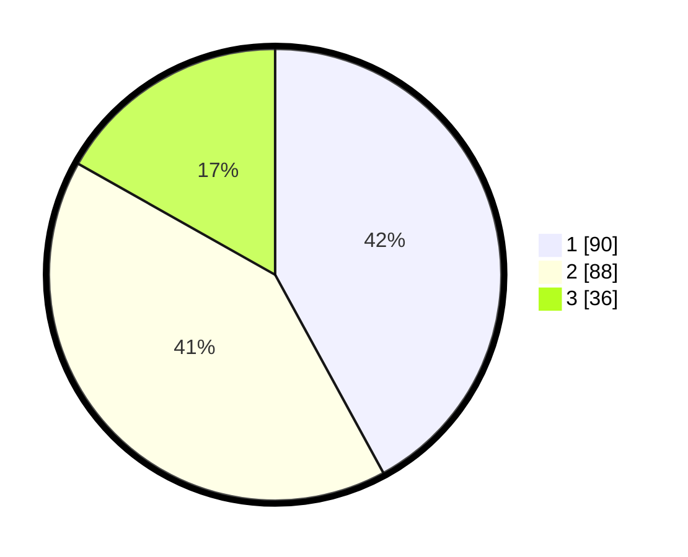

# Hasil

## Grafik

## Tabel

| No. | Nama Paslon    | Suara | Suara (raw) | Persentase |
|:--- |:-------------- | -----:| -----------:| ----------:|
| 1   | ANIES MUHAIMIN | 90    | [90][p-1]   | 42,06      |
| 2   | PRABOWO GIBRAN | 88    | [88][p-2]   | 41,12      |
| 3   | GANJAR MAHFUD  | 36    | [36][p-3]   | 16,82      |

[p-1]: https://github.com/gigit-pemilu/pemilu-2024/blob/main/pilpres/hitung-suara/sub/35-jawa-timur/sub/09-jember/sub/08-puger/sub/2002-mojomulyo/sub/002-tps/sub/paslon-1.txt
[p-2]: https://github.com/gigit-pemilu/pemilu-2024/blob/main/pilpres/hitung-suara/sub/35-jawa-timur/sub/09-jember/sub/08-puger/sub/2002-mojomulyo/sub/002-tps/sub/paslon-2.txt
[p-3]: https://github.com/gigit-pemilu/pemilu-2024/blob/main/pilpres/hitung-suara/sub/35-jawa-timur/sub/09-jember/sub/08-puger/sub/2002-mojomulyo/sub/002-tps/sub/paslon-3.txt

## Foto C Plano

https://sirekap-obj-formc.kpu.go.id/59f5/pemilu/ppwp/35/09/08/20/02/3509082002002-20240214-195859--f2eef495-cd30-44ad-bd4d-bc1811b904ae.jpg

https://sirekap-obj-formc.kpu.go.id/59f5/pemilu/ppwp/35/09/08/20/02/3509082002002-20240214-233032--bf714c30-a24c-4c15-a32b-d0980d52fb47.jpg

https://sirekap-obj-formc.kpu.go.id/59f5/pemilu/ppwp/35/09/08/20/02/3509082002002-20240214-200419--e9c714dc-cea9-473f-a594-3965ff933a48.jpg

## Metadata

| Key        | Value               |
| ---------- | ------------------- |
| Time Stamp | 2024-02-16 21:01:00 |

