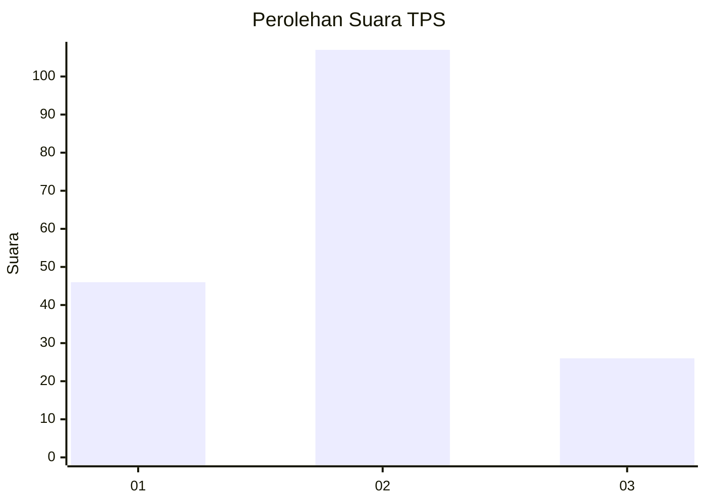
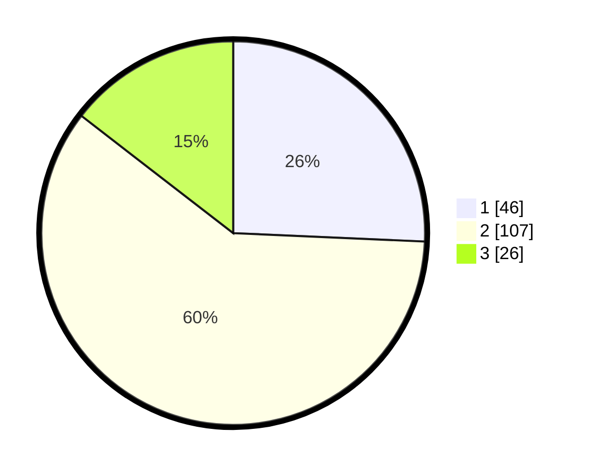

# Hasil

## Grafik

## Tabel

| No. | Nama Paslon    | Suara | Suara (raw) | Persentase |
|:--- |:-------------- | -----:| -----------:| ----------:|
| 1   | ANIES MUHAIMIN | 46    | [46][p-1]   | 25,70      |
| 2   | PRABOWO GIBRAN | 107   | [107][p-2]  | 59,78      |
| 3   | GANJAR MAHFUD  | 26    | [26][p-3]   | 14,53      |

[p-1]: https://github.com/gigit-pemilu/pemilu-2024/blob/main/pilpres/hitung-suara/sub/35-jawa-timur/sub/09-jember/sub/08-puger/sub/2002-mojomulyo/sub/004-tps/sub/paslon-1.txt
[p-2]: https://github.com/gigit-pemilu/pemilu-2024/blob/main/pilpres/hitung-suara/sub/35-jawa-timur/sub/09-jember/sub/08-puger/sub/2002-mojomulyo/sub/004-tps/sub/paslon-2.txt
[p-3]: https://github.com/gigit-pemilu/pemilu-2024/blob/main/pilpres/hitung-suara/sub/35-jawa-timur/sub/09-jember/sub/08-puger/sub/2002-mojomulyo/sub/004-tps/sub/paslon-3.txt

## Foto C Plano

https://sirekap-obj-formc.kpu.go.id/4611/pemilu/ppwp/35/09/08/20/02/3509082002004-20240215-025336--3646d5cc-9311-428e-a9da-d0e0e3d76b74.jpg

https://sirekap-obj-formc.kpu.go.id/4611/pemilu/ppwp/35/09/08/20/02/3509082002004-20240215-025453--b2b1cab6-42bd-4776-ad20-f7542984c34e.jpg

https://sirekap-obj-formc.kpu.go.id/4611/pemilu/ppwp/35/09/08/20/02/3509082002004-20240215-025550--ea5e3ad6-60a9-4ecc-bb48-6bbd6df1cd2c.jpg

## Metadata

| Key        | Value               |
| ---------- | ------------------- |
| Time Stamp | 2024-02-15 15:30:25 |

