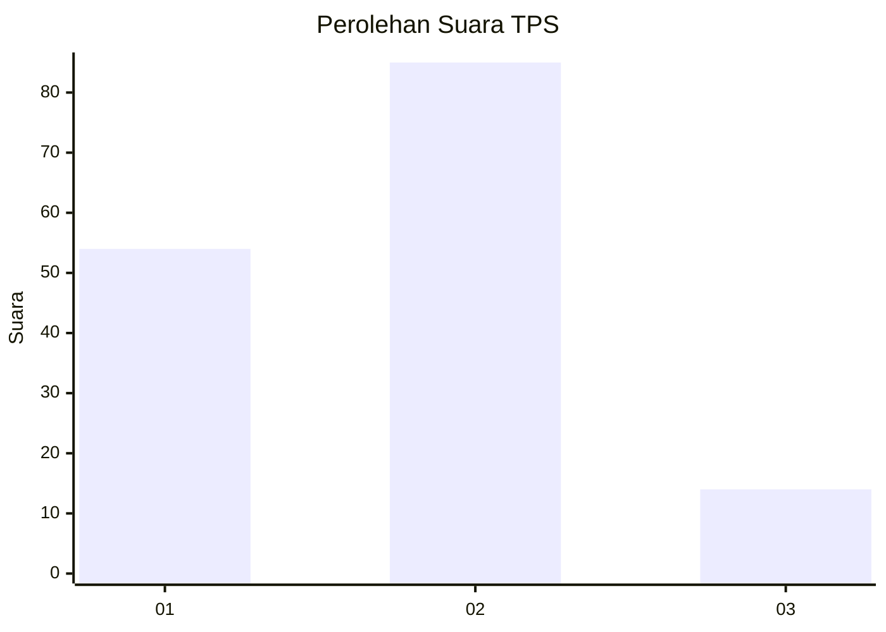
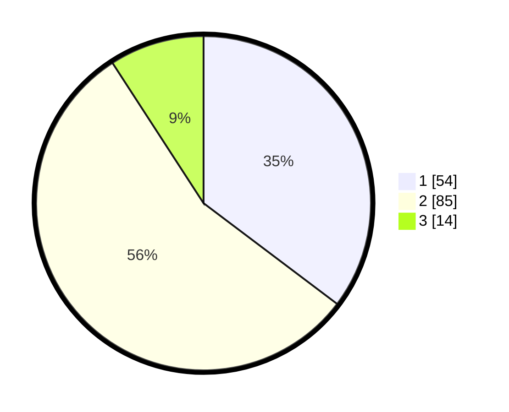

# Hasil

## Grafik

## Tabel

| No. | Nama Paslon    | Suara | Suara (raw) | Persentase |
|:--- |:-------------- | -----:| -----------:| ----------:|
| 1   | ANIES MUHAIMIN | 54    | [54][p-1]   | 35,29      |
| 2   | PRABOWO GIBRAN | 85    | [85][p-2]   | 55,56      |
| 3   | GANJAR MAHFUD  | 14    | [14][p-3]   | 9,15       |

[p-1]: https://github.com/gigit-pemilu/pemilu-2024-35-jawa-timur/blob/main/pilpres/hitung-suara/sub/35-jawa-timur/sub/09-jember/sub/08-puger/sub/2002-mojomulyo/sub/008-tps/sub/paslon-1.txt
[p-2]: https://github.com/gigit-pemilu/pemilu-2024-35-jawa-timur/blob/main/pilpres/hitung-suara/sub/35-jawa-timur/sub/09-jember/sub/08-puger/sub/2002-mojomulyo/sub/008-tps/sub/paslon-2.txt
[p-3]: https://github.com/gigit-pemilu/pemilu-2024-35-jawa-timur/blob/main/pilpres/hitung-suara/sub/35-jawa-timur/sub/09-jember/sub/08-puger/sub/2002-mojomulyo/sub/008-tps/sub/paslon-3.txt

## Foto C Plano

https://sirekap-obj-formc.kpu.go.id/bc47/pemilu/ppwp/35/09/08/20/02/3509082002008-20240214-223720--b0e76861-24dc-4052-acfb-34360f9fb1c4.jpg

https://sirekap-obj-formc.kpu.go.id/bc47/pemilu/ppwp/35/09/08/20/02/3509082002008-20240214-224003--b86eec54-a935-4d2f-a7e4-dc8b05c85eb8.jpg

https://sirekap-obj-formc.kpu.go.id/bc47/pemilu/ppwp/35/09/08/20/02/3509082002008-20240214-224032--47180e9b-482b-4071-ae6d-cce917a98656.jpg

## Metadata

| Key        | Value               |
| ---------- | ------------------- |
| Time Stamp | 2024-02-16 21:01:00 |

