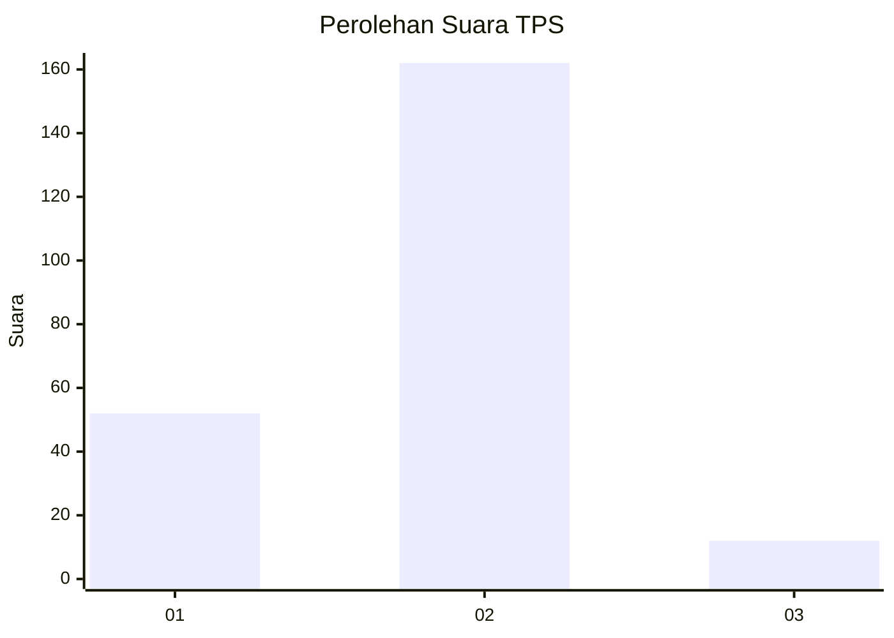
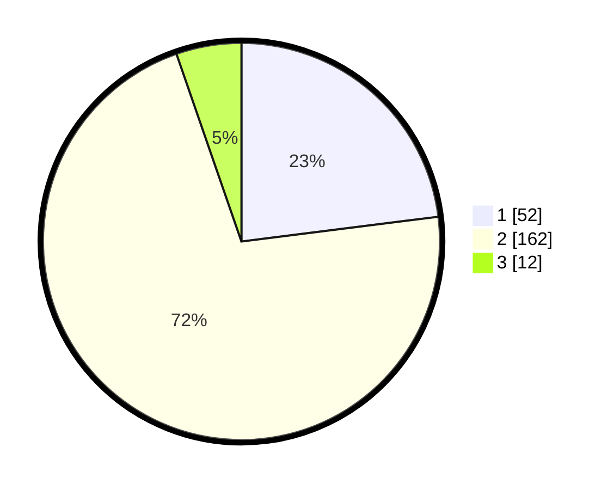

# Hasil

## Grafik

## Tabel

| No. | Nama Paslon    | Suara | Suara (raw) | Persentase |
|:--- |:-------------- | -----:| -----------:| ----------:|
| 1   | ANIES MUHAIMIN | 52    | [52][p-1]   | 23,01      |
| 2   | PRABOWO GIBRAN | 162   | [162][p-2]  | 71,68      |
| 3   | GANJAR MAHFUD  | 12    | [12][p-3]   | 5,31       |

[p-1]: https://github.com/gigit-pemilu/pemilu-2024/blob/main/pilpres/hitung-suara/sub/35-jawa-timur/sub/09-jember/sub/08-puger/sub/2002-mojomulyo/sub/014-tps/sub/paslon-1.txt
[p-2]: https://github.com/gigit-pemilu/pemilu-2024/blob/main/pilpres/hitung-suara/sub/35-jawa-timur/sub/09-jember/sub/08-puger/sub/2002-mojomulyo/sub/014-tps/sub/paslon-2.txt
[p-3]: https://github.com/gigit-pemilu/pemilu-2024/blob/main/pilpres/hitung-suara/sub/35-jawa-timur/sub/09-jember/sub/08-puger/sub/2002-mojomulyo/sub/014-tps/sub/paslon-3.txt

## Foto C Plano

https://sirekap-obj-formc.kpu.go.id/321b/pemilu/ppwp/35/09/08/20/02/3509082002014-20240214-210404--bf5bd940-888b-4e5b-b16c-f27a6d08ca11.jpg

https://sirekap-obj-formc.kpu.go.id/321b/pemilu/ppwp/35/09/08/20/02/3509082002014-20240214-210604--2239dfd0-7c98-4ef9-8348-75fd937f168c.jpg

https://sirekap-obj-formc.kpu.go.id/321b/pemilu/ppwp/35/09/08/20/02/3509082002014-20240214-210611--2b4c5cd0-a2e8-4580-93d9-78051e52f48f.jpg

## Metadata

| Key        | Value               |
| ---------- | ------------------- |
| Time Stamp | 2024-02-25 20:00:00 |

