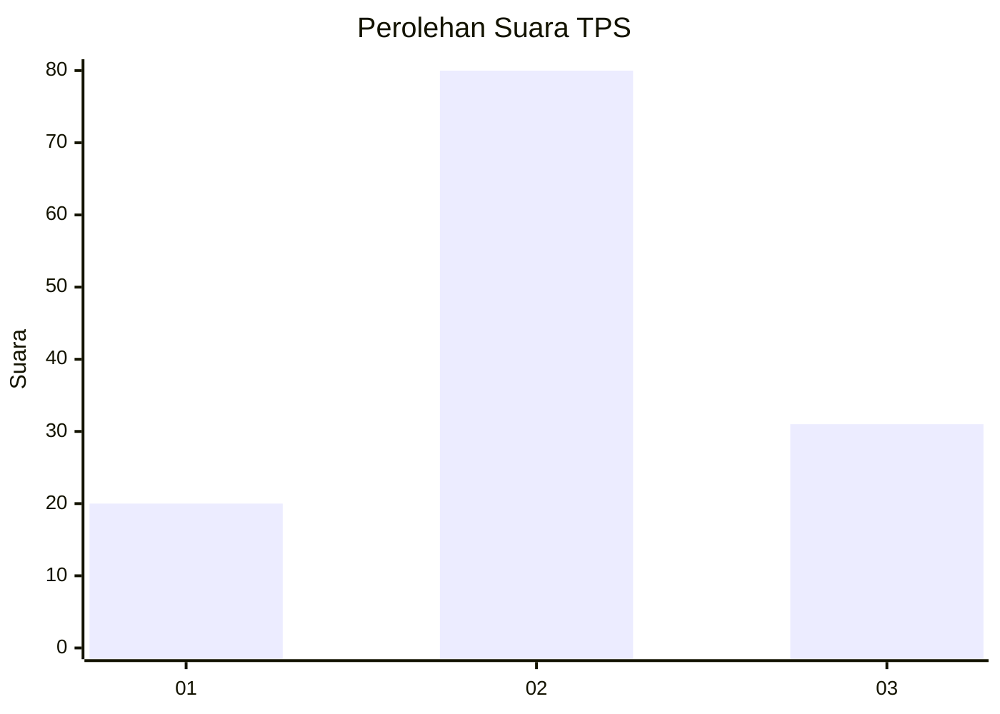
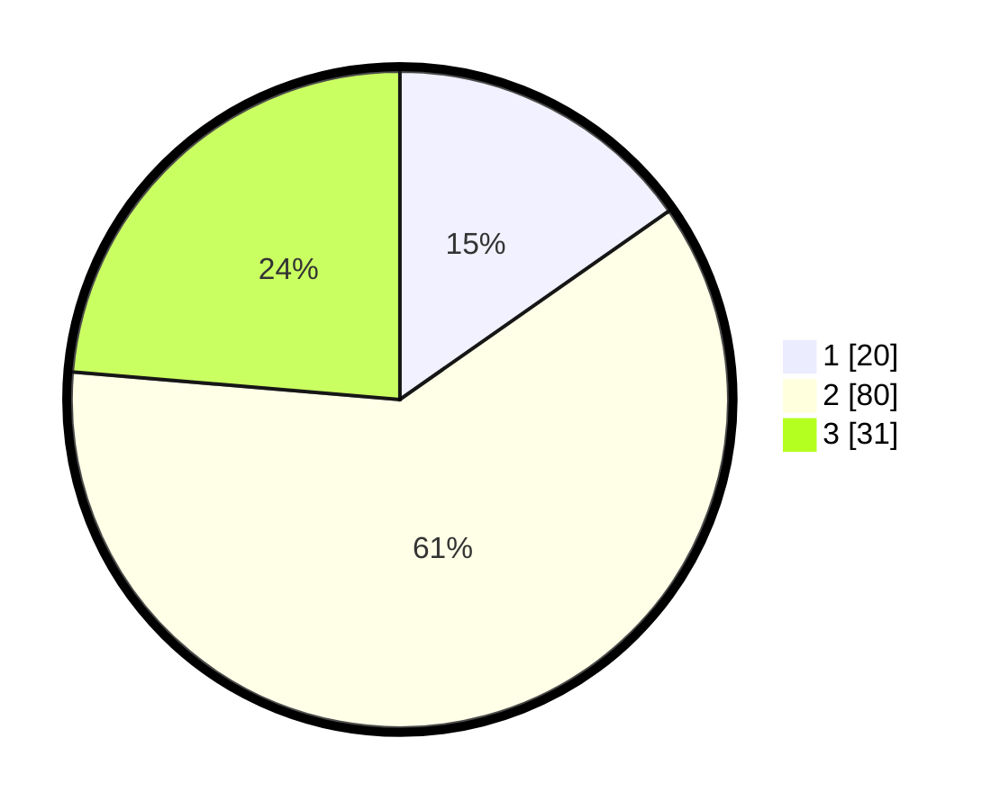

# Hasil

## Grafik

## Tabel

| No. | Nama Paslon    | Suara | Suara (raw) | Persentase |
|:--- |:-------------- | -----:| -----------:| ----------:|
| 1   | ANIES MUHAIMIN | 20    | [20][p-1]   | 15,27      |
| 2   | PRABOWO GIBRAN | 80    | [80][p-2]   | 61,07      |
| 3   | GANJAR MAHFUD  | 31    | [31][p-3]   | 23,66      |

[p-1]: https://github.com/gigit-pemilu/pemilu-2024-35-jawa-timur/blob/main/pilpres/hitung-suara/sub/35-jawa-timur/sub/09-jember/sub/08-puger/sub/2002-mojomulyo/sub/027-tps/sub/paslon-1.txt
[p-2]: https://github.com/gigit-pemilu/pemilu-2024-35-jawa-timur/blob/main/pilpres/hitung-suara/sub/35-jawa-timur/sub/09-jember/sub/08-puger/sub/2002-mojomulyo/sub/027-tps/sub/paslon-2.txt
[p-3]: https://github.com/gigit-pemilu/pemilu-2024-35-jawa-timur/blob/main/pilpres/hitung-suara/sub/35-jawa-timur/sub/09-jember/sub/08-puger/sub/2002-mojomulyo/sub/027-tps/sub/paslon-3.txt

## Foto C Plano

https://sirekap-obj-formc.kpu.go.id/caa8/pemilu/ppwp/35/09/08/20/02/3509082002027-20240215-023202--e8b1684c-917d-410f-91c4-9a0291ea430b.jpg

https://sirekap-obj-formc.kpu.go.id/caa8/pemilu/ppwp/35/09/08/20/02/3509082002027-20240215-023245--99af2085-fea0-4c58-9bc7-29fef0801f53.jpg

https://sirekap-obj-formc.kpu.go.id/caa8/pemilu/ppwp/35/09/08/20/02/3509082002027-20240215-020909--a24b6b87-fe6d-4862-9c98-2f14d468246e.jpg

## Metadata

| Key        | Value               |
| ---------- | ------------------- |
| Time Stamp | 2024-02-24 22:31:28 |

