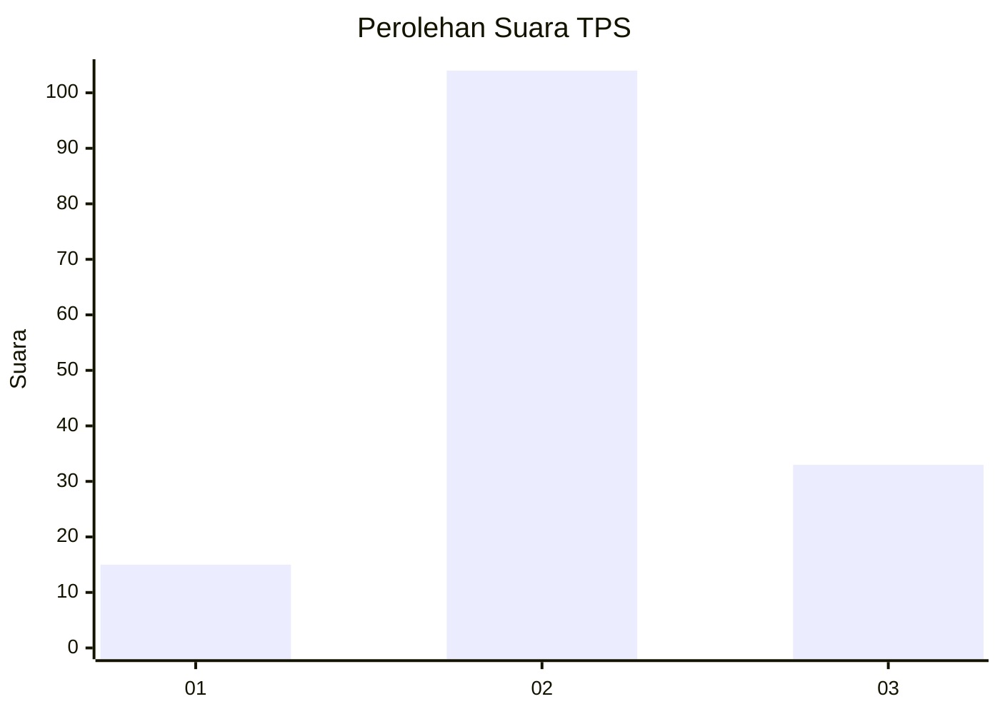
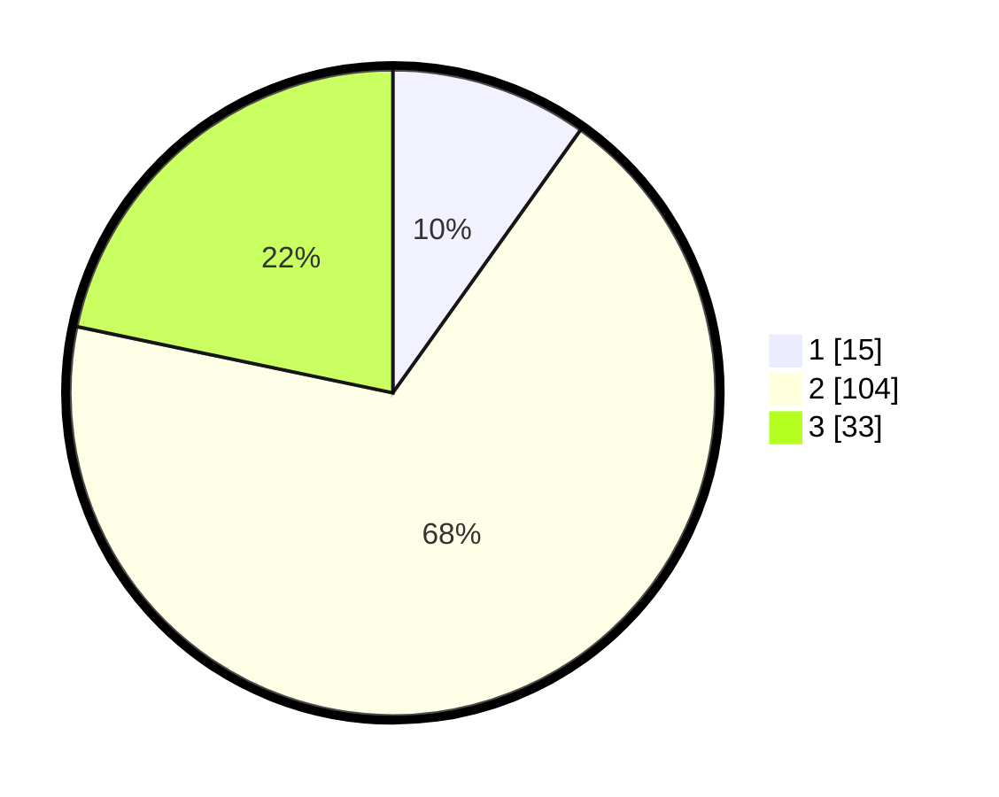

# Hasil

## Grafik

## Tabel

| No. | Nama Paslon    | Suara | Suara (raw) | Persentase |
|:--- |:-------------- | -----:| -----------:| ----------:|
| 1   | ANIES MUHAIMIN | 15    | [15][p-1]   | 9,87       |
| 2   | PRABOWO GIBRAN | 104   | [104][p-2]  | 68,42      |
| 3   | GANJAR MAHFUD  | 33    | [33][p-3]   | 21,71      |

[p-1]: https://github.com/gigit-pemilu/pemilu-2024/blob/main/pilpres/hitung-suara/sub/35-jawa-timur/sub/09-jember/sub/08-puger/sub/2003-mojosari/sub/001-tps/sub/paslon-1.txt
[p-2]: https://github.com/gigit-pemilu/pemilu-2024/blob/main/pilpres/hitung-suara/sub/35-jawa-timur/sub/09-jember/sub/08-puger/sub/2003-mojosari/sub/001-tps/sub/paslon-2.txt
[p-3]: https://github.com/gigit-pemilu/pemilu-2024/blob/main/pilpres/hitung-suara/sub/35-jawa-timur/sub/09-jember/sub/08-puger/sub/2003-mojosari/sub/001-tps/sub/paslon-3.txt

## Foto C Plano

https://sirekap-obj-formc.kpu.go.id/c5c8/pemilu/ppwp/35/09/08/20/03/3509082003001-20240215-035150--a3ffebac-6ad7-44ea-ba95-0cb07057c3ce.jpg

https://sirekap-obj-formc.kpu.go.id/c5c8/pemilu/ppwp/35/09/08/20/03/3509082003001-20240215-035328--bf937a2d-eb52-42f4-88be-90cdaf151402.jpg

https://sirekap-obj-formc.kpu.go.id/c5c8/pemilu/ppwp/35/09/08/20/03/3509082003001-20240215-035648--b279c469-5cc9-4722-8a98-940267433c1c.jpg

## Metadata

| Key        | Value               |
| ---------- | ------------------- |
| Time Stamp | 2024-02-15 15:30:25 |

