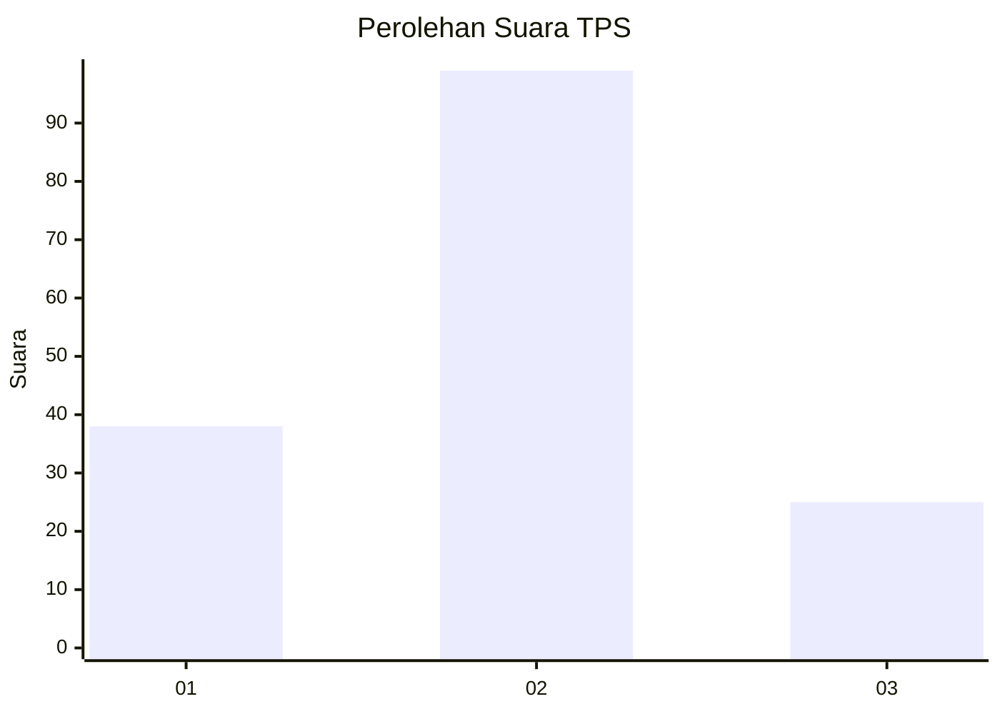
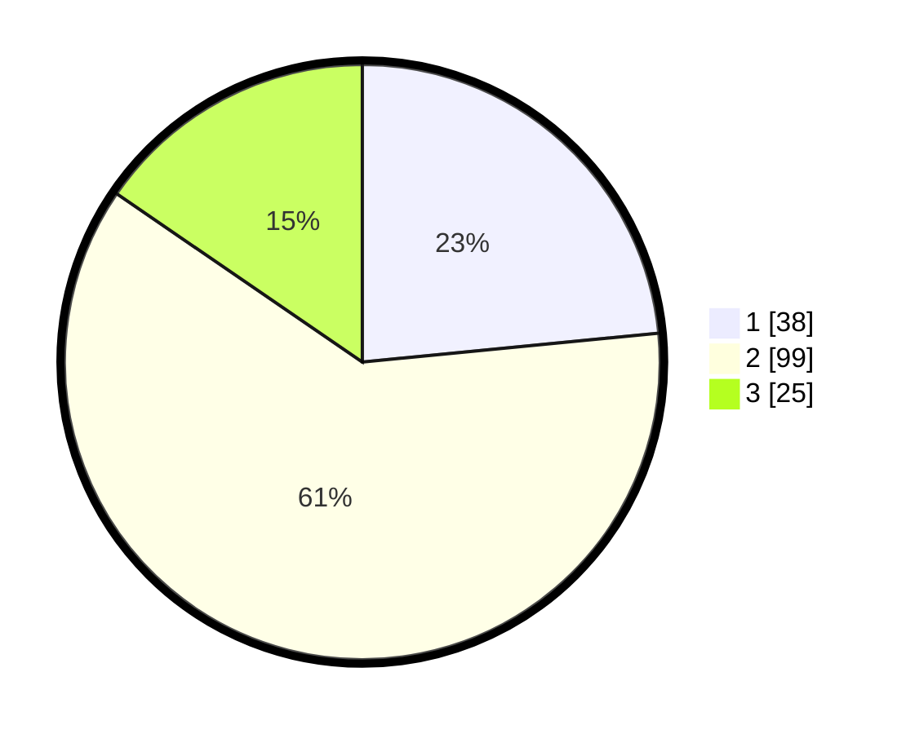

# Hasil

## Grafik

## Tabel

| No. | Nama Paslon    | Suara | Suara (raw) | Persentase |
|:--- |:-------------- | -----:| -----------:| ----------:|
| 1   | ANIES MUHAIMIN | 38    | [38][p-1]   | 23,46      |
| 2   | PRABOWO GIBRAN | 99    | [99][p-2]   | 61,11      |
| 3   | GANJAR MAHFUD  | 25    | [25][p-3]   | 15,43      |

[p-1]: https://github.com/gigit-pemilu/pemilu-2024-35-jawa-timur/blob/main/pilpres/hitung-suara/sub/35-jawa-timur/sub/09-jember/sub/08-puger/sub/2003-mojosari/sub/002-tps/sub/paslon-1.txt
[p-2]: https://github.com/gigit-pemilu/pemilu-2024-35-jawa-timur/blob/main/pilpres/hitung-suara/sub/35-jawa-timur/sub/09-jember/sub/08-puger/sub/2003-mojosari/sub/002-tps/sub/paslon-2.txt
[p-3]: https://github.com/gigit-pemilu/pemilu-2024-35-jawa-timur/blob/main/pilpres/hitung-suara/sub/35-jawa-timur/sub/09-jember/sub/08-puger/sub/2003-mojosari/sub/002-tps/sub/paslon-3.txt

## Foto C Plano

https://sirekap-obj-formc.kpu.go.id/2d4e/pemilu/ppwp/35/09/08/20/03/3509082003002-20240215-114501--5e33d2e7-a47e-436d-9719-8f4d8c042639.jpg

https://sirekap-obj-formc.kpu.go.id/2d4e/pemilu/ppwp/35/09/08/20/03/3509082003002-20240215-114616--7721fe4a-2bda-4bea-91a3-b0c69adc5df2.jpg

https://sirekap-obj-formc.kpu.go.id/2d4e/pemilu/ppwp/35/09/08/20/03/3509082003002-20240215-134744--c0425171-6c5a-4b66-9622-ab13d4fc44e4.jpg

## Metadata

| Key        | Value               |
| ---------- | ------------------- |
| Time Stamp | 2024-02-15 15:30:25 |

