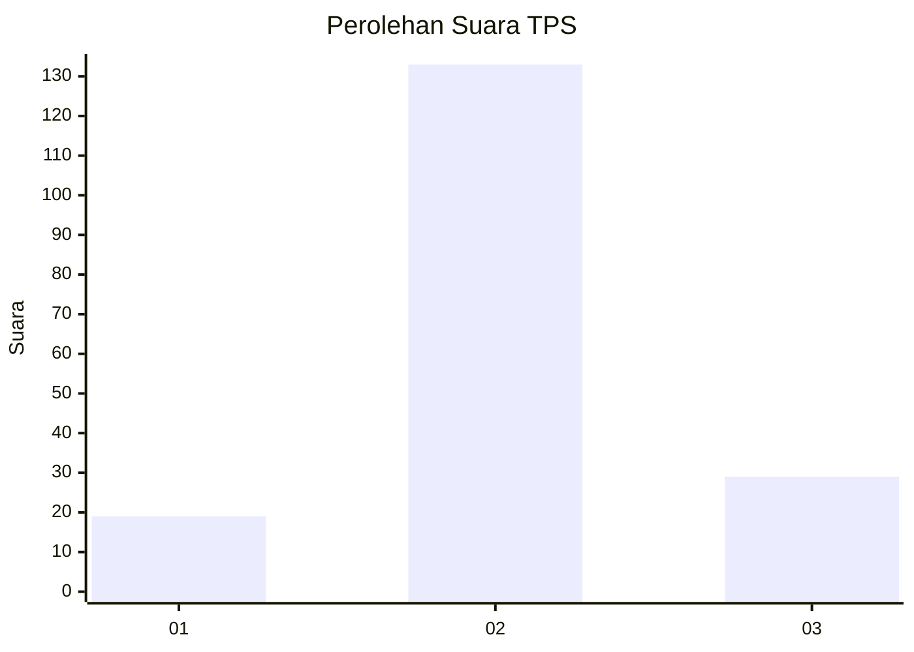
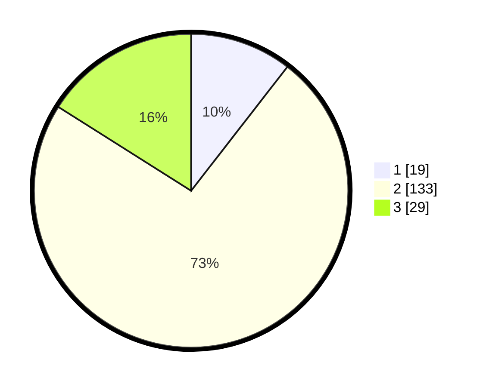

# Hasil

## Grafik

## Tabel

| No. | Nama Paslon    | Suara | Suara (raw) | Persentase |
|:--- |:-------------- | -----:| -----------:| ----------:|
| 1   | ANIES MUHAIMIN | 19    | [19][p-1]   | 10,50      |
| 2   | PRABOWO GIBRAN | 133   | [133][p-2]  | 73,48      |
| 3   | GANJAR MAHFUD  | 29    | [29][p-3]   | 16,02      |

[p-1]: https://github.com/gigit-pemilu/pemilu-2024-35-jawa-timur/blob/main/pilpres/hitung-suara/sub/35-jawa-timur/sub/09-jember/sub/08-puger/sub/2003-mojosari/sub/010-tps/sub/paslon-1.txt
[p-2]: https://github.com/gigit-pemilu/pemilu-2024-35-jawa-timur/blob/main/pilpres/hitung-suara/sub/35-jawa-timur/sub/09-jember/sub/08-puger/sub/2003-mojosari/sub/010-tps/sub/paslon-2.txt
[p-3]: https://github.com/gigit-pemilu/pemilu-2024-35-jawa-timur/blob/main/pilpres/hitung-suara/sub/35-jawa-timur/sub/09-jember/sub/08-puger/sub/2003-mojosari/sub/010-tps/sub/paslon-3.txt

## Foto C Plano

https://sirekap-obj-formc.kpu.go.id/66a2/pemilu/ppwp/35/09/08/20/03/3509082003010-20240214-204720--fe564709-6f33-4eba-b79b-b247e5f0c5dc.jpg

https://sirekap-obj-formc.kpu.go.id/66a2/pemilu/ppwp/35/09/08/20/03/3509082003010-20240214-205422--d763c576-1a58-474a-8f4b-6ce72e59dd9a.jpg

https://sirekap-obj-formc.kpu.go.id/66a2/pemilu/ppwp/35/09/08/20/03/3509082003010-20240214-205537--35ca4cc8-0c5c-49e7-8522-54c635e6a949.jpg

## Metadata

| Key        | Value               |
| ---------- | ------------------- |
| Time Stamp | 2024-02-19 16:00:00 |

## DATA PEMILIH TETAP

Jumlah pemilih dalam DPT: **22**.
 * L: **570**.
 * P: **976**.

## DATA PENGGUNA HAK PILIH

Jumlah pengguna hak pilih dalam DPT: **406**.
 * L: **700**.
 * P: **97**.

Jumlah pengguna hak pilih dalam DPTb: **800**.
 * L: **880**.
 * P: **88**.

Jumlah pengguna hak pilih dalam DPK: **6**.
 * L: **801**.
 * P: **800**.

Jumlah pengguna hak pilih: **442**.
 * L: **85**.
 * P: **897**.

## JUMLAH SUARA SAH DAN TIDAK SAH

JUMLAH SELURUH SUARA SAH: **181**.

JUMLAH SUARA TIDAK SAH: **1**.

JUMLAH SELURUH SUARA SAH DAN SUARA TIDAK SAH: **182**.

