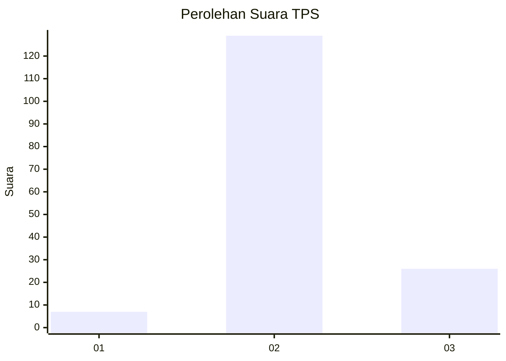
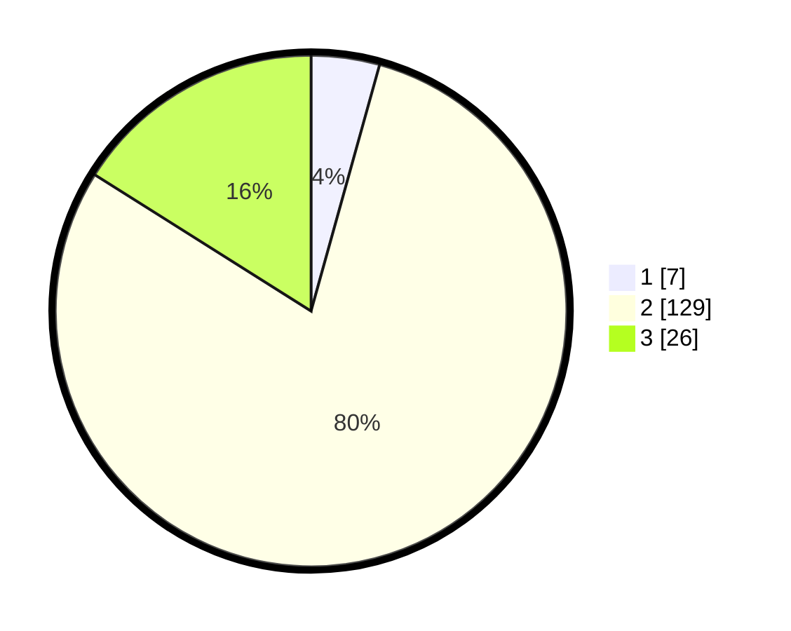

# Hasil

## Grafik

## Tabel

| No. | Nama Paslon    | Suara | Suara (raw) | Persentase |
|:--- |:-------------- | -----:| -----------:| ----------:|
| 1   | ANIES MUHAIMIN | 7     | [7][p-1]    | 4,32       |
| 2   | PRABOWO GIBRAN | 129   | [129][p-2]  | 79,63      |
| 3   | GANJAR MAHFUD  | 26    | [26][p-3]   | 16,05      |

[p-1]: https://github.com/gigit-pemilu/pemilu-2024-35-jawa-timur/blob/main/pilpres/hitung-suara/sub/35-jawa-timur/sub/09-jember/sub/08-puger/sub/2003-mojosari/sub/017-tps/sub/paslon-1.txt
[p-2]: https://github.com/gigit-pemilu/pemilu-2024-35-jawa-timur/blob/main/pilpres/hitung-suara/sub/35-jawa-timur/sub/09-jember/sub/08-puger/sub/2003-mojosari/sub/017-tps/sub/paslon-2.txt
[p-3]: https://github.com/gigit-pemilu/pemilu-2024-35-jawa-timur/blob/main/pilpres/hitung-suara/sub/35-jawa-timur/sub/09-jember/sub/08-puger/sub/2003-mojosari/sub/017-tps/sub/paslon-3.txt

## Foto C Plano

https://sirekap-obj-formc.kpu.go.id/0245/pemilu/ppwp/35/09/08/20/03/3509082003017-20240219-144549--55c9e369-704e-4185-a8ac-55811f8f04f6.jpg

https://sirekap-obj-formc.kpu.go.id/0245/pemilu/ppwp/35/09/08/20/03/3509082003017-20240219-144740--2f44cbe6-5ae4-4a82-a05b-2b319a973942.jpg

https://sirekap-obj-formc.kpu.go.id/0245/pemilu/ppwp/35/09/08/20/03/3509082003017-20240219-144916--034ec64f-168a-4045-9020-c18e70bd4a1d.jpg

## Metadata

| Key        | Value               |
| ---------- | ------------------- |
| Time Stamp | 2024-02-25 13:00:00 |

