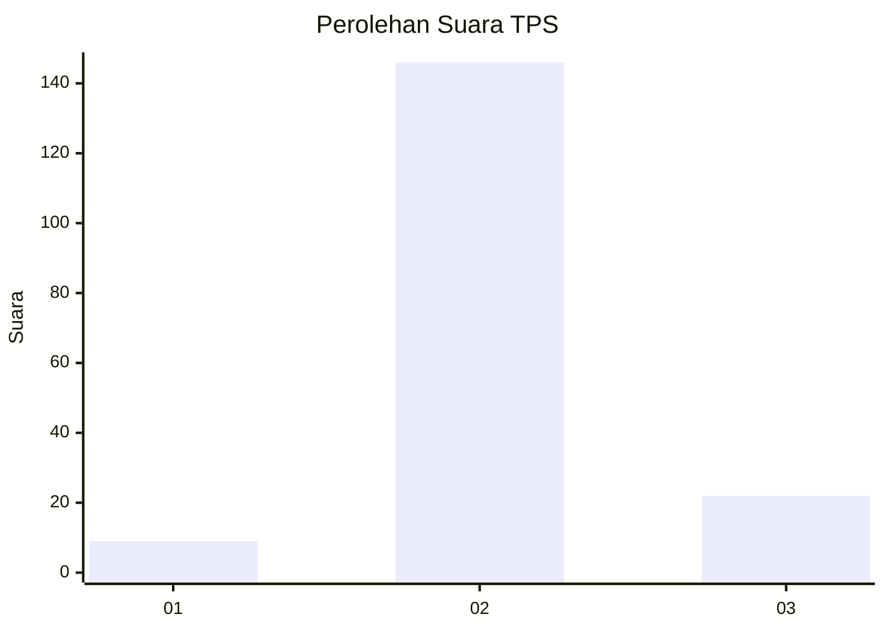
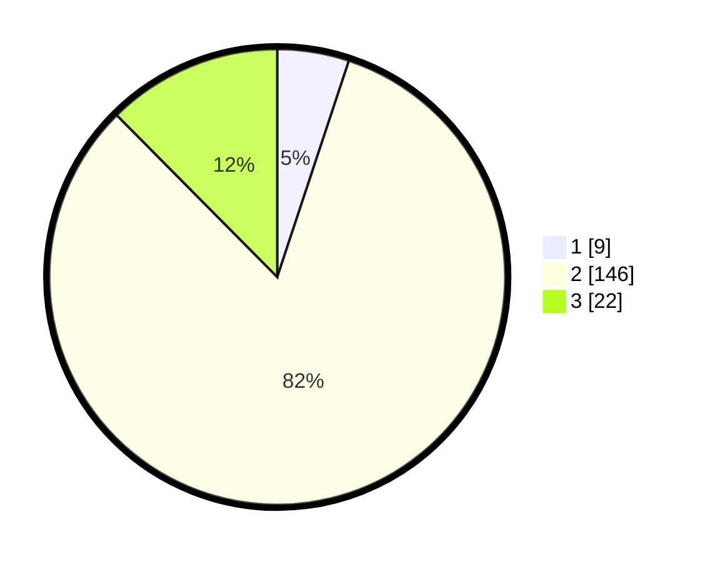

# Hasil

## Grafik

## Tabel

| No. | Nama Paslon    | Suara | Suara (raw) | Persentase |
|:--- |:-------------- | -----:| -----------:| ----------:|
| 1   | ANIES MUHAIMIN | 9     | [9][p-1]    | 5,08       |
| 2   | PRABOWO GIBRAN | 146   | [146][p-2]  | 82,49      |
| 3   | GANJAR MAHFUD  | 22    | [22][p-3]   | 12,43      |

[p-1]: https://github.com/gigit-pemilu/pemilu-2024-35-jawa-timur/blob/main/pilpres/hitung-suara/sub/35-jawa-timur/sub/09-jember/sub/08-puger/sub/2003-mojosari/sub/025-tps/sub/paslon-1.txt
[p-2]: https://github.com/gigit-pemilu/pemilu-2024-35-jawa-timur/blob/main/pilpres/hitung-suara/sub/35-jawa-timur/sub/09-jember/sub/08-puger/sub/2003-mojosari/sub/025-tps/sub/paslon-2.txt
[p-3]: https://github.com/gigit-pemilu/pemilu-2024-35-jawa-timur/blob/main/pilpres/hitung-suara/sub/35-jawa-timur/sub/09-jember/sub/08-puger/sub/2003-mojosari/sub/025-tps/sub/paslon-3.txt

## Foto C Plano

https://sirekap-obj-formc.kpu.go.id/bef5/pemilu/ppwp/35/09/08/20/03/3509082003025-20240219-113924--64a46238-613a-4533-855e-be5daeb146d0.jpg

https://sirekap-obj-formc.kpu.go.id/bef5/pemilu/ppwp/35/09/08/20/03/3509082003025-20240214-222505--77ba7f10-933a-48a8-8f40-af82aa748ed0.jpg

https://sirekap-obj-formc.kpu.go.id/bef5/pemilu/ppwp/35/09/08/20/03/3509082003025-20240214-222657--959b7c96-0448-4429-8278-f16593218ade.jpg

## Metadata

| Key        | Value               |
| ---------- | ------------------- |
| Time Stamp | 2024-02-19 12:00:00 |

