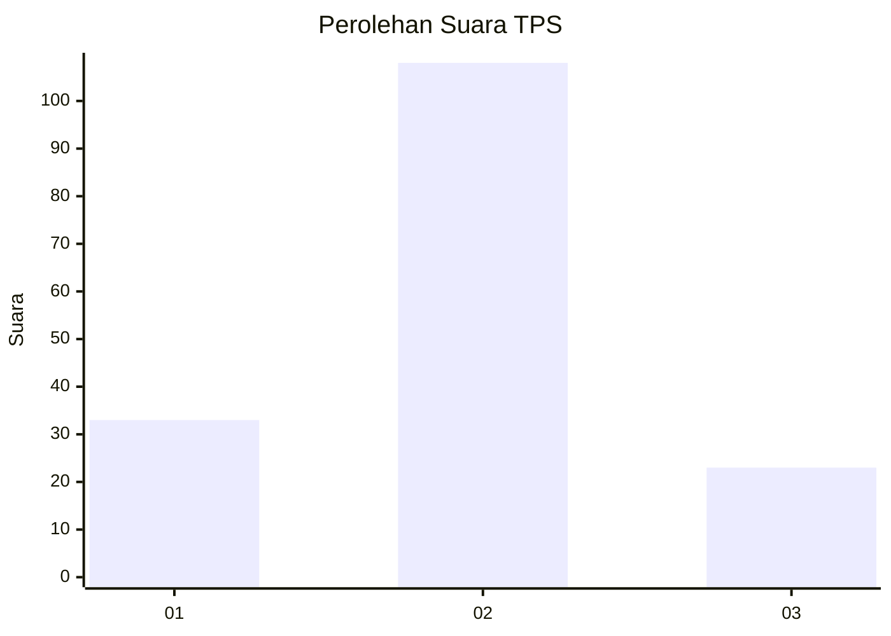
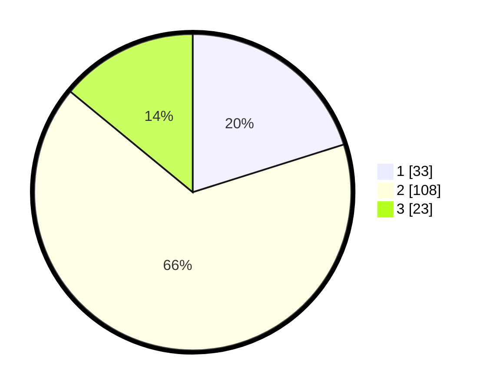

# Hasil

## Grafik

## Tabel

| No. | Nama Paslon    | Suara | Suara (raw) | Persentase |
|:--- |:-------------- | -----:| -----------:| ----------:|
| 1   | ANIES MUHAIMIN | 33    | [33][p-1]   | 20,12      |
| 2   | PRABOWO GIBRAN | 108   | [108][p-2]  | 65,85      |
| 3   | GANJAR MAHFUD  | 23    | [23][p-3]   | 14,02      |

[p-1]: https://github.com/gigit-pemilu/pemilu-2024/blob/main/pilpres/hitung-suara/sub/35-jawa-timur/sub/09-jember/sub/08-puger/sub/2003-mojosari/sub/032-tps/sub/paslon-1.txt
[p-2]: https://github.com/gigit-pemilu/pemilu-2024/blob/main/pilpres/hitung-suara/sub/35-jawa-timur/sub/09-jember/sub/08-puger/sub/2003-mojosari/sub/032-tps/sub/paslon-2.txt
[p-3]: https://github.com/gigit-pemilu/pemilu-2024/blob/main/pilpres/hitung-suara/sub/35-jawa-timur/sub/09-jember/sub/08-puger/sub/2003-mojosari/sub/032-tps/sub/paslon-3.txt

## Foto C Plano

https://sirekap-obj-formc.kpu.go.id/431f/pemilu/ppwp/35/09/08/20/03/3509082003032-20240219-224943--1a7cc677-1d84-463e-8527-0c4ac5be5c17.jpg

https://sirekap-obj-formc.kpu.go.id/431f/pemilu/ppwp/35/09/08/20/03/3509082003032-20240219-222906--ff8f96bc-5e80-48a2-aa58-0412c5745d54.jpg

https://sirekap-obj-formc.kpu.go.id/431f/pemilu/ppwp/35/09/08/20/03/3509082003032-20240219-223023--76f808db-a25b-4f4b-ad86-1ef3edface61.jpg

## Metadata

| Key        | Value               |
| ---------- | ------------------- |
| Time Stamp | 2024-02-19 23:00:00 |

