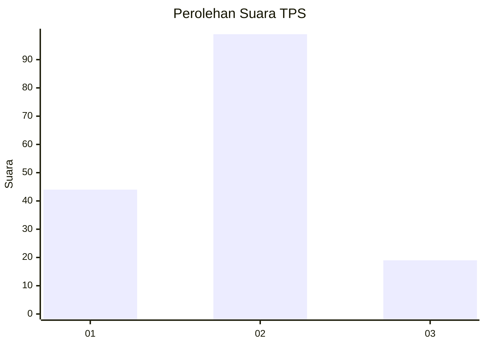
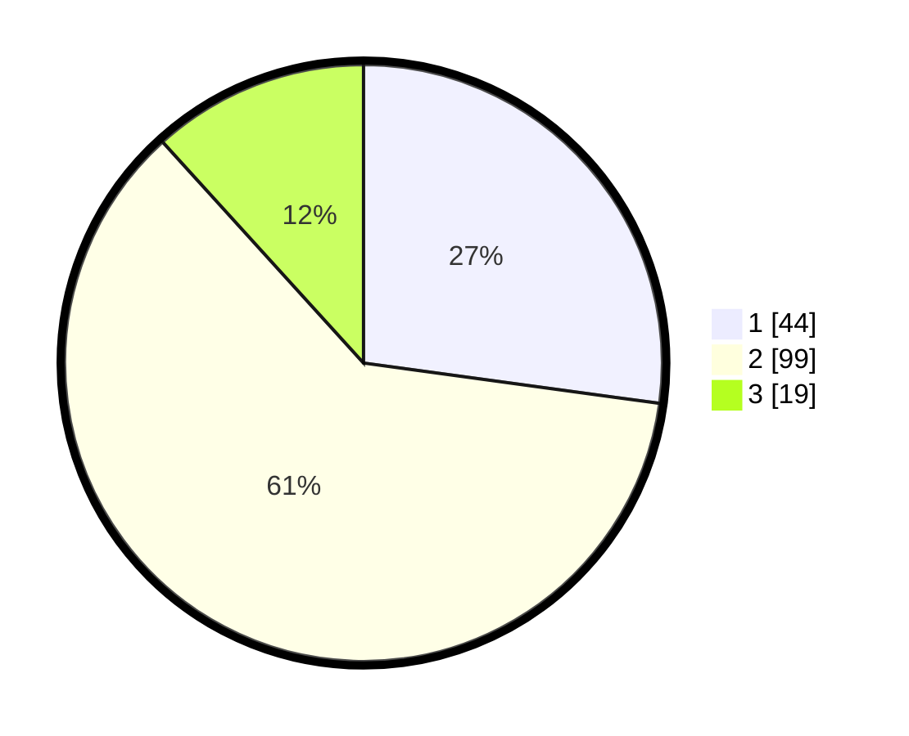

# Hasil

## Grafik

## Tabel

| No. | Nama Paslon    | Suara | Suara (raw) | Persentase |
|:--- |:-------------- | -----:| -----------:| ----------:|
| 1   | ANIES MUHAIMIN | 44    | [44][p-1]   | 27,16      |
| 2   | PRABOWO GIBRAN | 99    | [99][p-2]   | 61,11      |
| 3   | GANJAR MAHFUD  | 19    | [19][p-3]   | 11,73      |

[p-1]: https://github.com/gigit-pemilu/pemilu-2024-35-jawa-timur/blob/main/pilpres/hitung-suara/sub/35-jawa-timur/sub/09-jember/sub/08-puger/sub/2003-mojosari/sub/036-tps/sub/paslon-1.txt
[p-2]: https://github.com/gigit-pemilu/pemilu-2024-35-jawa-timur/blob/main/pilpres/hitung-suara/sub/35-jawa-timur/sub/09-jember/sub/08-puger/sub/2003-mojosari/sub/036-tps/sub/paslon-2.txt
[p-3]: https://github.com/gigit-pemilu/pemilu-2024-35-jawa-timur/blob/main/pilpres/hitung-suara/sub/35-jawa-timur/sub/09-jember/sub/08-puger/sub/2003-mojosari/sub/036-tps/sub/paslon-3.txt

## Foto C Plano

https://sirekap-obj-formc.kpu.go.id/e294/pemilu/ppwp/35/09/08/20/03/3509082003036-20240219-093337--d465b4a4-73ea-4366-abc1-a724c945117e.jpg

https://sirekap-obj-formc.kpu.go.id/e294/pemilu/ppwp/35/09/08/20/03/3509082003036-20240219-063240--9dbb3fa5-0e5b-4bc3-adc2-e0b59bf4c981.jpg

https://sirekap-obj-formc.kpu.go.id/e294/pemilu/ppwp/35/09/08/20/03/3509082003036-20240219-063533--9eb39da7-3a1b-434c-9e03-75b5fd3c1460.jpg

## Metadata

| Key        | Value               |
| ---------- | ------------------- |
| Time Stamp | 2024-02-24 22:31:28 |

