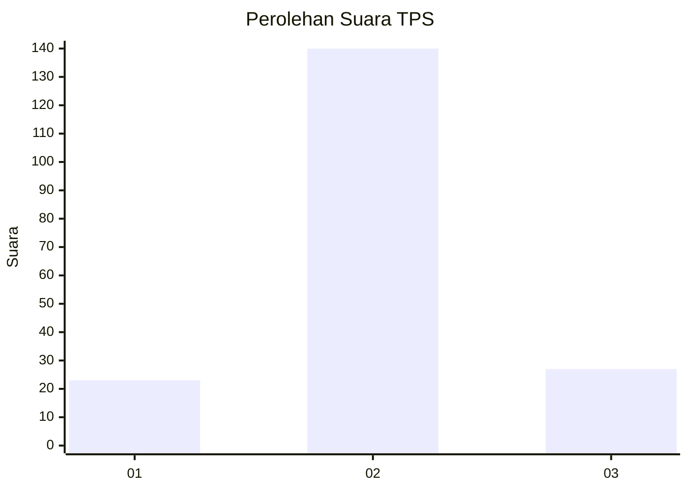
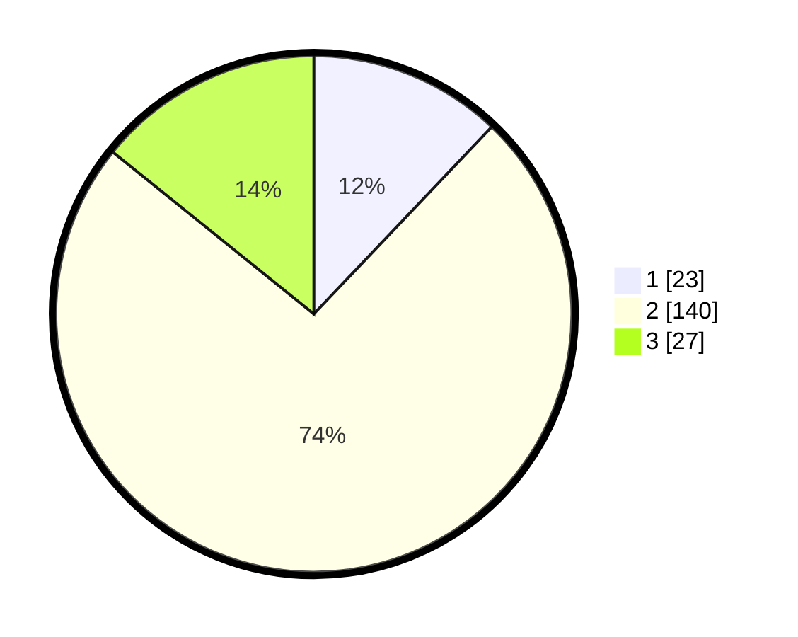

# Hasil

## Grafik

## Tabel

| No. | Nama Paslon    | Suara | Suara (raw) | Persentase |
|:--- |:-------------- | -----:| -----------:| ----------:|
| 1   | ANIES MUHAIMIN | 23    | [23][p-1]   | 12,11      |
| 2   | PRABOWO GIBRAN | 140   | [140][p-2]  | 73,68      |
| 3   | GANJAR MAHFUD  | 27    | [27][p-3]   | 14,21      |

[p-1]: https://github.com/gigit-pemilu/pemilu-2024-35-jawa-timur/blob/main/pilpres/hitung-suara/sub/35-jawa-timur/sub/09-jember/sub/08-puger/sub/2004-pugerkulon/sub/002-tps/sub/paslon-1.txt
[p-2]: https://github.com/gigit-pemilu/pemilu-2024-35-jawa-timur/blob/main/pilpres/hitung-suara/sub/35-jawa-timur/sub/09-jember/sub/08-puger/sub/2004-pugerkulon/sub/002-tps/sub/paslon-2.txt
[p-3]: https://github.com/gigit-pemilu/pemilu-2024-35-jawa-timur/blob/main/pilpres/hitung-suara/sub/35-jawa-timur/sub/09-jember/sub/08-puger/sub/2004-pugerkulon/sub/002-tps/sub/paslon-3.txt

## Foto C Plano

https://sirekap-obj-formc.kpu.go.id/5a3a/pemilu/ppwp/35/09/08/20/04/3509082004002-20240215-015617--7006d83d-e192-4e33-8acb-07a81ec79132.jpg

https://sirekap-obj-formc.kpu.go.id/5a3a/pemilu/ppwp/35/09/08/20/04/3509082004002-20240215-015725--8ce178e2-79fa-4cc0-9560-f61c306fd39c.jpg

https://sirekap-obj-formc.kpu.go.id/5a3a/pemilu/ppwp/35/09/08/20/04/3509082004002-20240215-015830--90f12aa6-860d-4383-9e66-4688b5fb6013.jpg

## Metadata

| Key        | Value               |
| ---------- | ------------------- |
| Time Stamp | 2024-02-24 22:31:28 |

