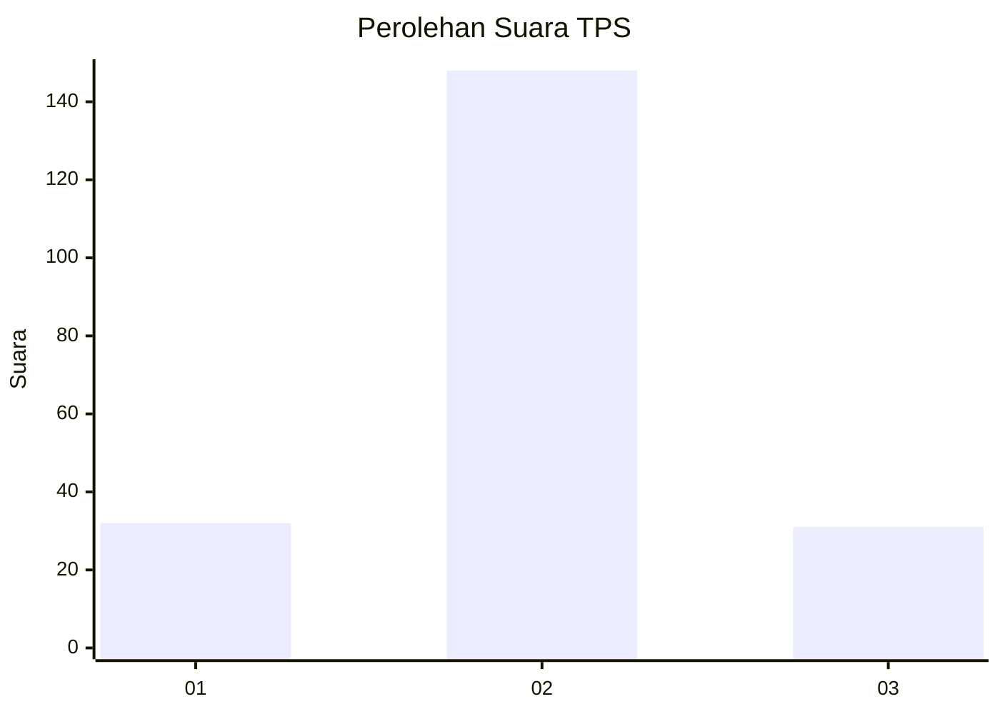

# Hasil

## Grafik

## Tabel

| No. | Nama Paslon    | Suara | Suara (raw) | Persentase |
|:--- |:-------------- | -----:| -----------:| ----------:|
| 1   | ANIES MUHAIMIN | 32    | [32][p-1]   | 15,17      |
| 2   | PRABOWO GIBRAN | 148   | [148][p-2]  | 70,14      |
| 3   | GANJAR MAHFUD  | 31    | [31][p-3]   | 14,69      |

[p-1]: https://github.com/gigit-pemilu/pemilu-2024-35-jawa-timur/blob/main/pilpres/hitung-suara/sub/35-jawa-timur/sub/09-jember/sub/08-puger/sub/2004-pugerkulon/sub/005-tps/sub/paslon-1.txt
[p-2]: https://github.com/gigit-pemilu/pemilu-2024-35-jawa-timur/blob/main/pilpres/hitung-suara/sub/35-jawa-timur/sub/09-jember/sub/08-puger/sub/2004-pugerkulon/sub/005-tps/sub/paslon-2.txt
[p-3]: https://github.com/gigit-pemilu/pemilu-2024-35-jawa-timur/blob/main/pilpres/hitung-suara/sub/35-jawa-timur/sub/09-jember/sub/08-puger/sub/2004-pugerkulon/sub/005-tps/sub/paslon-3.txt

## Foto C Plano

https://sirekap-obj-formc.kpu.go.id/fdee/pemilu/ppwp/35/09/08/20/04/3509082004005-20240215-023136--3a5790a9-1c67-466e-a63e-afa1e7426379.jpg

https://sirekap-obj-formc.kpu.go.id/fdee/pemilu/ppwp/35/09/08/20/04/3509082004005-20240214-224107--afec1bb7-09d5-4a0f-9d26-40f27a056536.jpg

https://sirekap-obj-formc.kpu.go.id/fdee/pemilu/ppwp/35/09/08/20/04/3509082004005-20240214-224155--f4e1c83c-b9e4-4a81-a641-ac223127f1e7.jpg

## Metadata

| Key        | Value               |
| ---------- | ------------------- |
| Time Stamp | 2024-02-25 15:00:00 |

