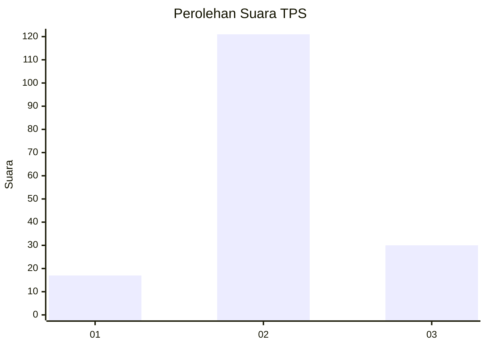
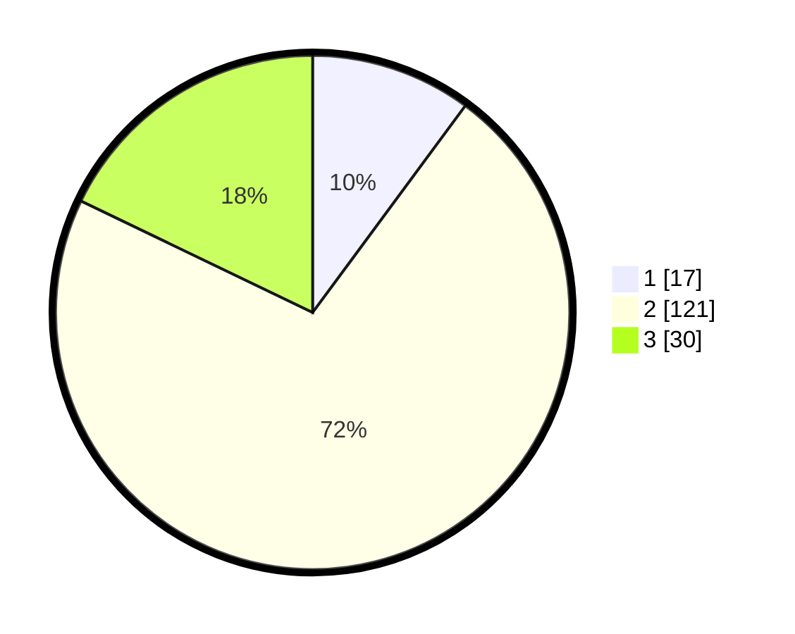

# Hasil

## Grafik

## Tabel

| No. | Nama Paslon    | Suara | Suara (raw) | Persentase |
|:--- |:-------------- | -----:| -----------:| ----------:|
| 1   | ANIES MUHAIMIN | 17    | [17][p-1]   | 10,12      |
| 2   | PRABOWO GIBRAN | 121   | [121][p-2]  | 72,02      |
| 3   | GANJAR MAHFUD  | 30    | [30][p-3]   | 17,86      |

[p-1]: https://github.com/gigit-pemilu/pemilu-2024-35-jawa-timur/blob/main/pilpres/hitung-suara/sub/35-jawa-timur/sub/09-jember/sub/08-puger/sub/2004-pugerkulon/sub/006-tps/sub/paslon-1.txt
[p-2]: https://github.com/gigit-pemilu/pemilu-2024-35-jawa-timur/blob/main/pilpres/hitung-suara/sub/35-jawa-timur/sub/09-jember/sub/08-puger/sub/2004-pugerkulon/sub/006-tps/sub/paslon-2.txt
[p-3]: https://github.com/gigit-pemilu/pemilu-2024-35-jawa-timur/blob/main/pilpres/hitung-suara/sub/35-jawa-timur/sub/09-jember/sub/08-puger/sub/2004-pugerkulon/sub/006-tps/sub/paslon-3.txt

## Foto C Plano

https://sirekap-obj-formc.kpu.go.id/c44f/pemilu/ppwp/35/09/08/20/04/3509082004006-20240215-002644--a4b65d7f-ee6f-445e-8386-4f8c7561da03.jpg

https://sirekap-obj-formc.kpu.go.id/c44f/pemilu/ppwp/35/09/08/20/04/3509082004006-20240215-010334--41f70bc1-d1b1-4d74-91ca-d4b1dbc8a807.jpg

https://sirekap-obj-formc.kpu.go.id/c44f/pemilu/ppwp/35/09/08/20/04/3509082004006-20240215-010427--39e4bcbd-e522-4042-b9be-65539cf39ccf.jpg

## Metadata

| Key        | Value               |
| ---------- | ------------------- |
| Time Stamp | 2024-02-16 21:01:00 |

