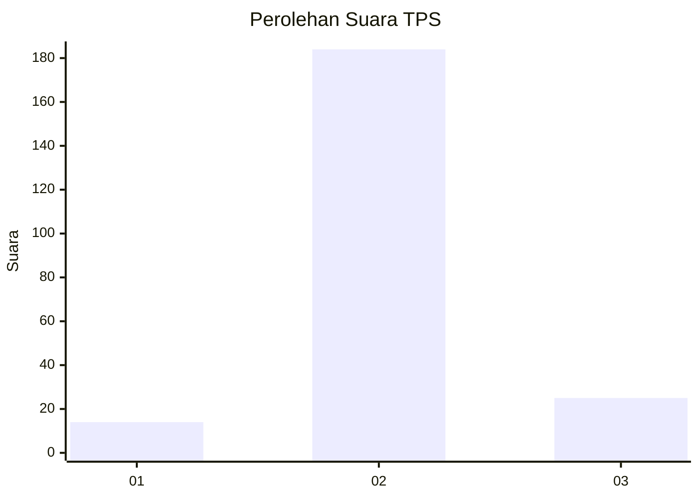
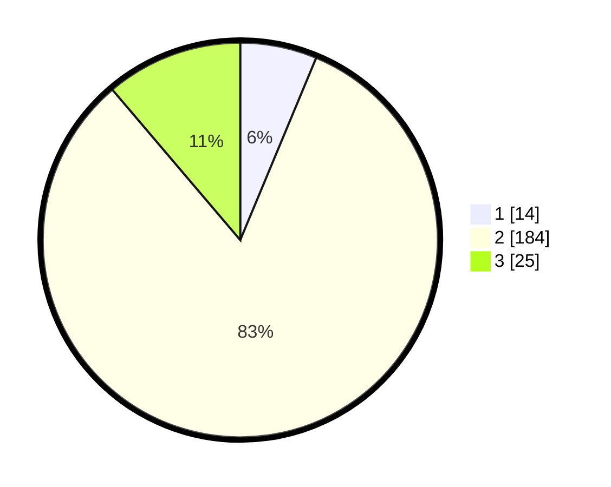

# Hasil

## Grafik

## Tabel

| No. | Nama Paslon    | Suara | Suara (raw) | Persentase |
|:--- |:-------------- | -----:| -----------:| ----------:|
| 1   | ANIES MUHAIMIN | 14    | [14][p-1]   | 6,28       |
| 2   | PRABOWO GIBRAN | 184   | [184][p-2]  | 82,51      |
| 3   | GANJAR MAHFUD  | 25    | [25][p-3]   | 11,21      |

[p-1]: https://github.com/gigit-pemilu/pemilu-2024-35-jawa-timur/blob/main/pilpres/hitung-suara/sub/35-jawa-timur/sub/09-jember/sub/08-puger/sub/2004-pugerkulon/sub/011-tps/sub/paslon-1.txt
[p-2]: https://github.com/gigit-pemilu/pemilu-2024-35-jawa-timur/blob/main/pilpres/hitung-suara/sub/35-jawa-timur/sub/09-jember/sub/08-puger/sub/2004-pugerkulon/sub/011-tps/sub/paslon-2.txt
[p-3]: https://github.com/gigit-pemilu/pemilu-2024-35-jawa-timur/blob/main/pilpres/hitung-suara/sub/35-jawa-timur/sub/09-jember/sub/08-puger/sub/2004-pugerkulon/sub/011-tps/sub/paslon-3.txt

## Foto C Plano

https://sirekap-obj-formc.kpu.go.id/5541/pemilu/ppwp/35/09/08/20/04/3509082004011-20240215-021023--6cd21279-ac4a-4261-826b-85cffe1e4462.jpg

https://sirekap-obj-formc.kpu.go.id/5541/pemilu/ppwp/35/09/08/20/04/3509082004011-20240215-021125--29daf4a0-dd51-44ad-bc68-dbfb8b8a8da8.jpg

https://sirekap-obj-formc.kpu.go.id/5541/pemilu/ppwp/35/09/08/20/04/3509082004011-20240215-021201--64927613-3195-4708-ac49-1cf932f86d30.jpg

## Metadata

| Key        | Value               |
| ---------- | ------------------- |
| Time Stamp | 2024-02-15 16:00:26 |

