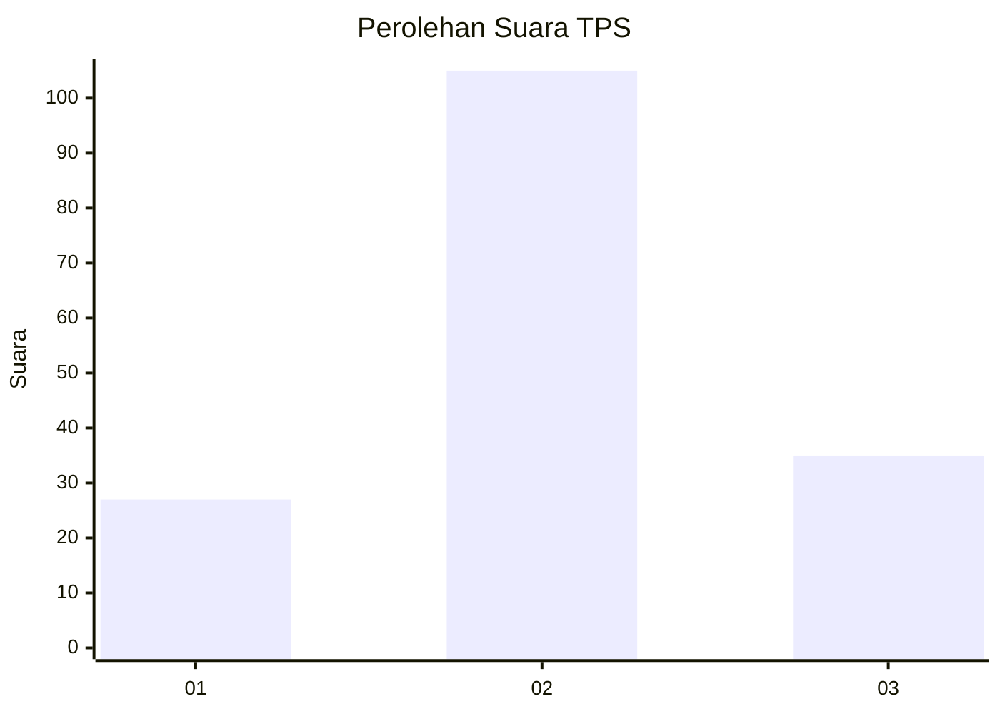
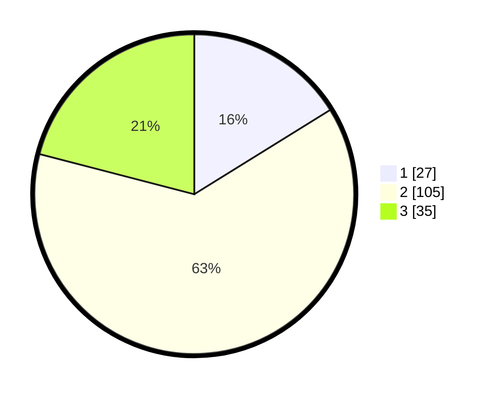

# Hasil

## Grafik

## Tabel

| No. | Nama Paslon    | Suara | Suara (raw) | Persentase |
|:--- |:-------------- | -----:| -----------:| ----------:|
| 1   | ANIES MUHAIMIN | 27    | [27][p-1]   | 16,17      |
| 2   | PRABOWO GIBRAN | 105   | [105][p-2]  | 62,87      |
| 3   | GANJAR MAHFUD  | 35    | [35][p-3]   | 20,96      |

[p-1]: https://github.com/gigit-pemilu/pemilu-2024-35-jawa-timur/blob/main/pilpres/hitung-suara/sub/35-jawa-timur/sub/09-jember/sub/08-puger/sub/2004-pugerkulon/sub/020-tps/sub/paslon-1.txt
[p-2]: https://github.com/gigit-pemilu/pemilu-2024-35-jawa-timur/blob/main/pilpres/hitung-suara/sub/35-jawa-timur/sub/09-jember/sub/08-puger/sub/2004-pugerkulon/sub/020-tps/sub/paslon-2.txt
[p-3]: https://github.com/gigit-pemilu/pemilu-2024-35-jawa-timur/blob/main/pilpres/hitung-suara/sub/35-jawa-timur/sub/09-jember/sub/08-puger/sub/2004-pugerkulon/sub/020-tps/sub/paslon-3.txt

## Foto C Plano

https://sirekap-obj-formc.kpu.go.id/0340/pemilu/ppwp/35/09/08/20/04/3509082004020-20240215-000936--2545ac34-4cf7-446b-a726-f0c0342792ae.jpg

https://sirekap-obj-formc.kpu.go.id/0340/pemilu/ppwp/35/09/08/20/04/3509082004020-20240215-001207--66dc52ef-be60-453f-a670-4e4506f7019a.jpg

https://sirekap-obj-formc.kpu.go.id/0340/pemilu/ppwp/35/09/08/20/04/3509082004020-20240215-001326--91197716-7946-4463-ad54-f85ab69139c2.jpg

## Metadata

| Key        | Value               |
| ---------- | ------------------- |
| Time Stamp | 2024-02-15 16:00:26 |

